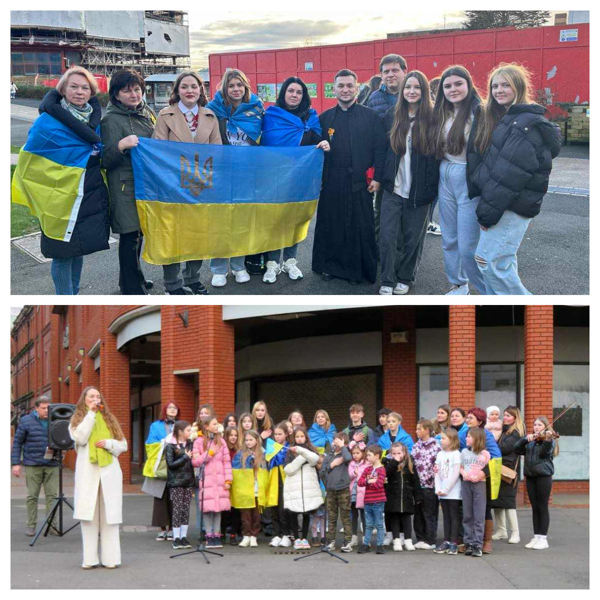
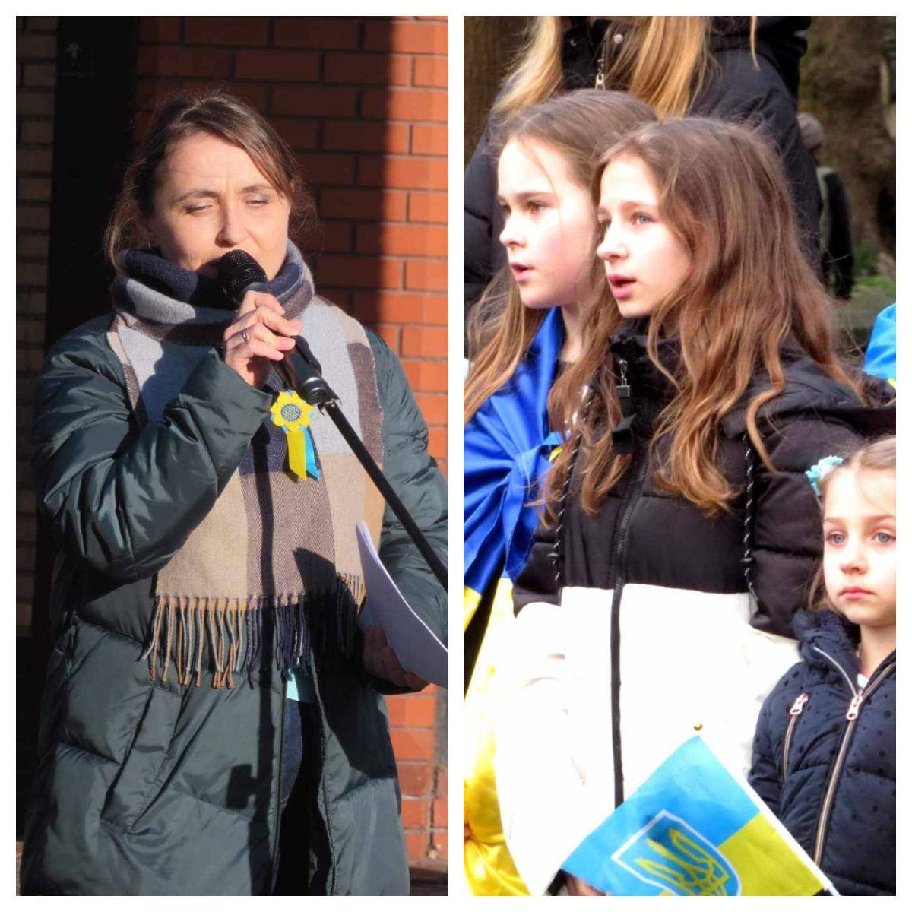
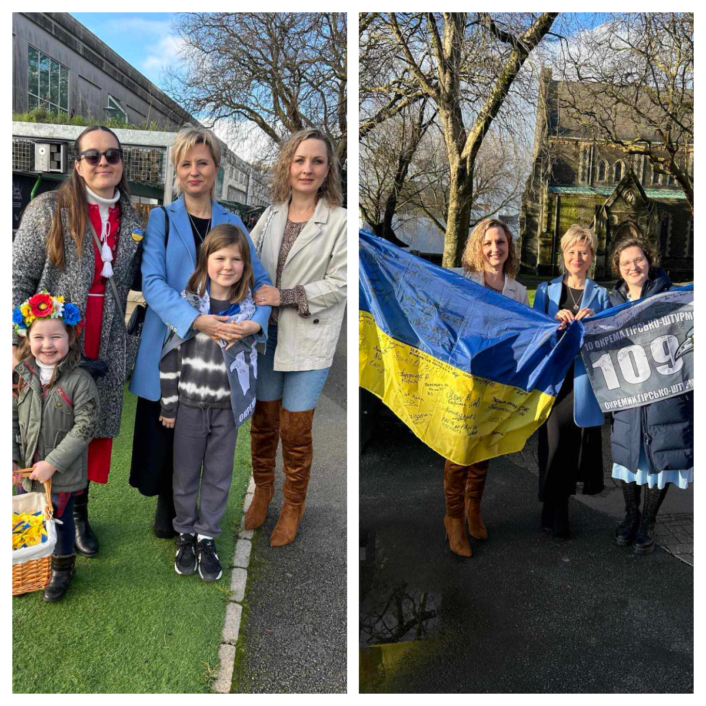
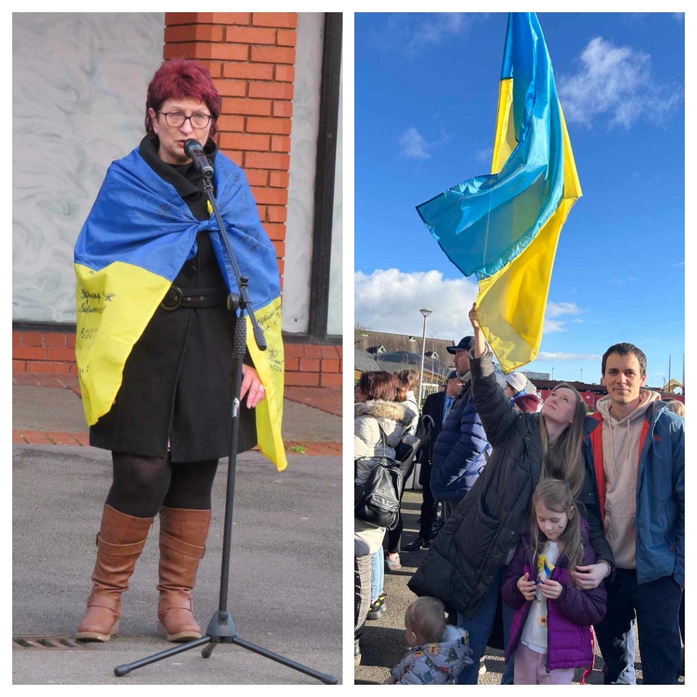
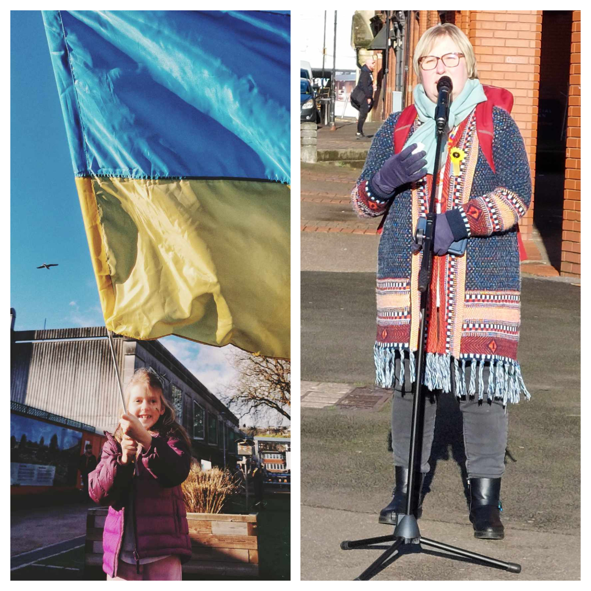
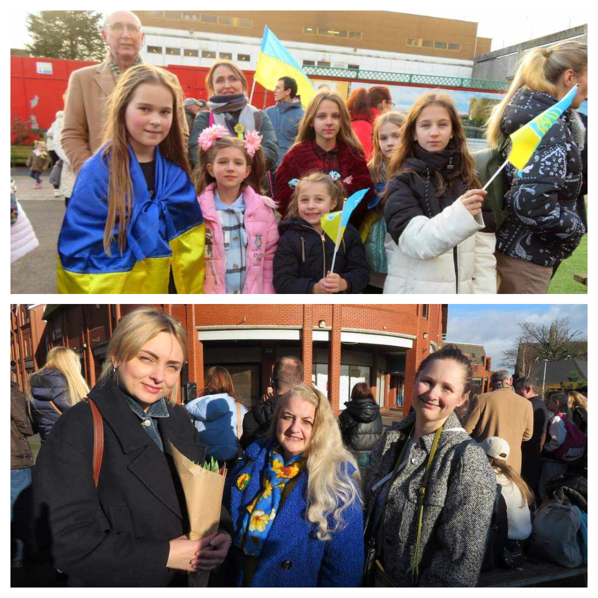
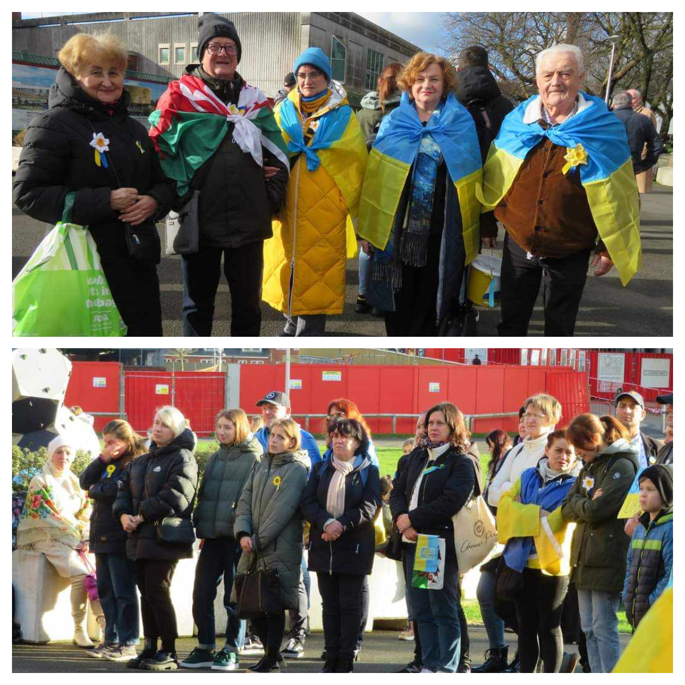
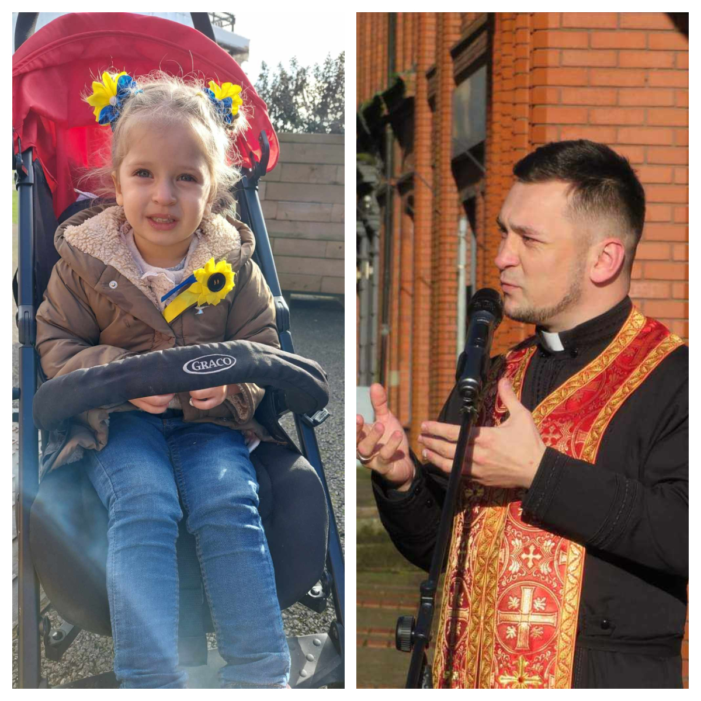
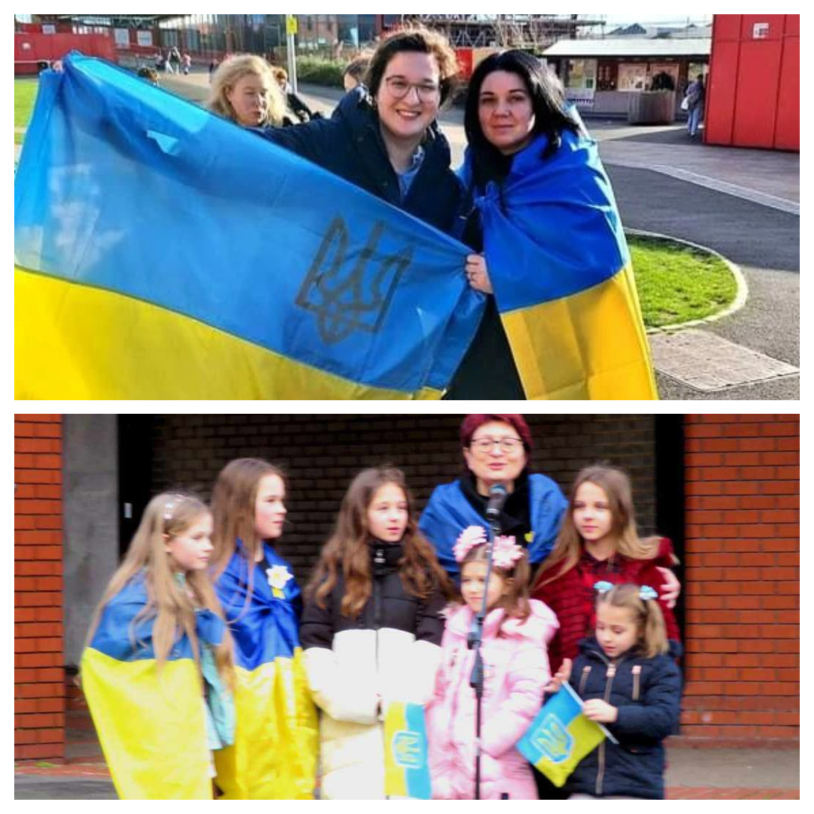
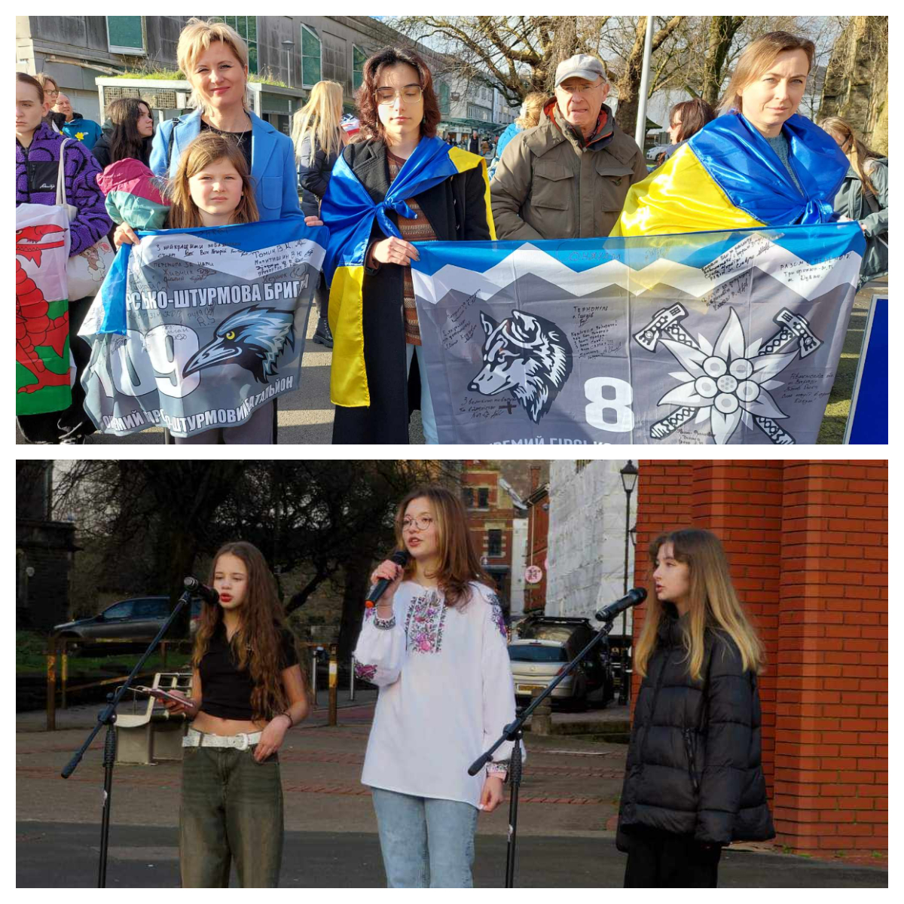

Today, at St David's Place in Swansea, dozens of Ukrainians and Welsh people gathered on the 2nd anniversary of the full-scale invasion and on the coming  10th anniversary of the beginning of the war. 

On this day, it was especially important for all of us to have friends by our side, to feel words of support, and to demonstrate our unity. 

That's why it was so wonderful to see many beautiful people who found the time and opportunity to come and support Ukraine!

