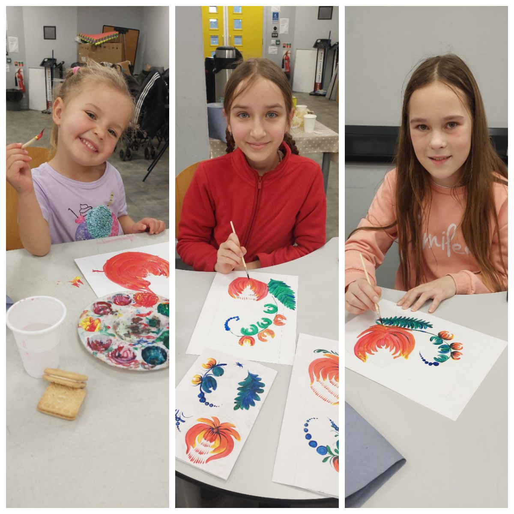
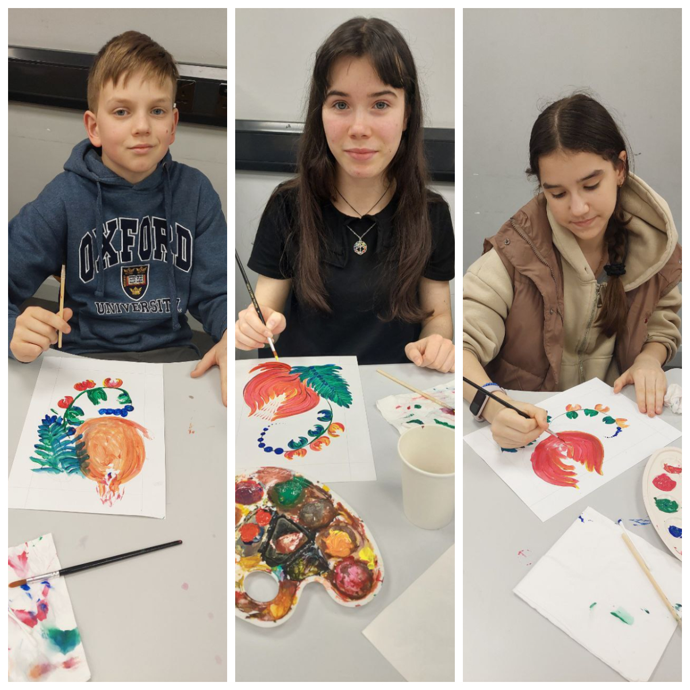

The second art class on a traditional Ukrainian decorative painting style was again run by multi-talented Lisa Kalianova.

<!--more-->

 We met again at <a href="https://www.swanseagrand.co.uk/article/5523/The-Grand-Multicultural-Hub" target="_blank">Swansea Multicultural Hub</a> proud;y supported by the Winter Wellbeing Grant from <a href="https://www.swansea.gov.uk/" target="_blank">Swansea Council</a>!

    <iframe width="318" height="566" src="https://www.youtube.com/embed/D7nAGzU4MZU" title="The second art class on Petrykivka painting" frameborder="0" allow="accelerometer; autoplay; clipboard-write; encrypted-media; gyroscope; picture-in-picture; web-share" referrerpolicy="strict-origin-when-cross-origin" allowfullscreen></iframe>

