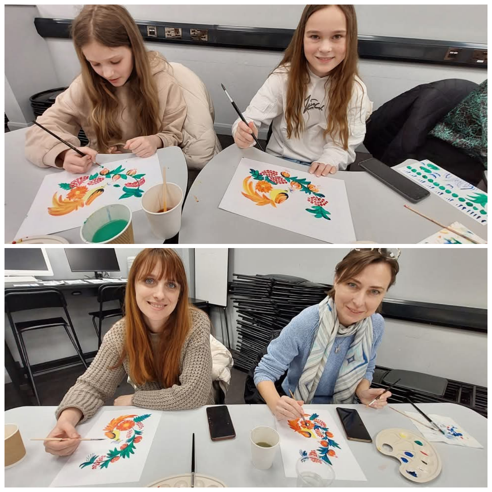
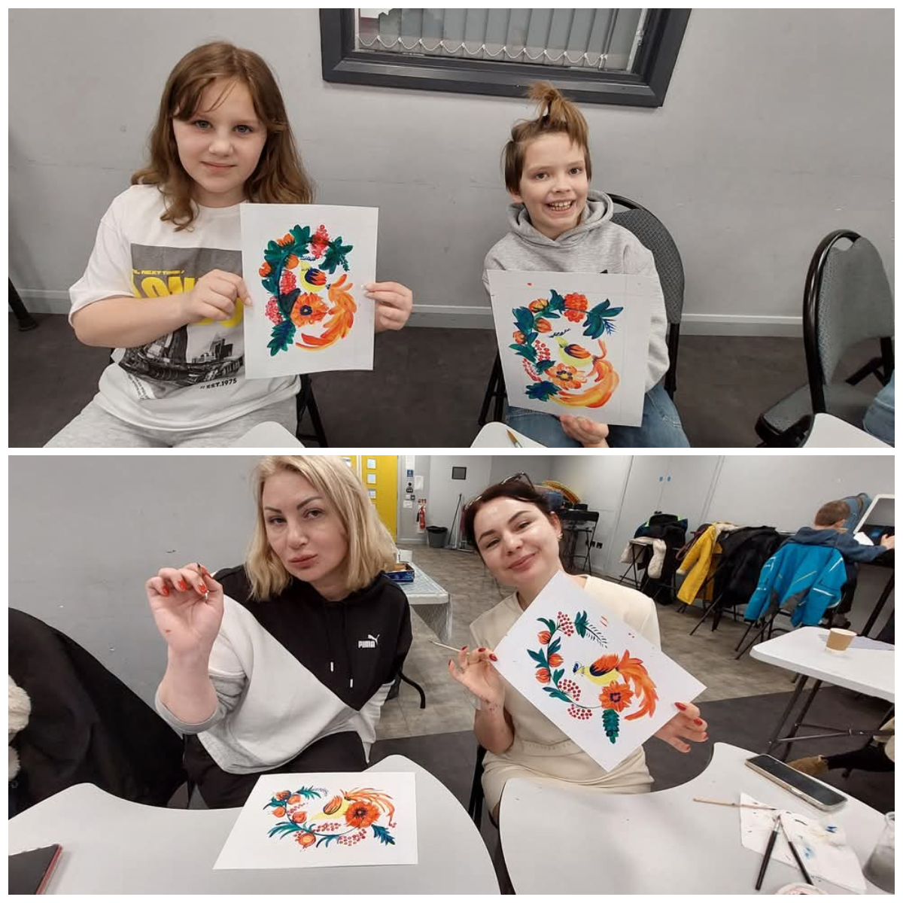
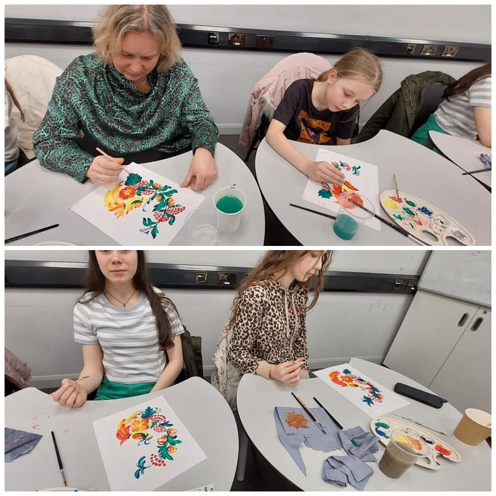
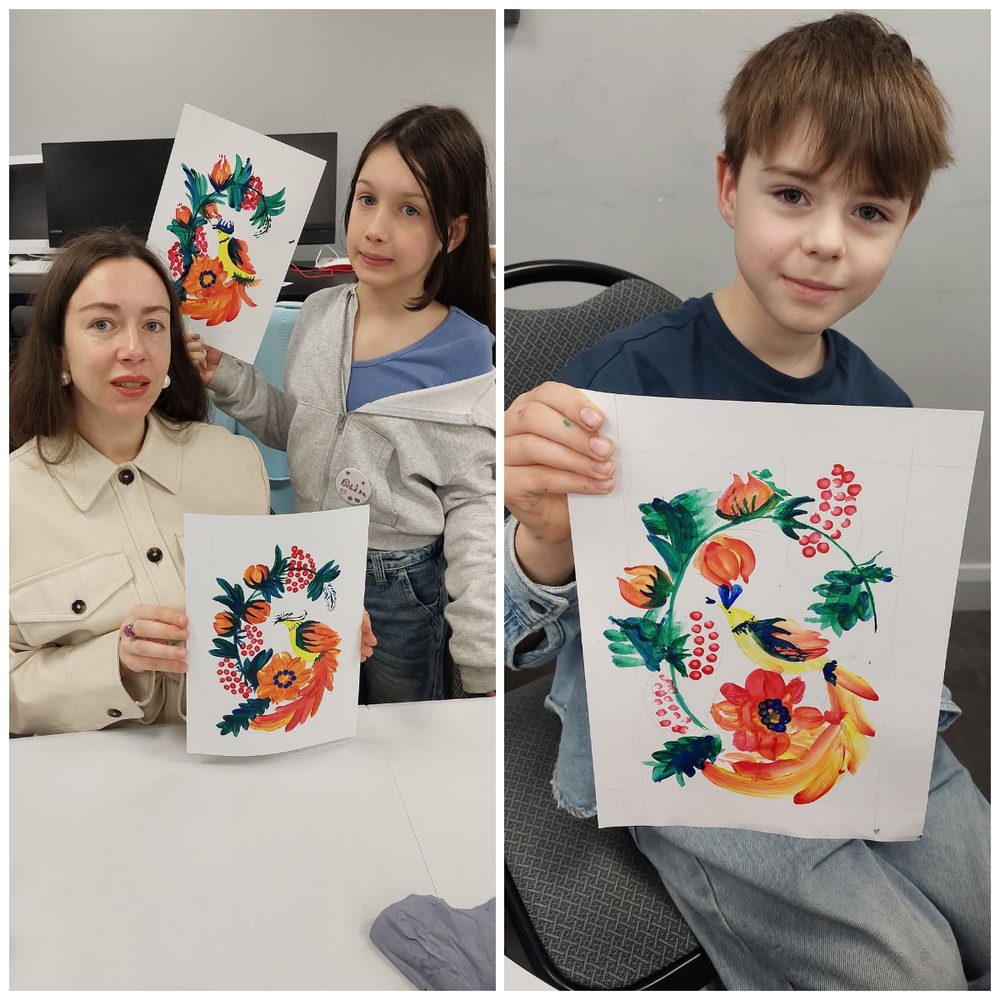

The last winter art class from Sunflowers was warm, bright, and traditionally engaging. Our wonderful Liza Kalyanova once again immersed everyone in the magical art of Petrykivka painting!

Both mothers and children had the chance to feel like true artists!

Thank you to everyone who participated in our events this winter! Stay tuned—there's more to come!

Many thanks to <a href="https://www.swansea.gov.uk/" target="_blank">Swansea City Council</a> for the funding which made these events possible!

