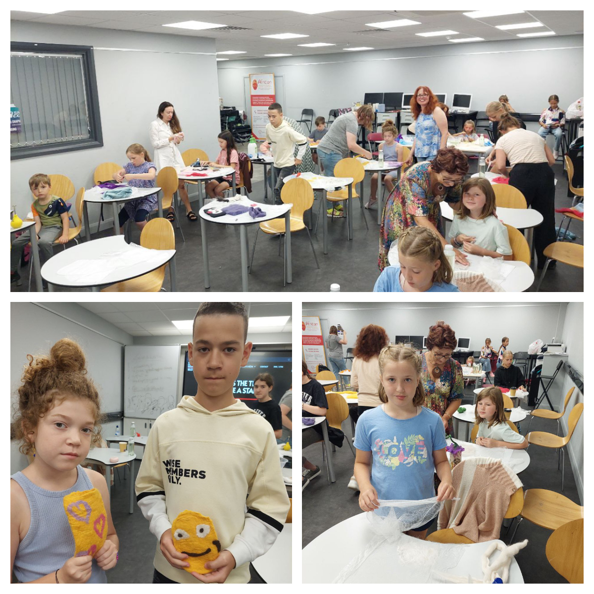
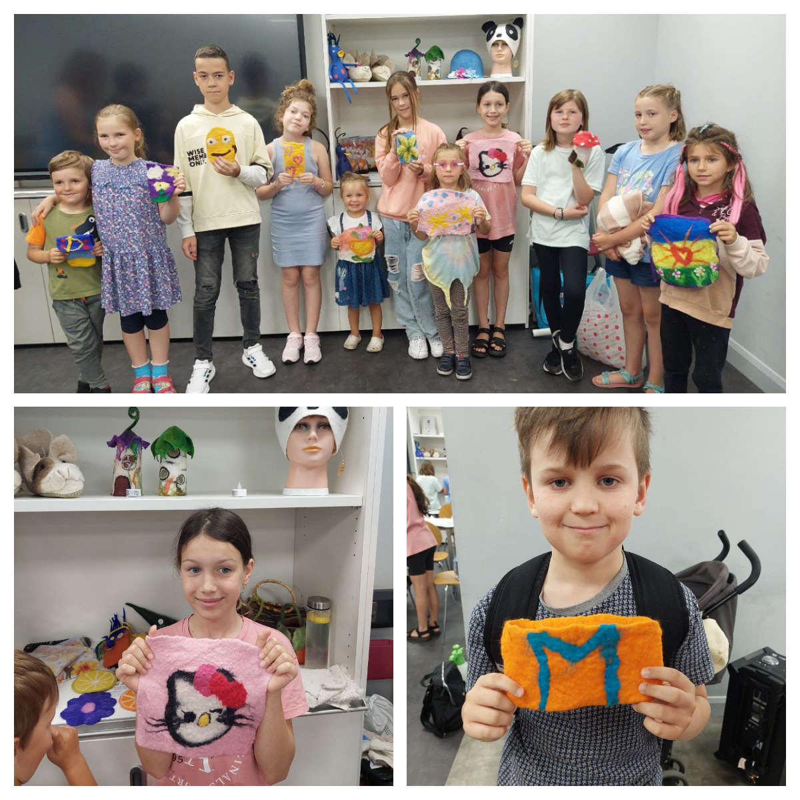
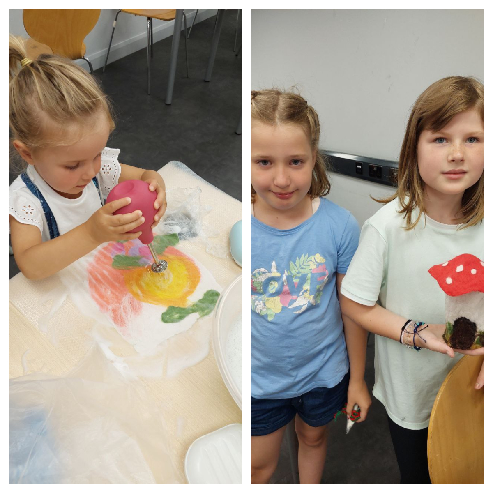
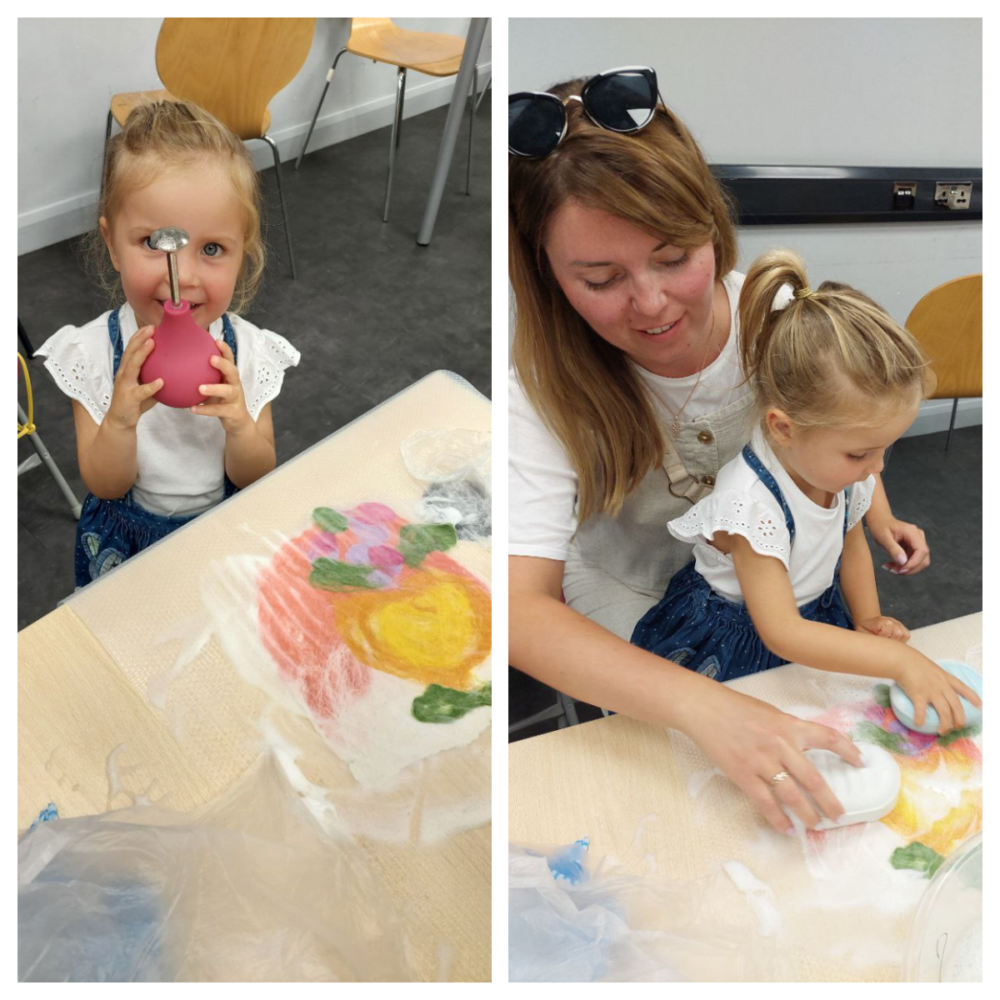
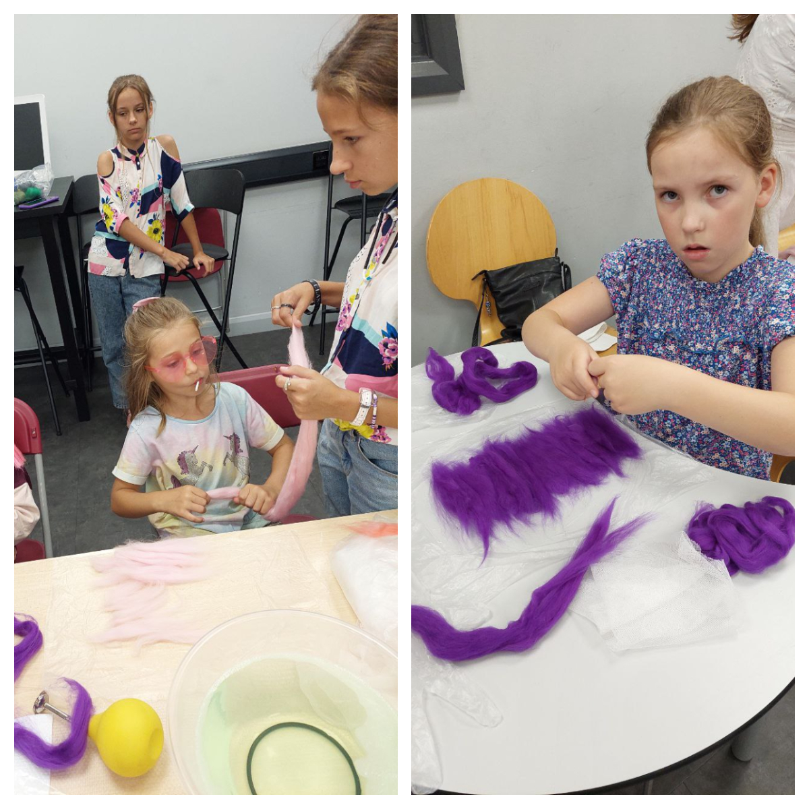

Another a fantastic felting class in Swansea for Ukrainian ladies and children ran by the incredible <a href="https://www.facebook.com/svetlana.lilley" target="_blank">Svetlana Lilley</a>.

Three hours of joy and entertainment! Children were very enthusiastic and excited about the event!

The art class was supported by the UK Government and Swansea City Council through the COAST project funding.

