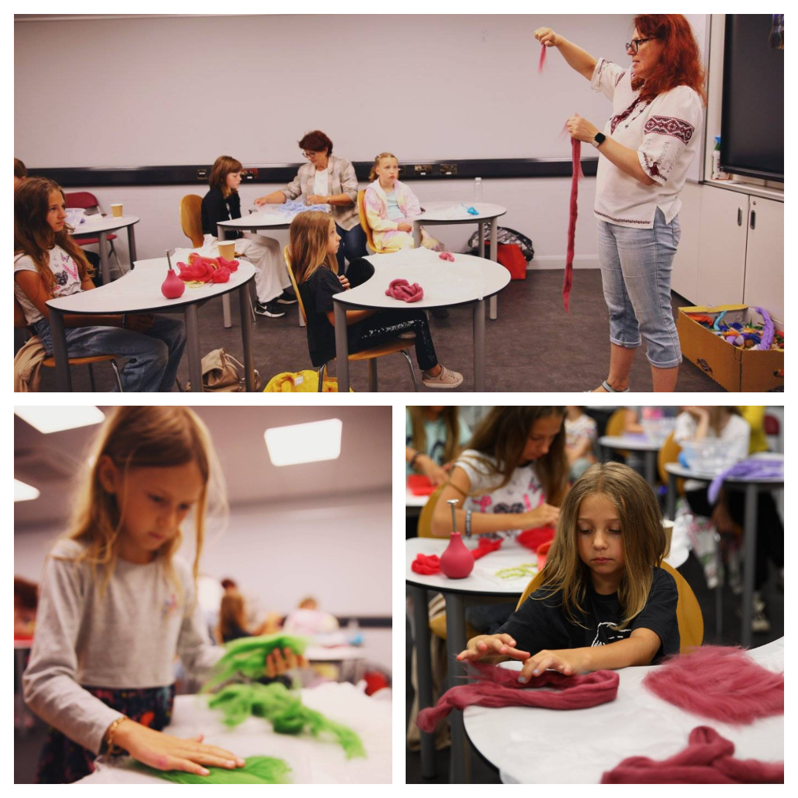
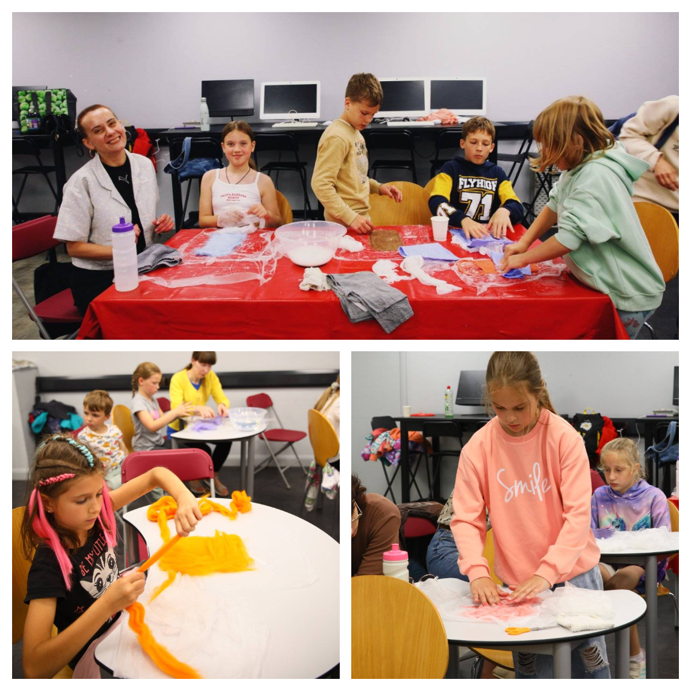
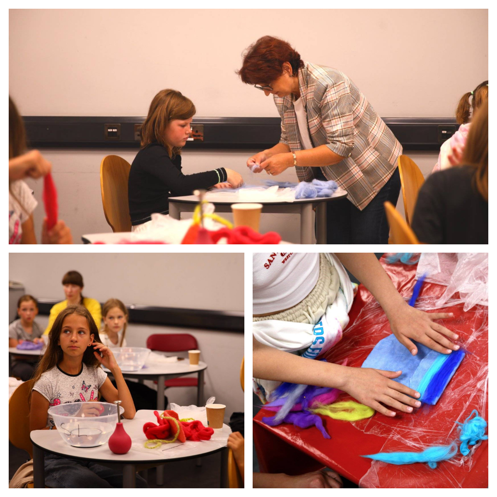
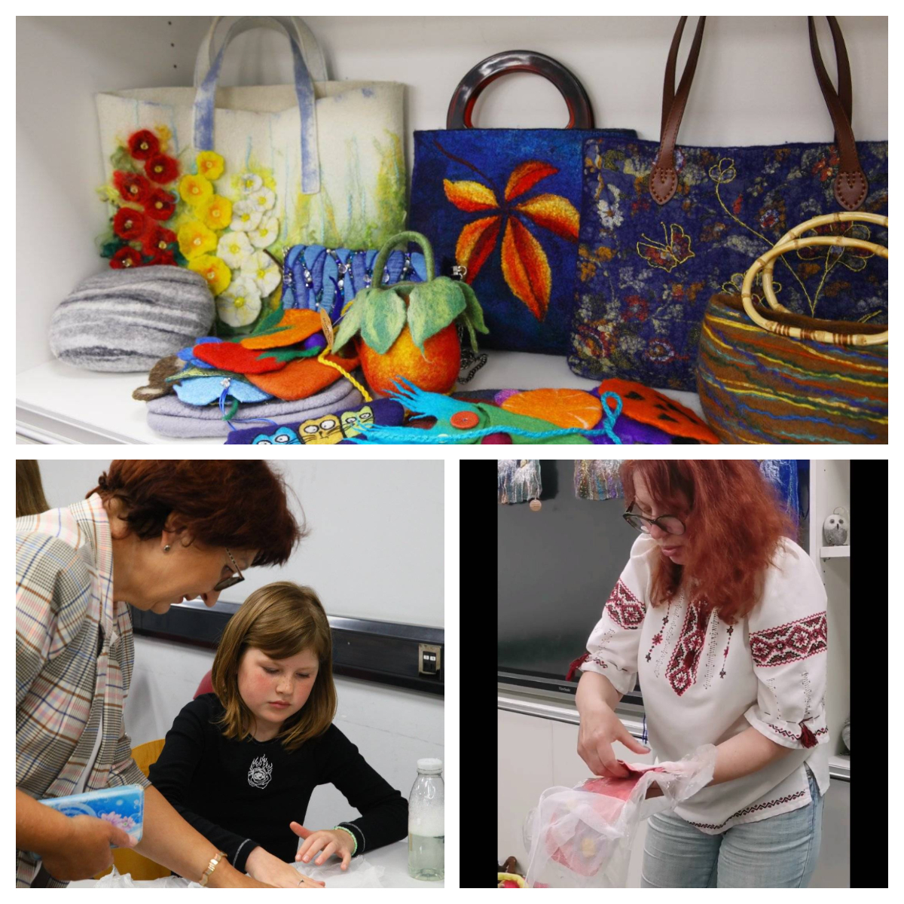
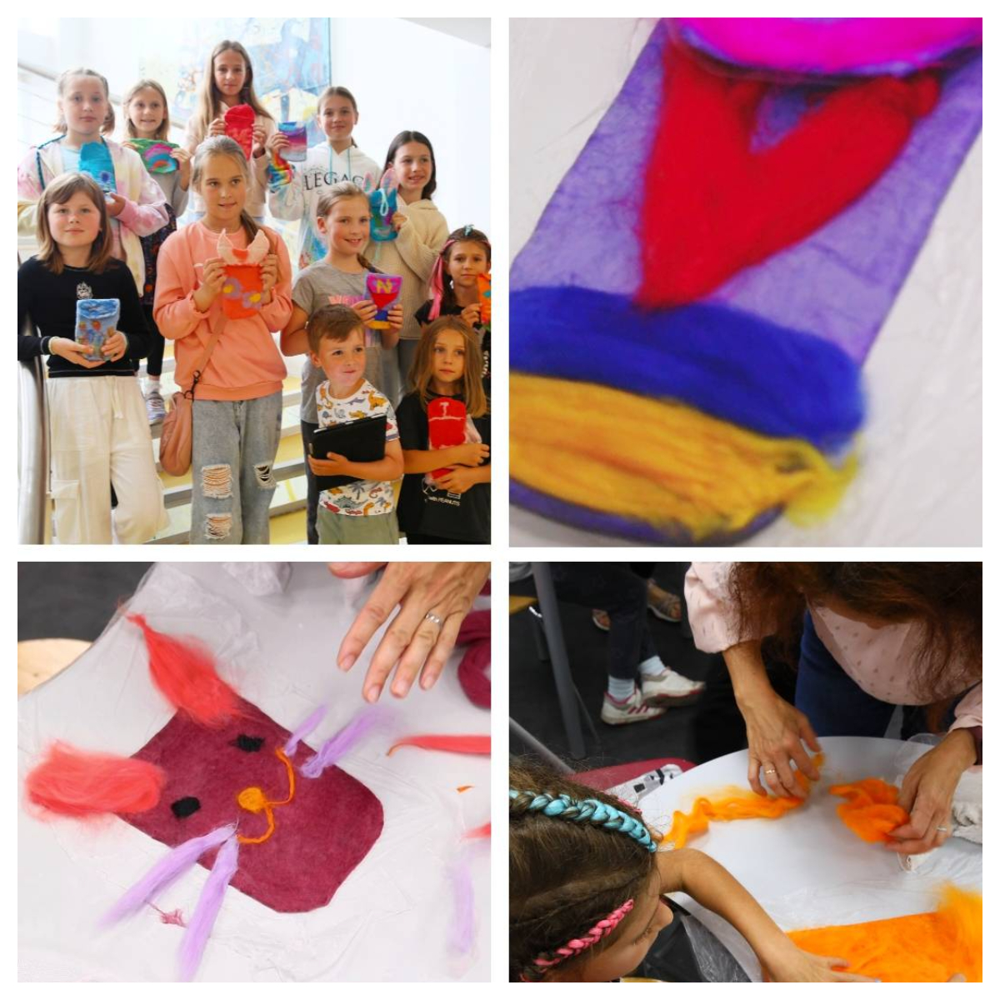

We have a fantastic felting class today in Swansea for Ukrainian ladies and children ran by the incredible <a href="https://www.facebook.com/svetlana.lilley" target="_blank">Svetlana Lilley</a>.

Children were excited and very satisfied with their success!

The art class was supported by the UK Government and Swansea City Council through the COAST project funding.

