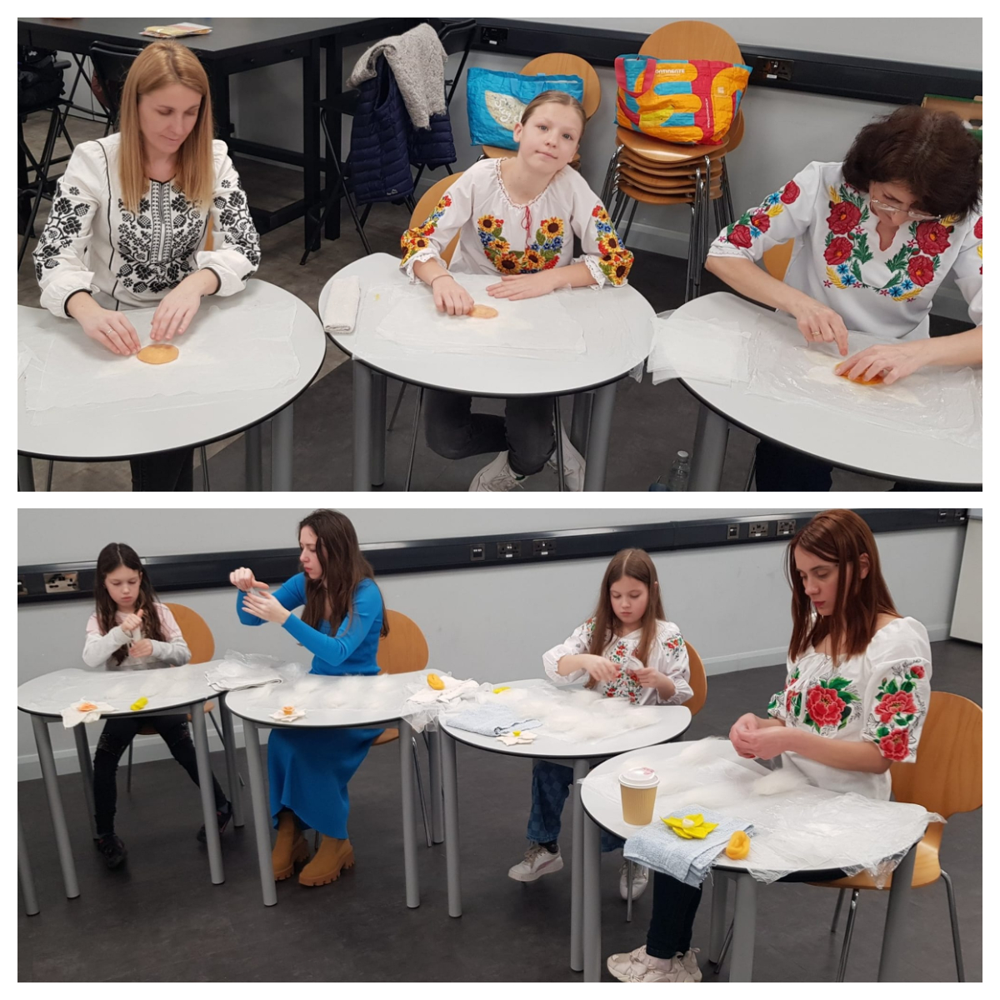
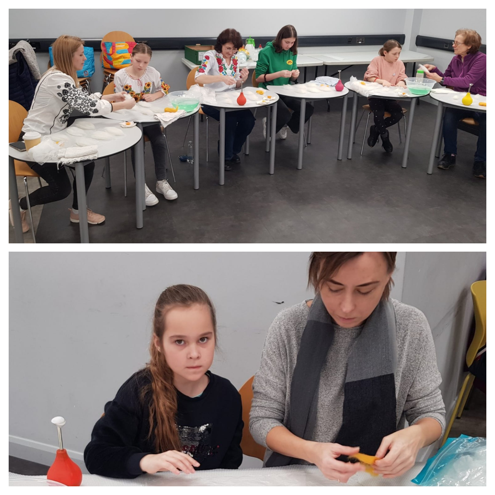
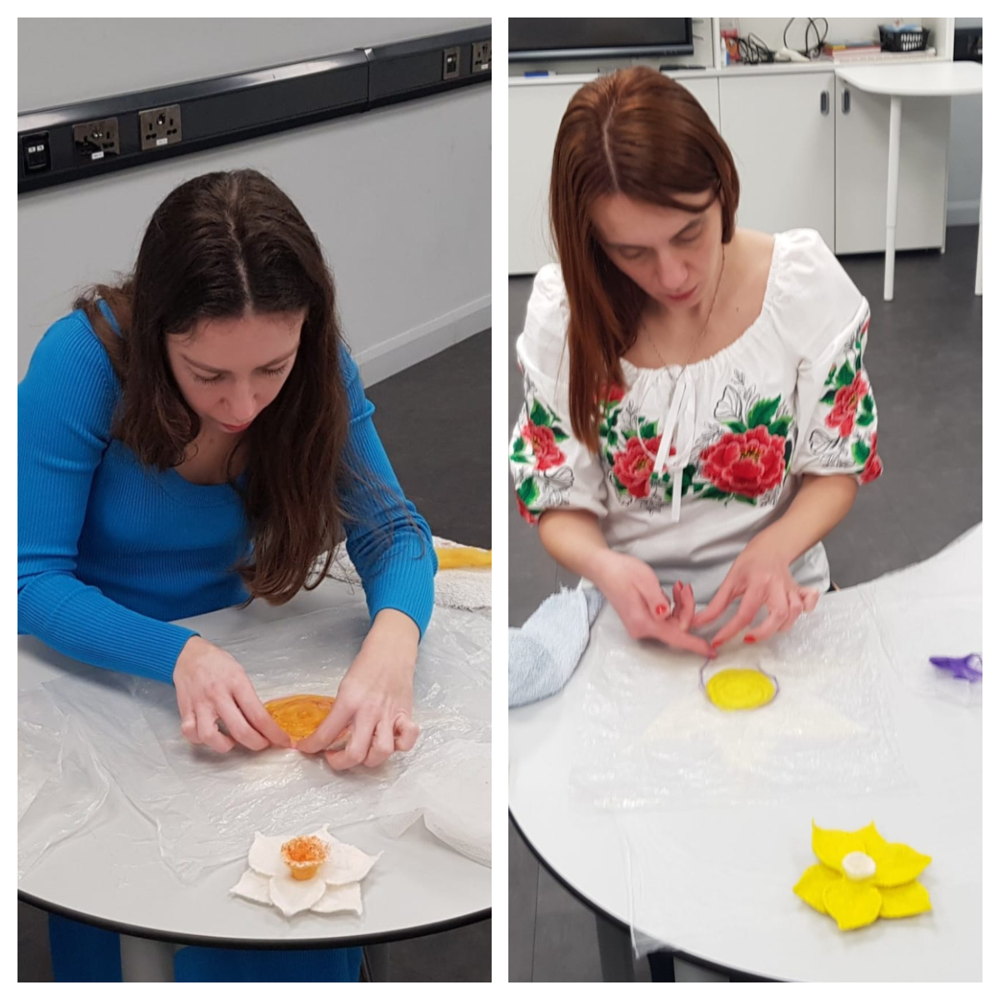
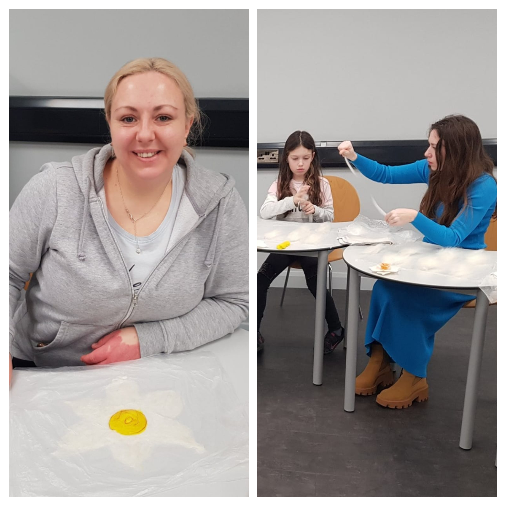

We have a fantastic class today in Swansea for Ukrainian ladies and children.

All have made a beautiful Welsh Daffodil. Absolutely stunning results for a first attempt. 

Kids and adults --- they all were excited!

