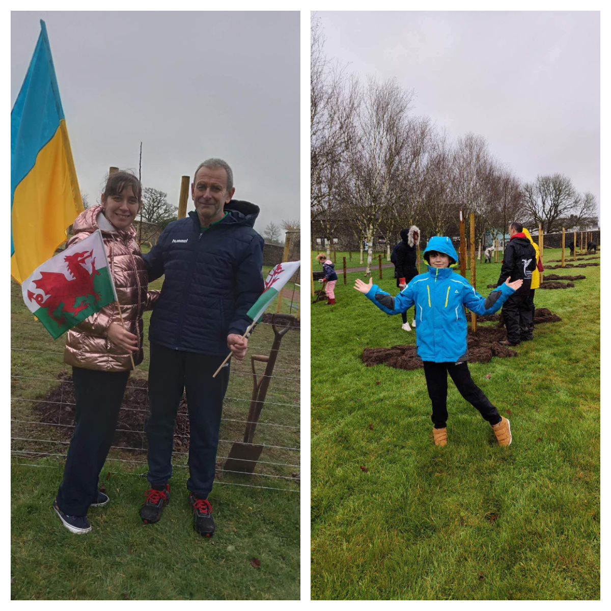

A large group of <a href="https://www.facebook.com/groups/601579067497655" target="_blank">Sunflowers Wales (Соняшники)</a> members have visited the <a href="https://www.facebook.com/pages/National%20Botanic%20Garden%20of%20Wales/136641249690054/" target="_blank">National Botanic Garden of Wales</a>.

And not just visited. We were invited by <a href="https://www.facebook.com/profile.php?id=100087773228747" target="_blank">Stephen Pearce</a> to plant apple orchard!!!

26 trees were planted, every tree  has got a number. Purpose of this is to have a plaque on the wall nearby with number of tree and name of the ukrainian person who planted it with name of city where they are from! 
What an amazing idea from Stephen!

The oldest our gardener is 84, the youngest - 6. Everybody worked hard. In less than 2 hours we have finished: a bit tired, a lot dirty, and very happy! 

Tom and Kate, our gardening instructors, were well impressed! :-)

We hope that our friendship with Botanic Garden will carry on. We are ready for the next challenge! :-)
Thank you Stephen!

 

