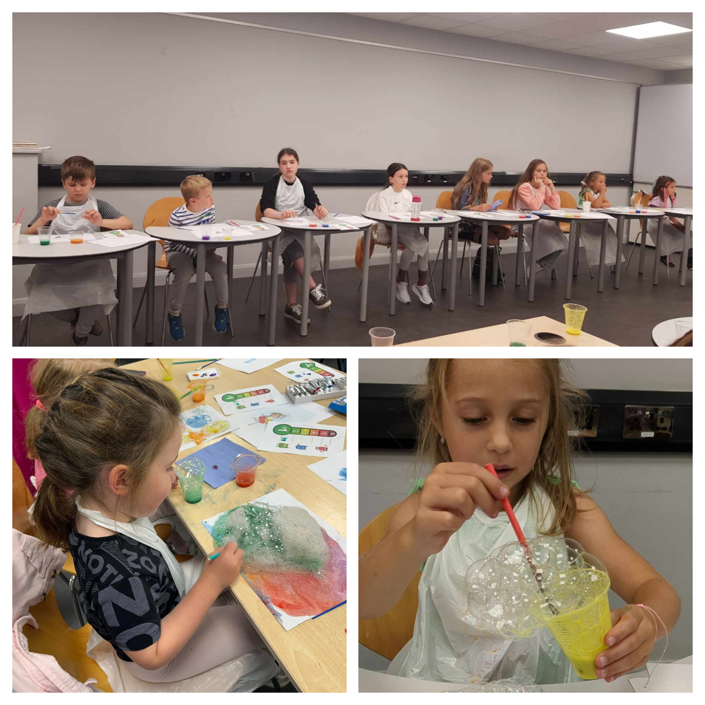
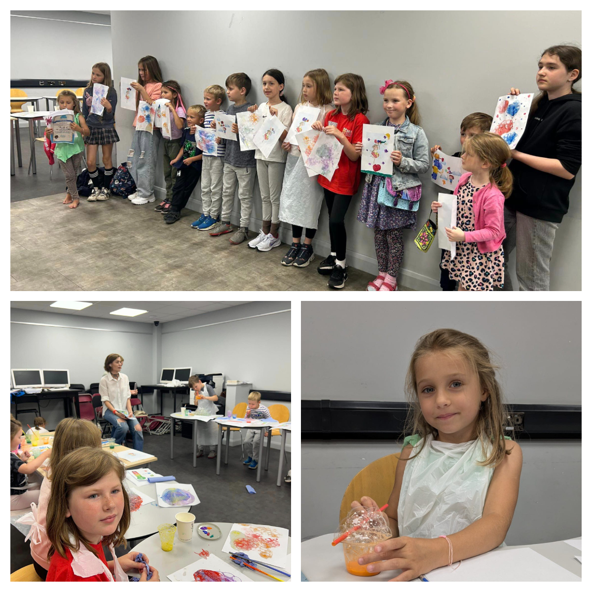
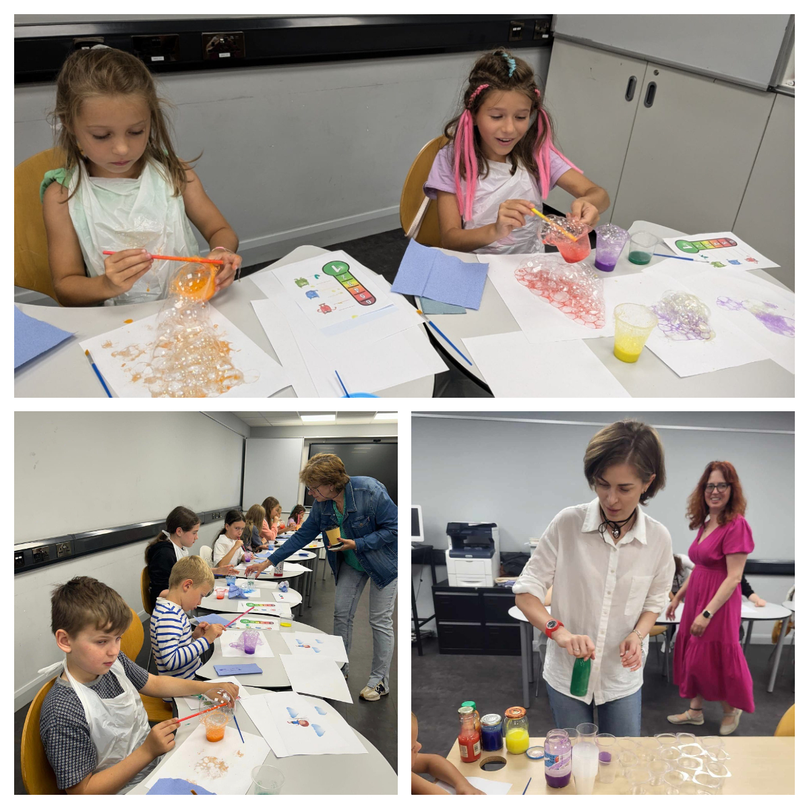
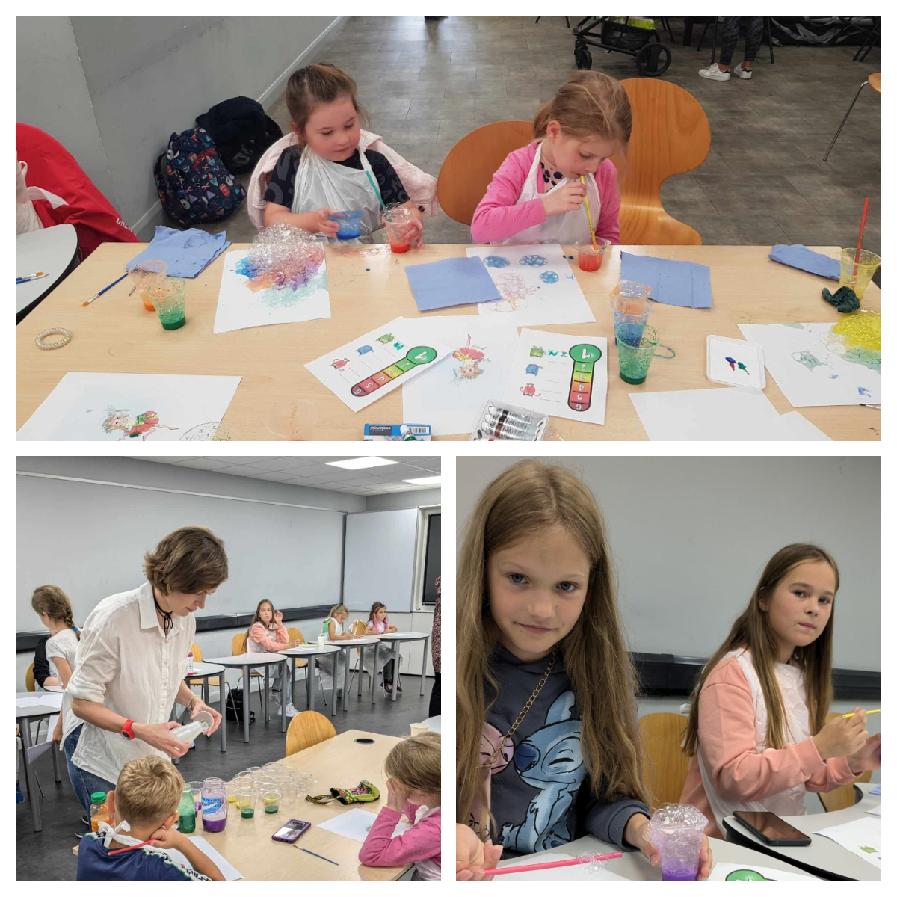
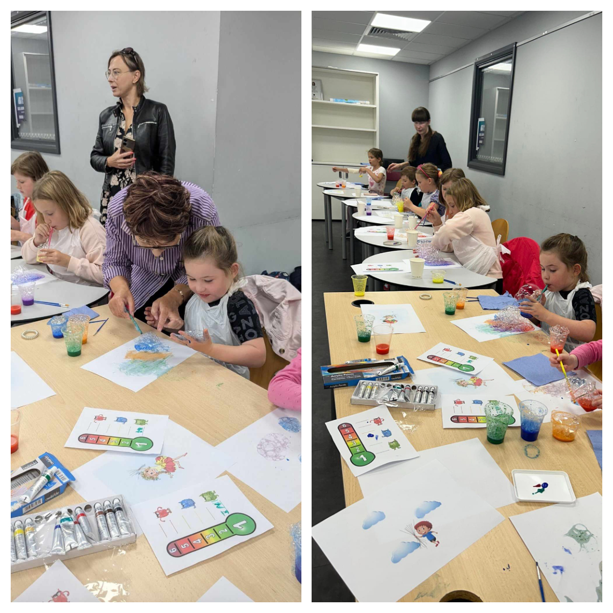
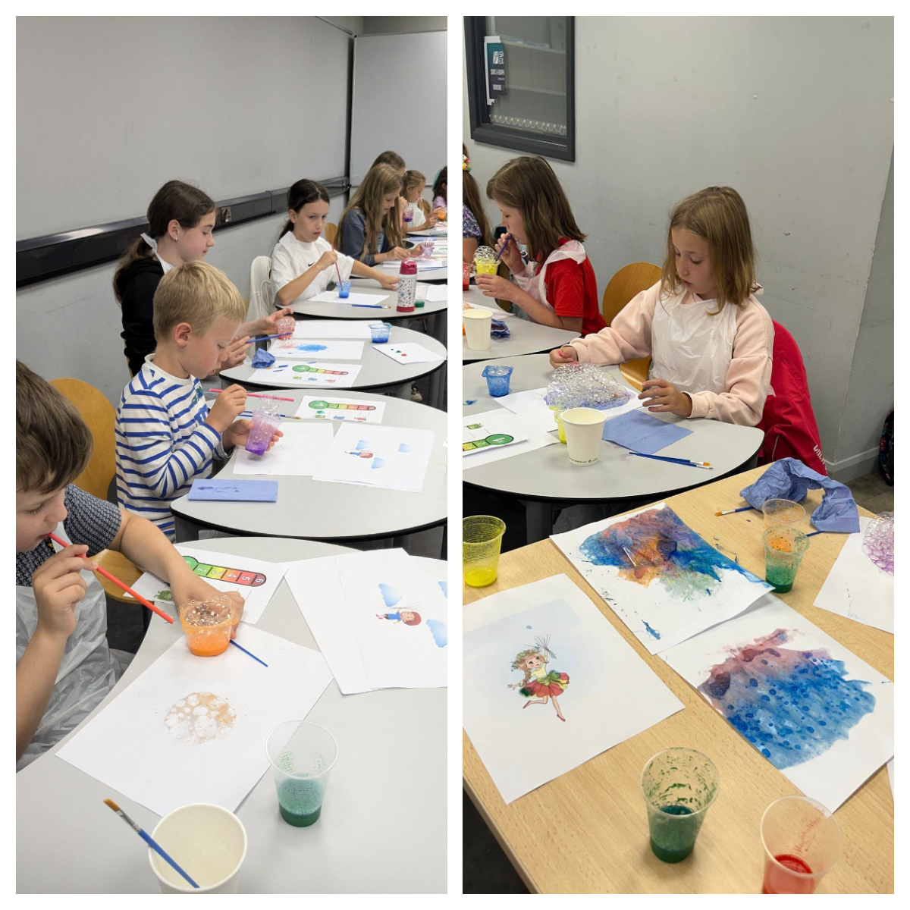

<a href="https://www.facebook.com/groups/601579067497655/" target="_blank">Sunflowers Wales (Соняшники)</a> are very grateful to the wonderful <a href="https://www.facebook.com/svetlana.lanovenko/" target="_blank">Svitlana Kravchenko</a> for the unique bubble art therapy for our children! 

The kids relaxed in a fun and carefree atmosphere, received positive emotions, gained new experiences, brought home their own artworks, and even received certificates! 

We look forward to new meetings with the craftswoman!

