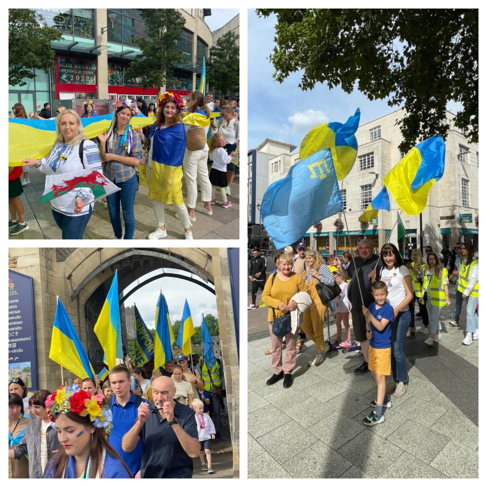
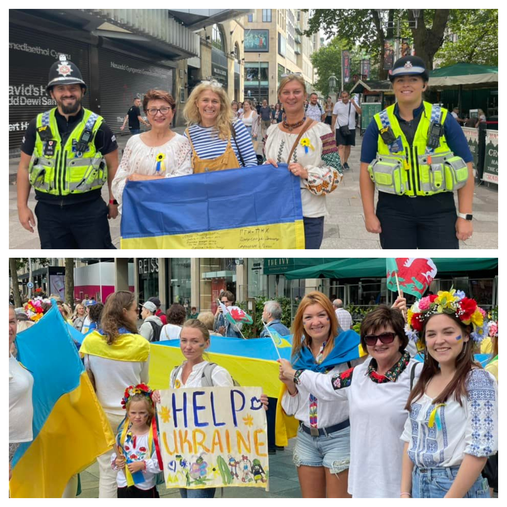
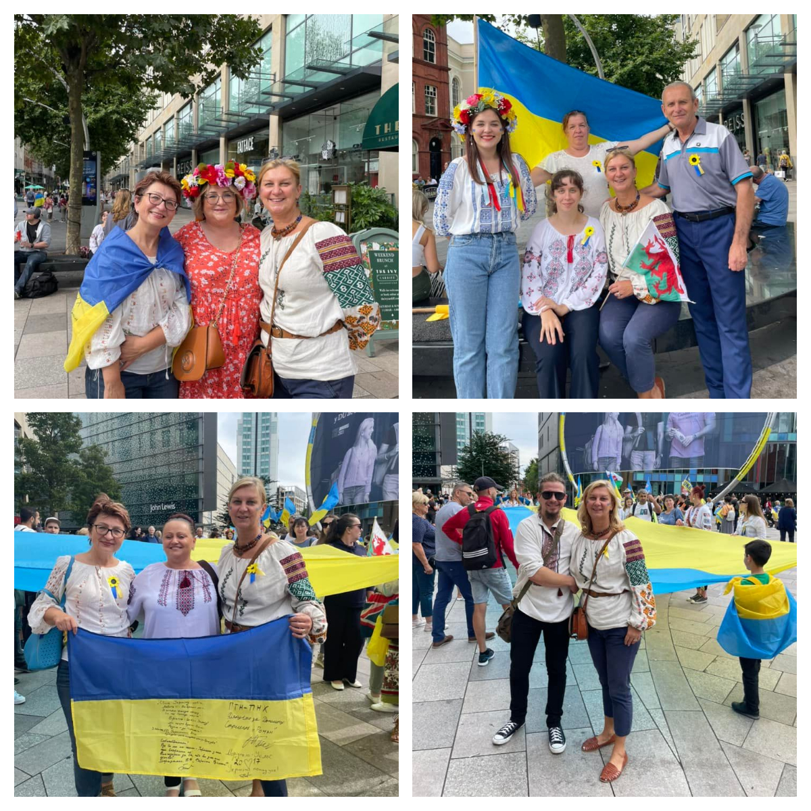
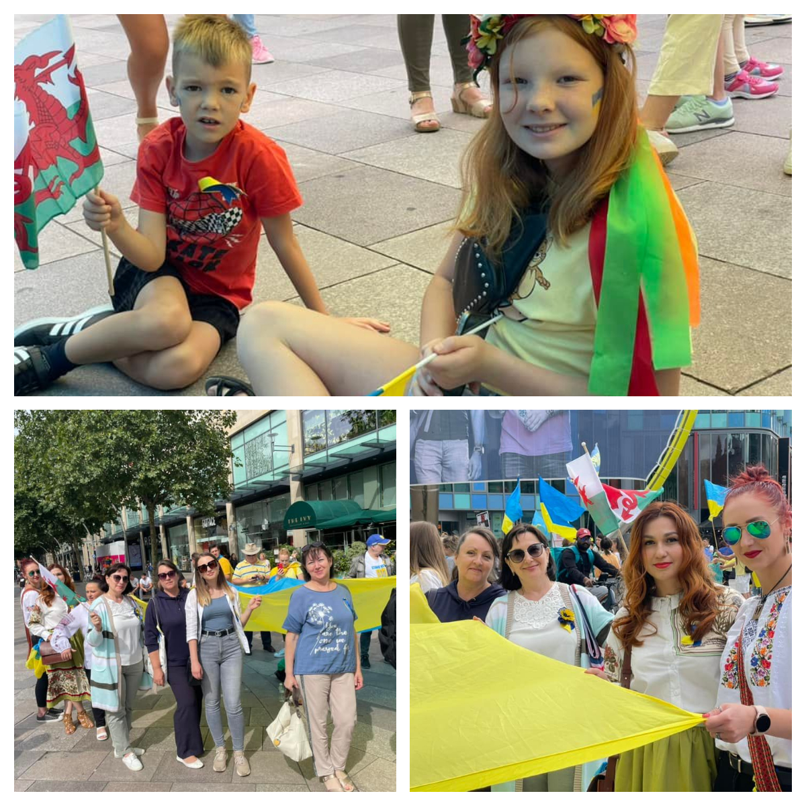

Cardiff Castle was full of blue and yellow flags — Ukrainians marched today in Welsh capital to celebrate Independence day. And of course members of <a href="https://www.facebook.com/groups/601579067497655" target="_blank">Sunflowers Wales (Соняшники)</a> were there too.

More than 500 people took part in march, wearing traditional Ukrainian  shirts, waving Ukrainian  and Welsh National flags, singing patriotic songs.

It was very emotional as people on streets were applauding us, repeating our slogan “Slava Ukraini!”.

Many thanks for the great day of unity to <a href="https://www.facebook.com/groups/509119647453752/" target="_blank">Cardiff For Ukraine</a> group.

Слава Україні!

Героям слава!

Слава Нації! 

Смерть ворогам!

 

