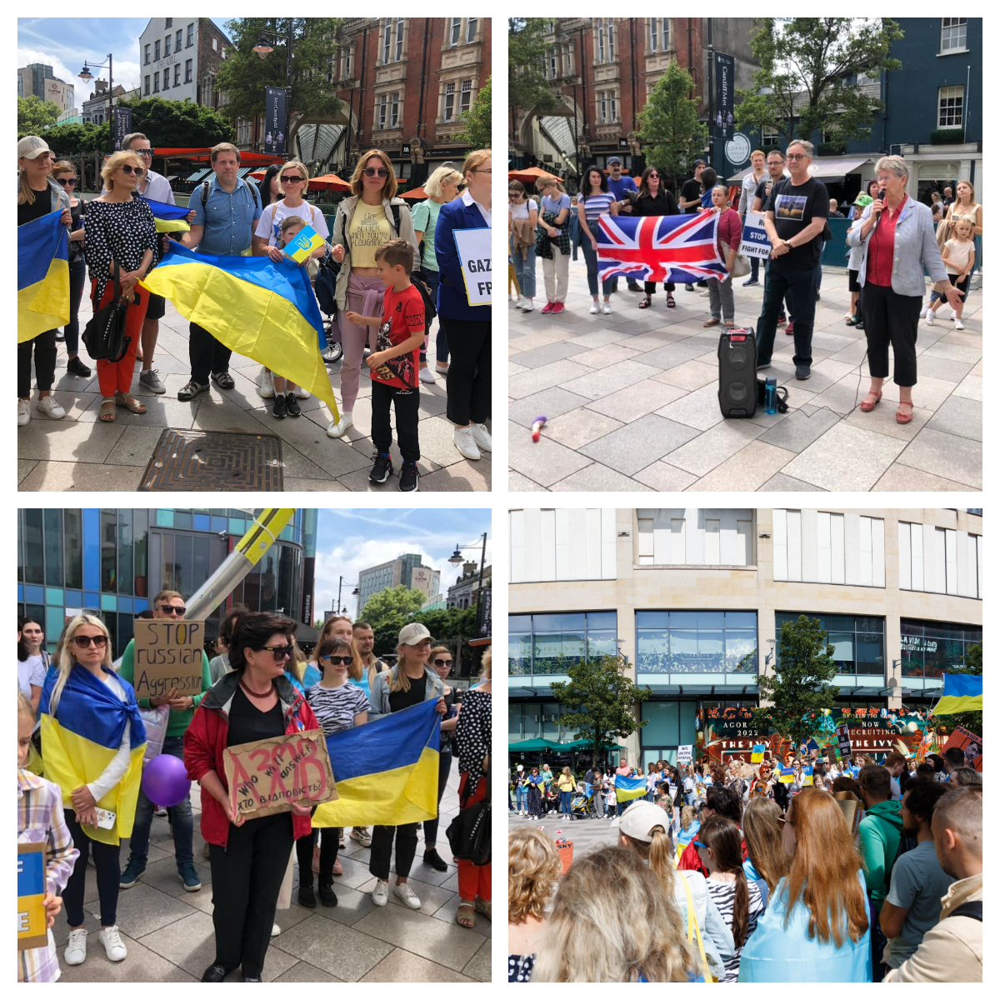
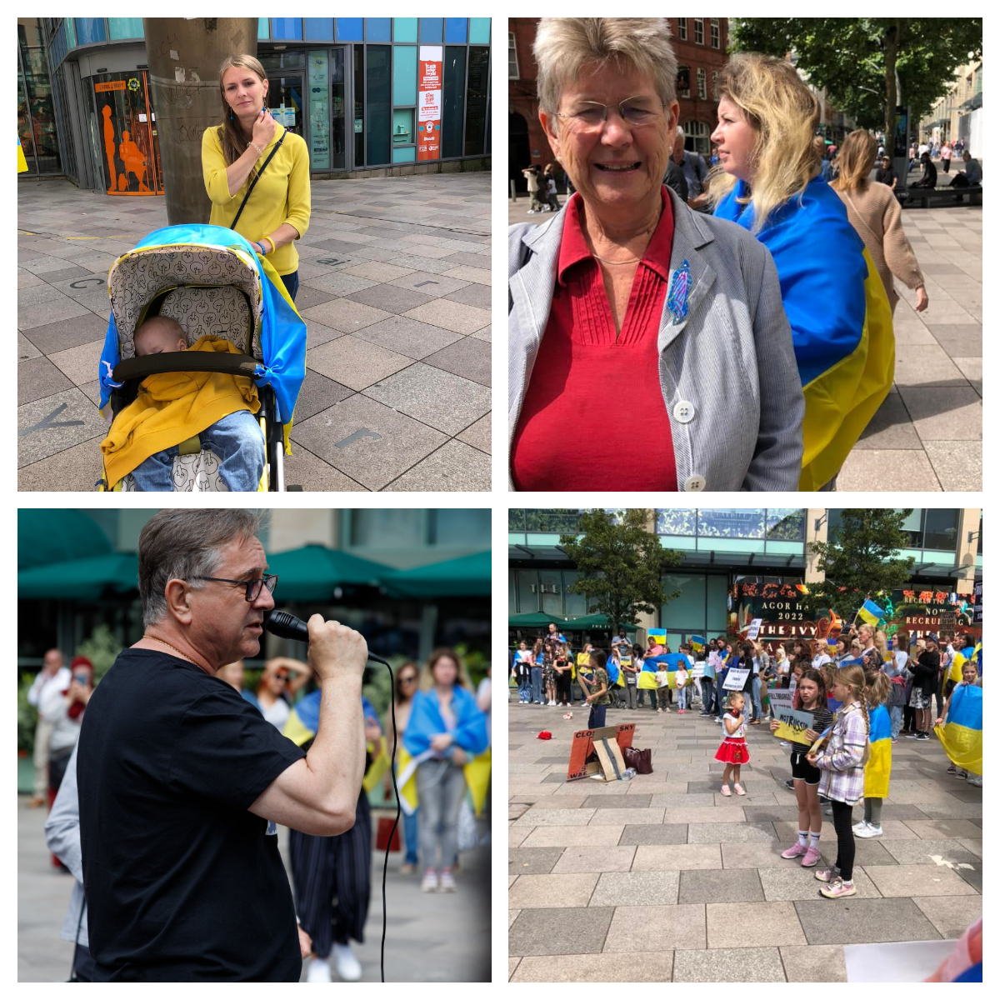
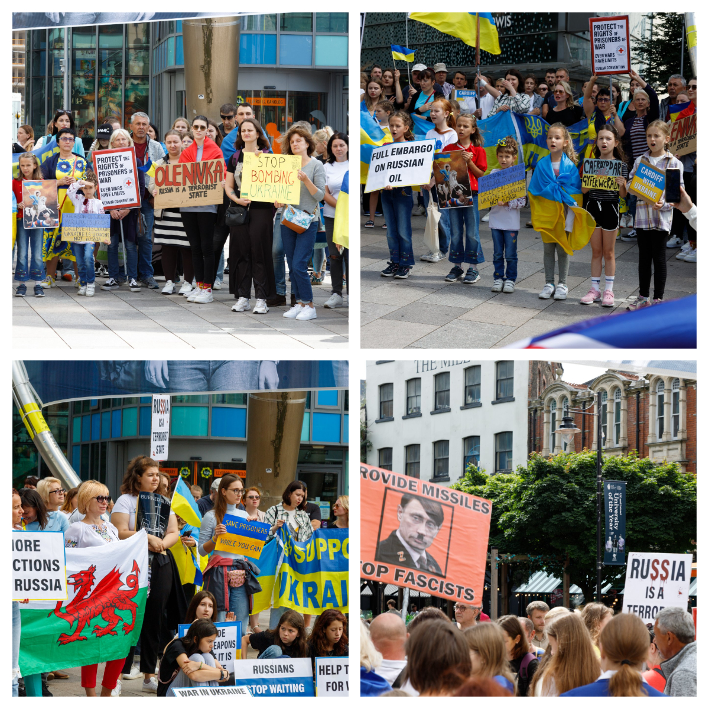
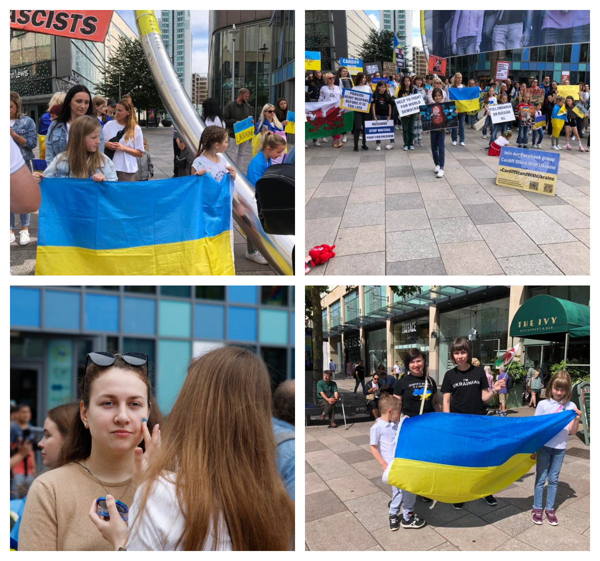

Members of <a href="https://www.facebook.com/groups/601579067497655" target="_blank">Sunflowers Wales (Соняшники)</a> Facebook group joined protest in Cardiff against russian treatment of Ukrainian prisoners of war organised by <a href="https://www.facebook.com/groups/cardiffstandwithukraine/" target="_blank">Cardiff Stand With Ukraine</a> Facebook group. 

There were a number of people, many Ukrainians from different parts of Wales. Among speakers, there were the Counsel General of Wales <a href="https://www.facebook.com/mick.antoniw" target="_blank">Mick Antoniw</a> and the Minister for Social Justice of Wales <a href="https://www.facebook.com/jane.hutt.714" target="_blank">Jane Hutt</a>.

