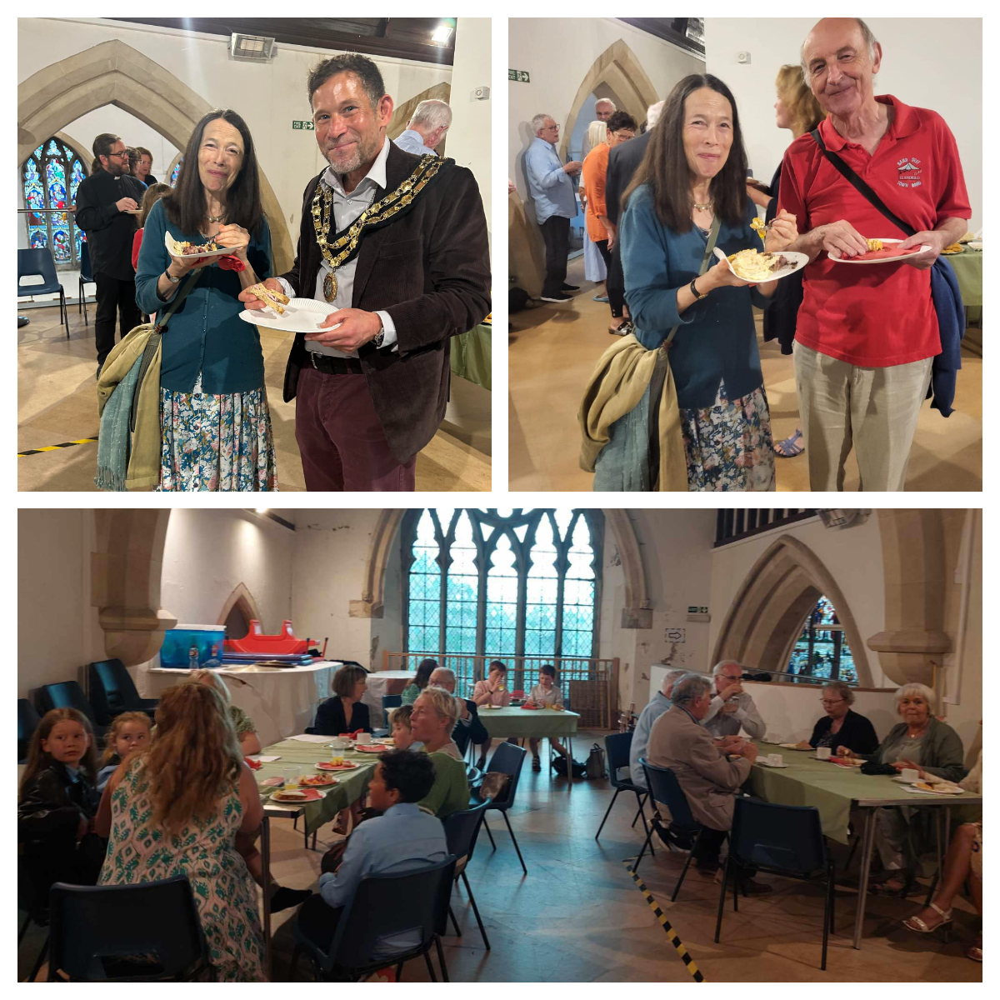

Sunflowers Wales team was honoured to be invited to the <a href="https://www.facebook.com/christophffischer/posts/pfbid02tkeevb59NN6cxvcC5g9sUZa2rLMcvy33ZAVK1Z52QY4NwG5bRN4heR9uKj1R5q9Ul" target="_blank">Civic Thanksgiving Service</a> in St Teilo's Church, Llandeilo. 

It was a beautiful event connecting the proud past of the site that goes back to the 6th century with the present of the great people who help the community and with the future presented by amazing and talented kids who performed touching music and singing.

Many thanks to <a href="https://www.facebook.com/christophffischer" target="_blank">Christoph Fischer</a> for the invitation! We are so proud to be named a mayor's charity! We have received over £300 of donations!

Thank you to all who made this event happen!

And many thanks to Irina Chaus, Victoria Pavliichuk, Christina Evans, and Christina Zaluc'ka  for the tasty cakes, all the guests were really amazed!

 

