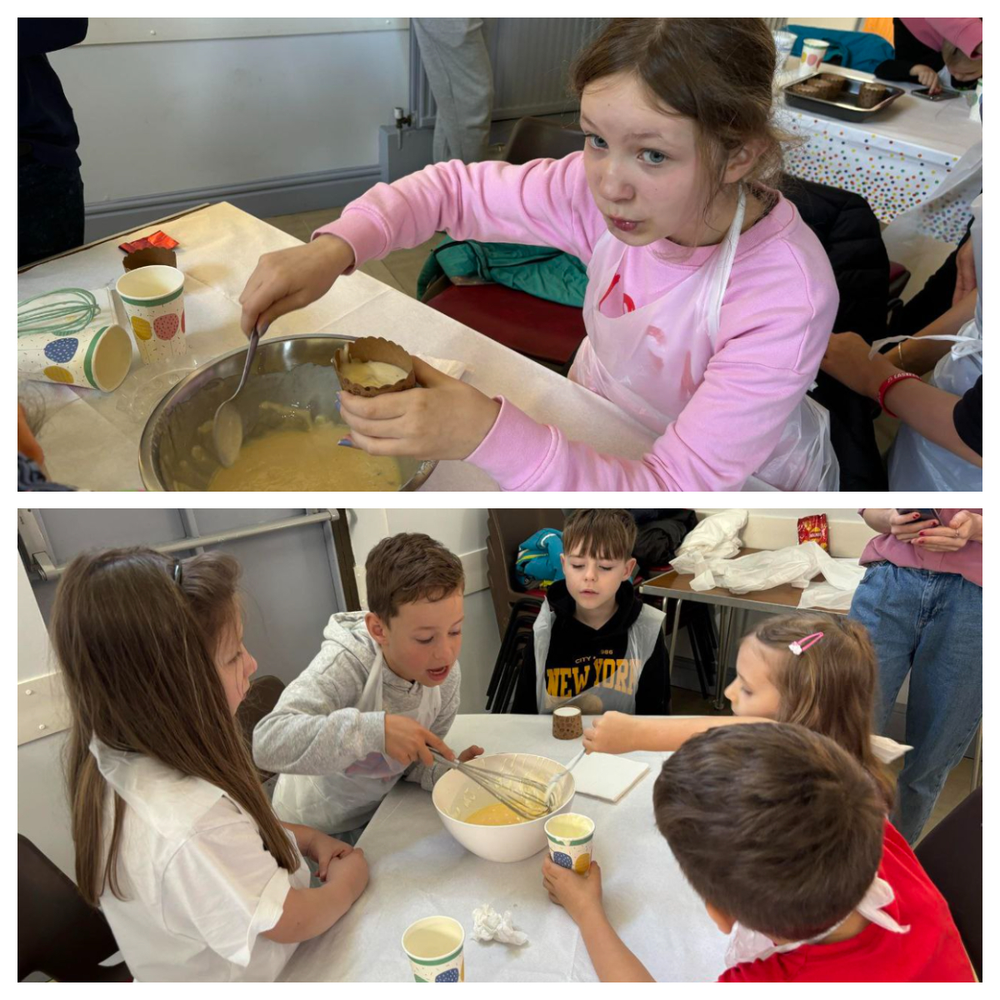
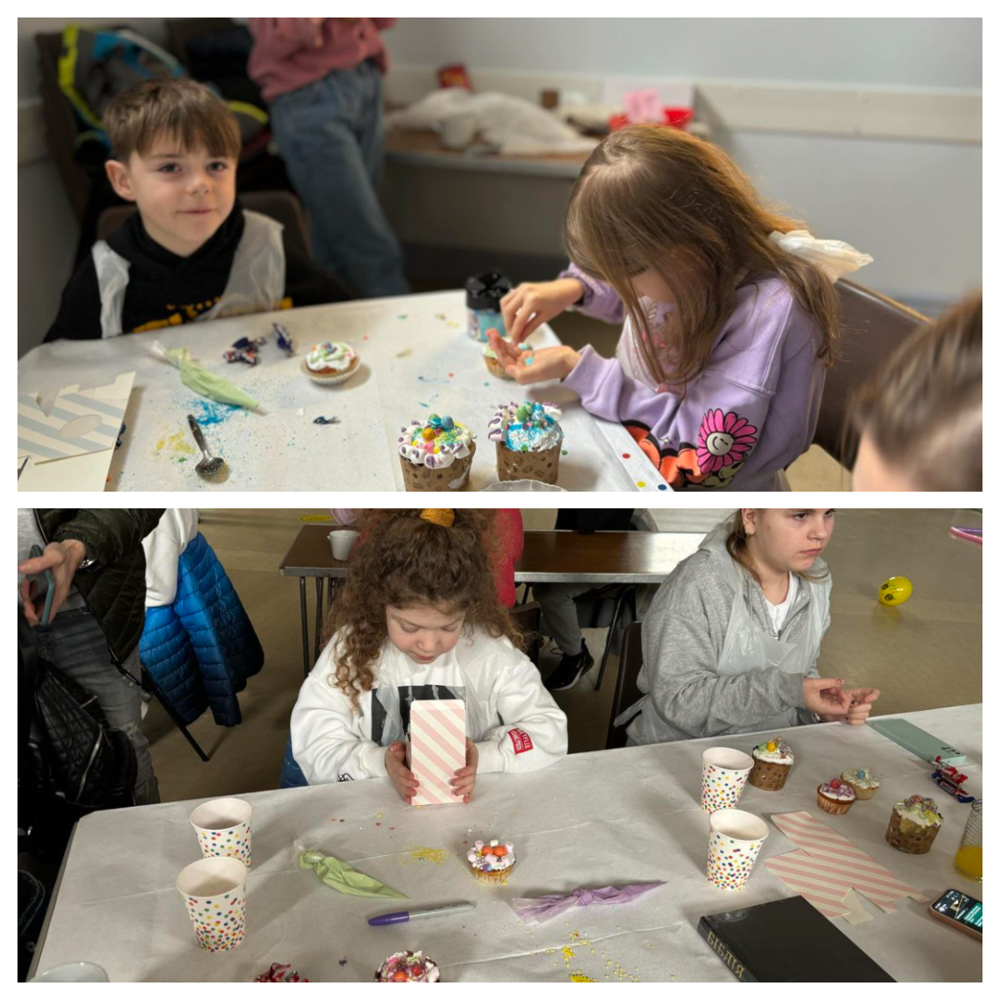
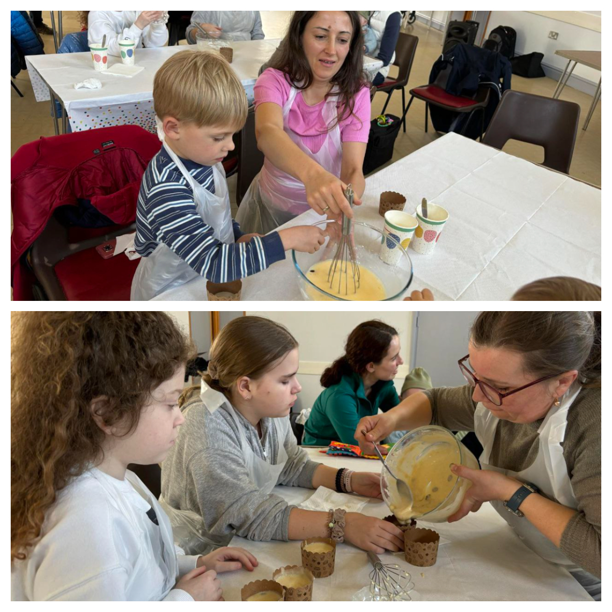
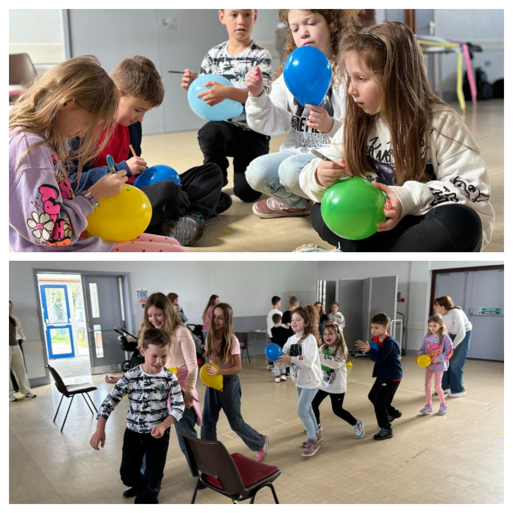
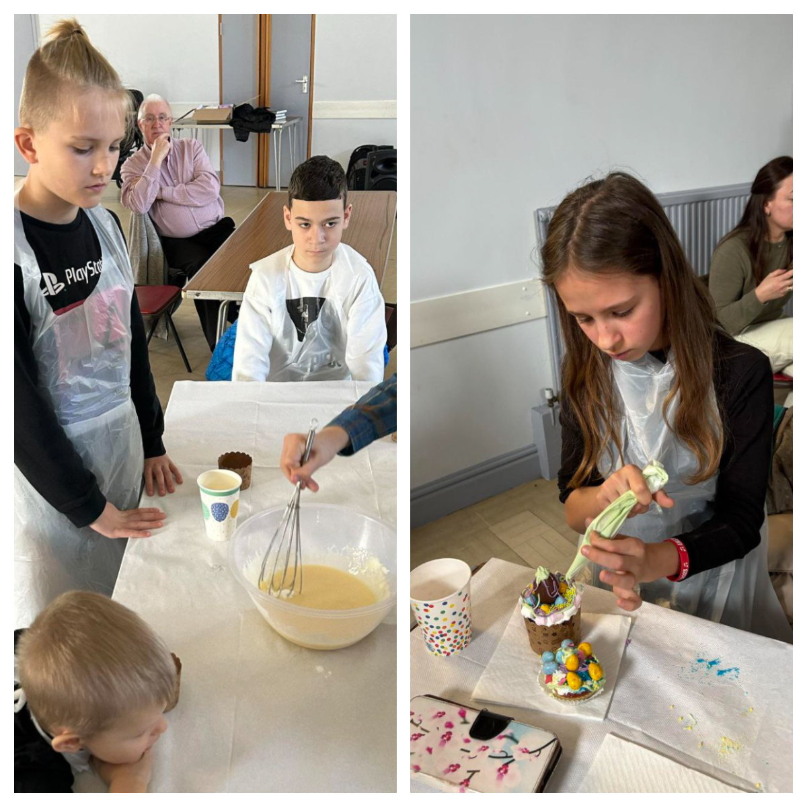
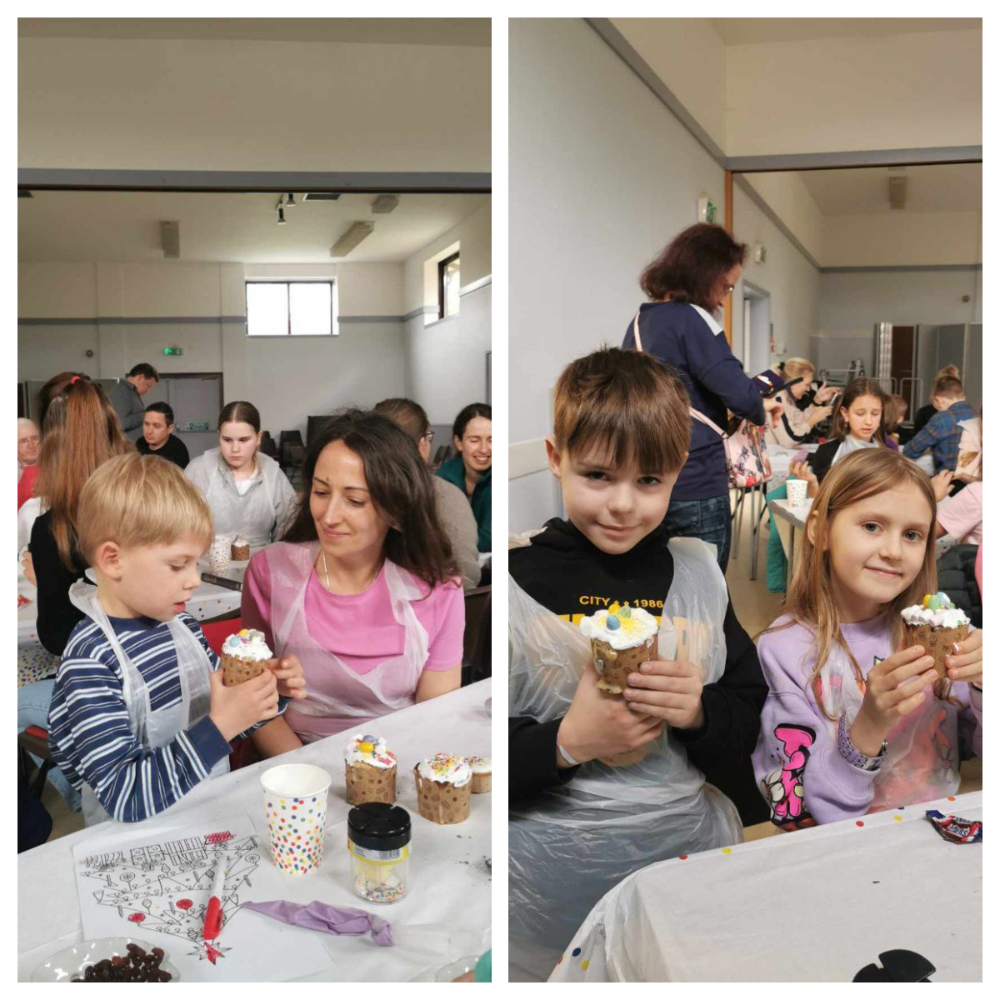
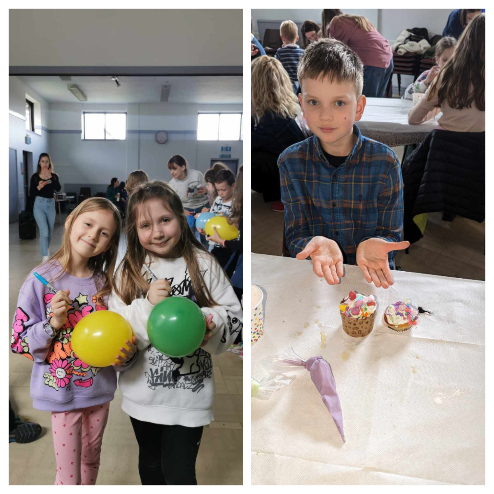
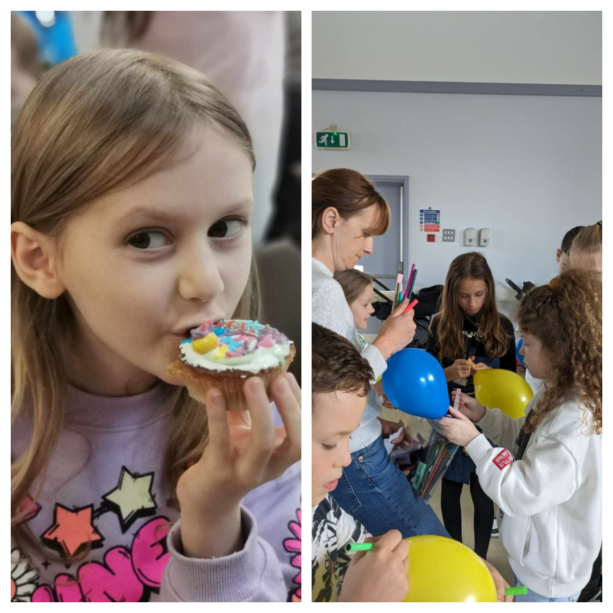
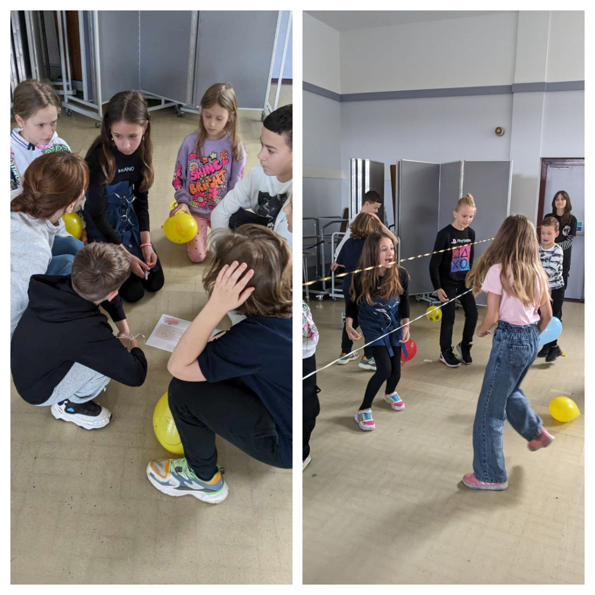
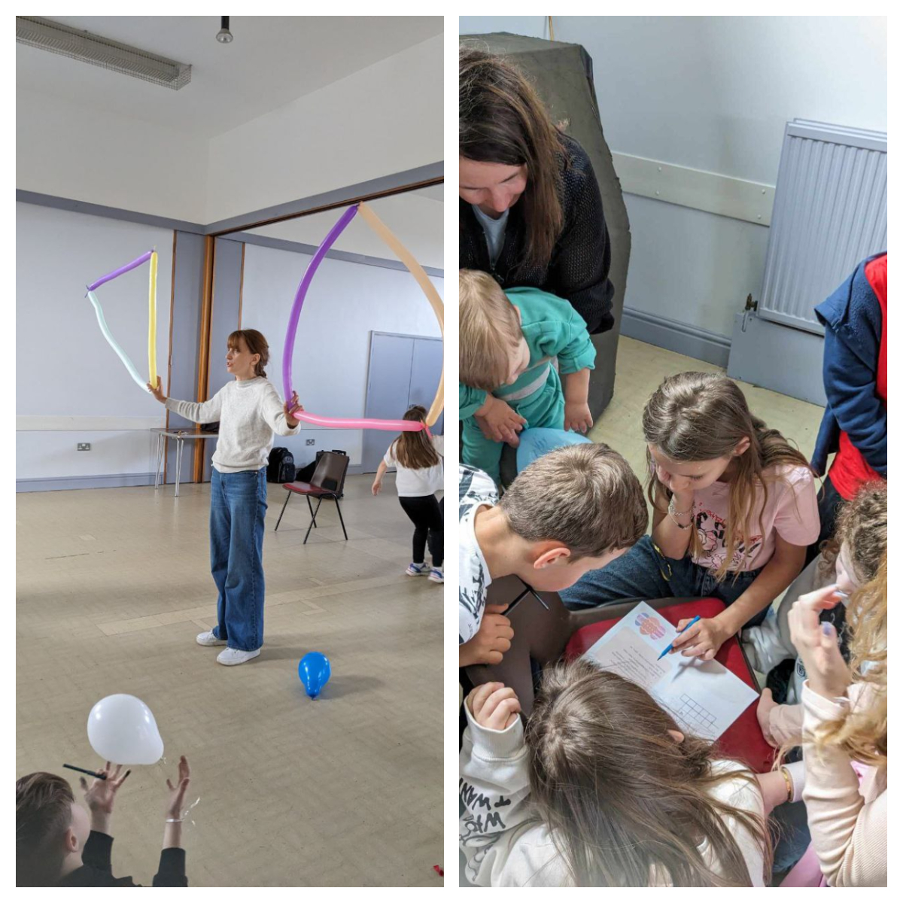

It was very nice to meet again at our Cooking Class!

It seems all the kids were pleased both with making Easter cakes and with the entertainment.

And the parents had a good opportunity to socialize – so, everything we planned came true! 🙂

Many thanks to <a href="https://www.facebook.com/groups/601579067497655/user/100065221683874/" target="_blank">Tetiana Yefimova</a> for conducting the cooking class and organizing competitions for the children, everything was incredible!!!

And of course, thanks to everyone who came! As always, your donations will be used to purchase medical supplies for the Armed Forces of Ukraine!

Stay with us, don't switch off – more to come! 🙂

