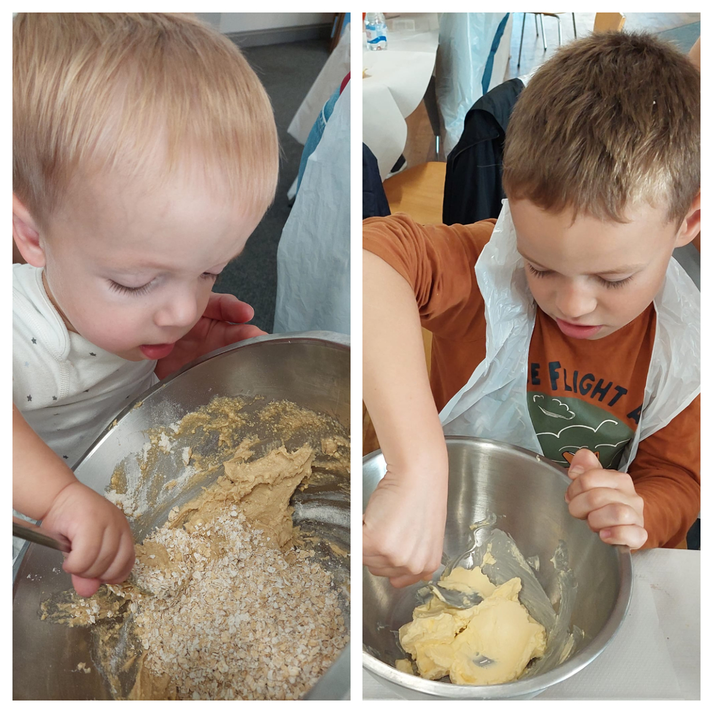
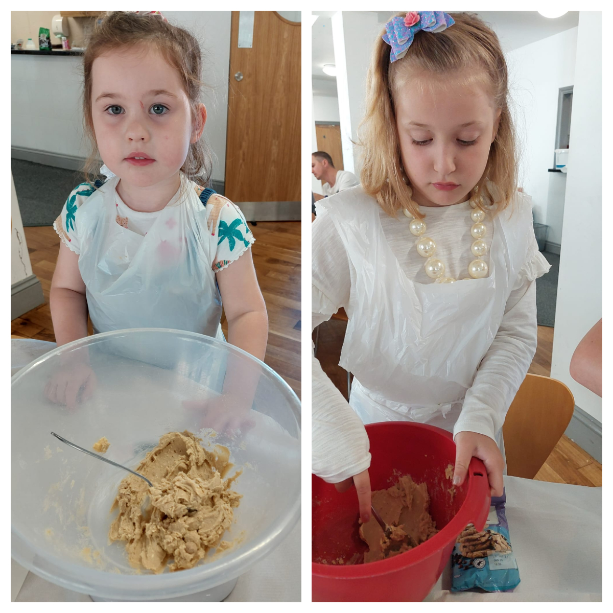
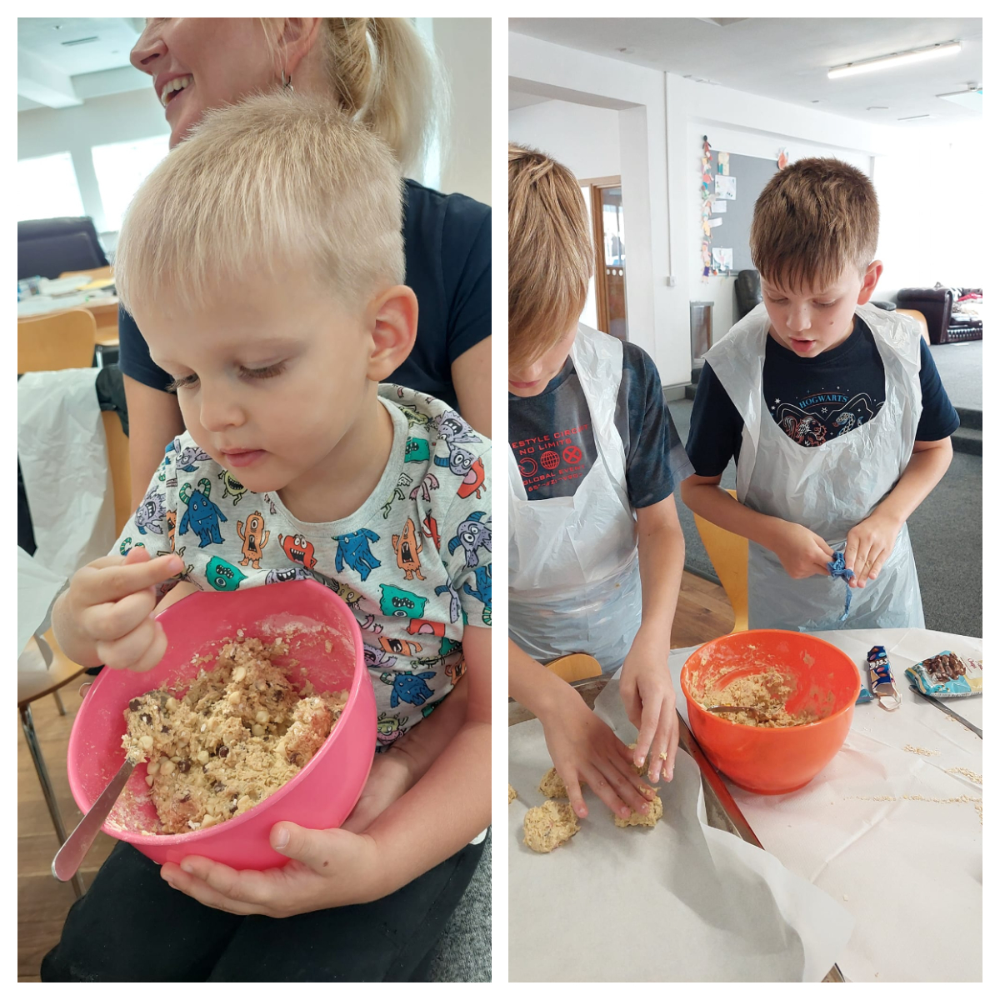
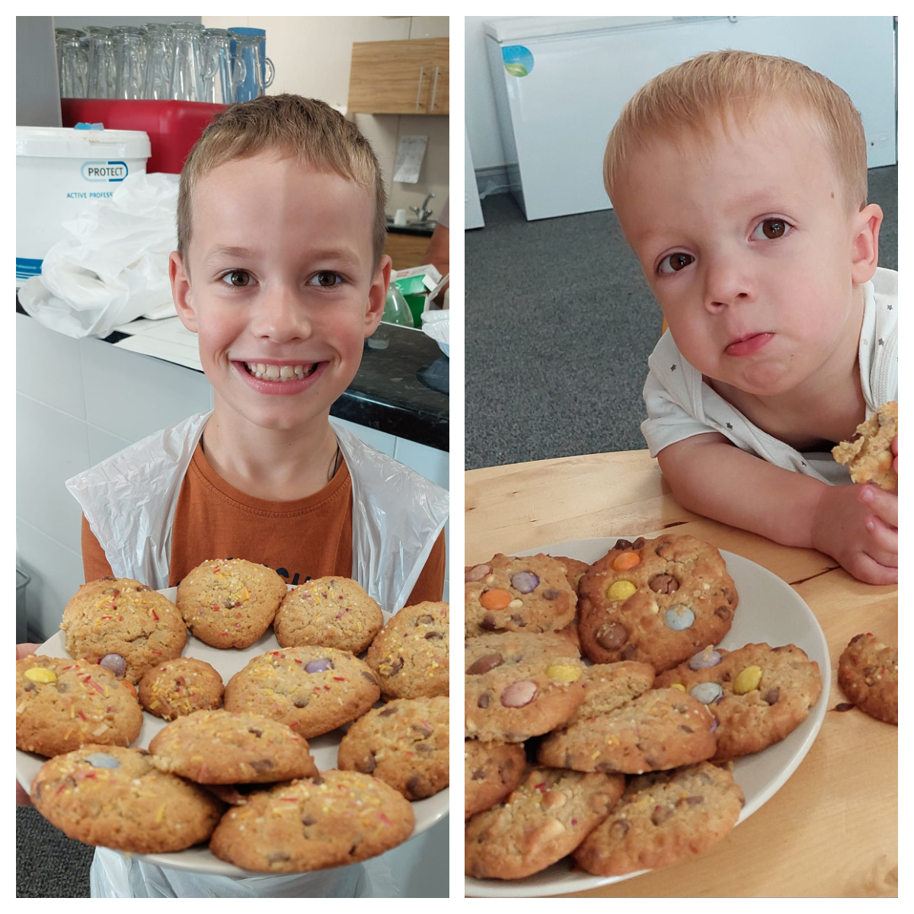
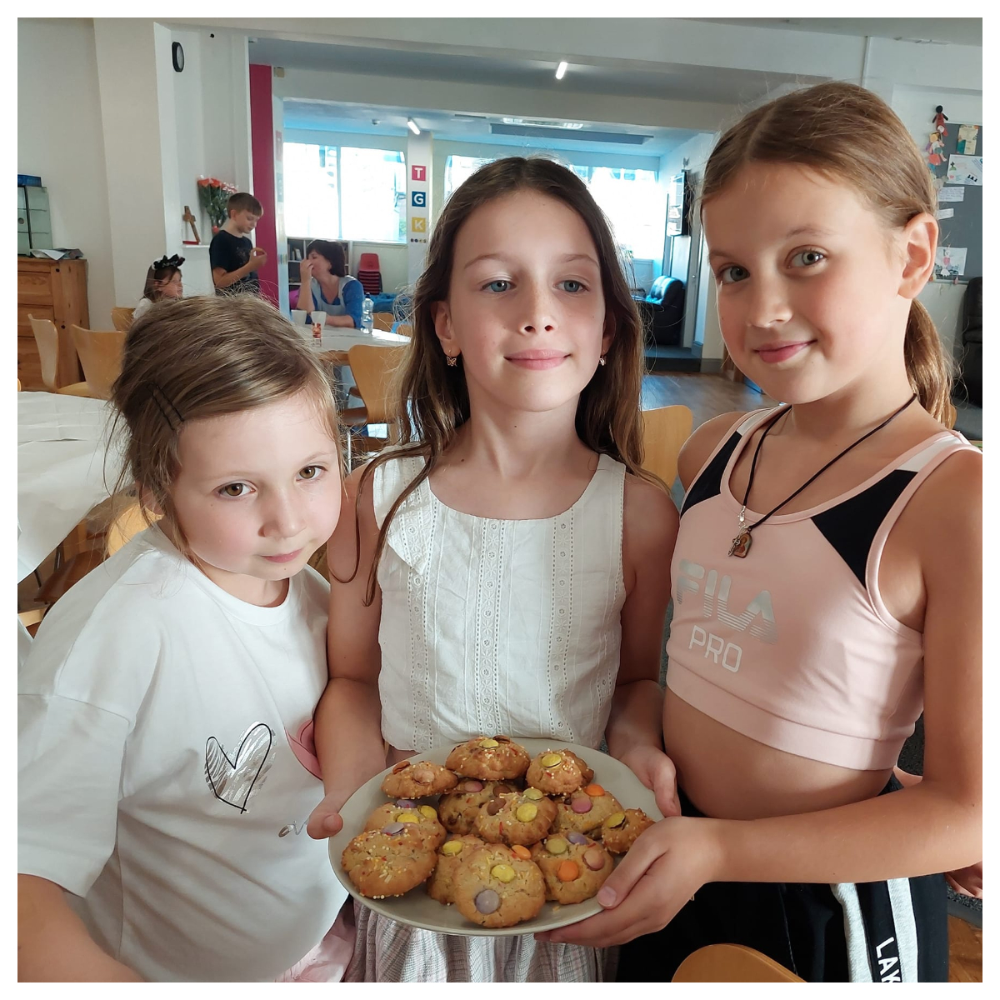
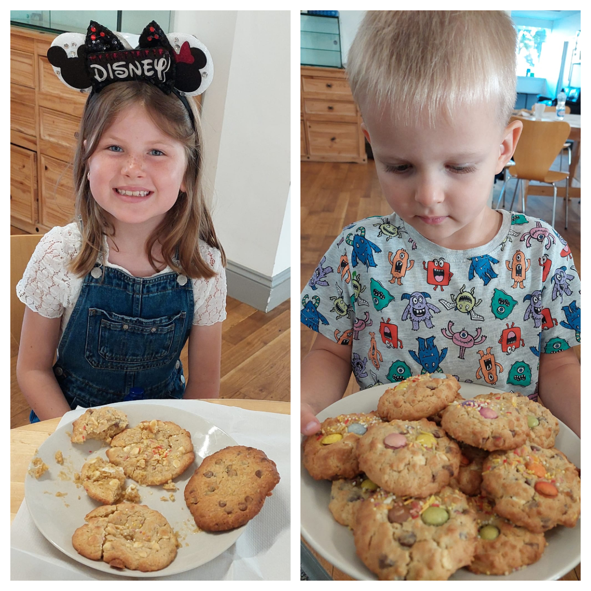
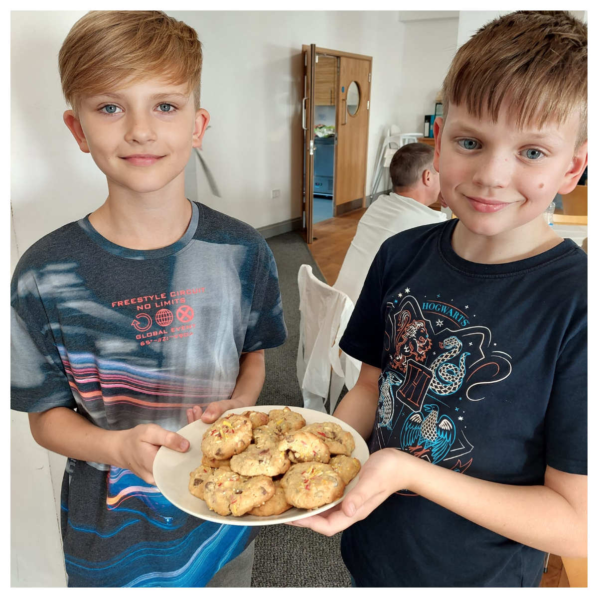
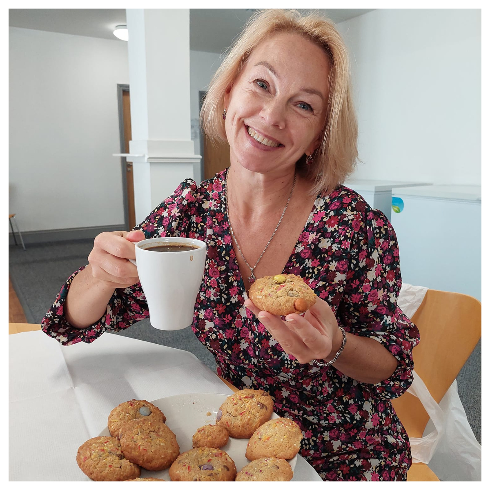

"Making cookies for school together" by Sunflowers Wales.

A good start to the school year!

The tastiest cookies are those made with your own hands, and the most valuable are those made by your own child!

At work and in a friendly atmosphere - time flew by imperceptibly!

Thank you to everyone who came to cook goodies!

It was good – and not for the last time!

Stay with us, don't switch – it's always interesting with us. 🙂

