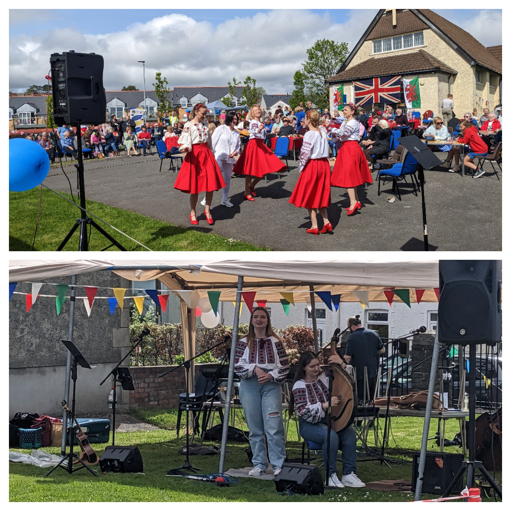

**On the first day of the Coronation** (6/05/23), <a href="https://www.facebook.com/groups/601579067497655" target="_blank">Sunflowers Wales (Соняшники)</a> joined <a href="https://www.facebook.com/standwithukraine.cardiff" target="_blank"> Stand With Ukraine Cardiff</a> for the traditional Saturday meeting which was partially devoted to the Coronation event.

We brought to Cardiff, on top of good weather, our amazing dancing group <a href="https://localgiving.org/charity/sunflowers-wales/project/dancing/" target="_blank">Sunflowers</a> and a beautiful duet of bandura players and singers.  Many thanks to everyone who came along to support us!

**On the second day of the Coronation** (7/05/23), <a href="https://www.facebook.com/groups/601579067497655" target="_blank">Sunflowers Wales (Соняшники)</a> participated in Musical Feast at <a href="https://www.skettycommunitychurch.com/" target="_blank">Sketty Community Church</a>. 

It was a really wonderful day, sunny, with a friendly atmosphere and lovely people who warmly welcomed our dances, music, and singing. It was nice to meet our good friends from <a href="https://www.facebook.com/groups/httpsjohnfryphoto.wixsite.comswanseaukuleleclu/" target="_blank">Rockerleles Band</a> who play rock-n-roll with so great inspiration that it was just impossible to do not start dancing 😀

Thank you Sketty Community Church for the invitation and the possibility for future cooperation!

**On the third day of the Coronation** (8/05/23), the Welsh weather reminded about itself, however, this has not scared the dancers from <a href="https://www.facebook.com/groups/601579067497655" target="_blank">Sunflowers Wales (Соняшники)</a> nor the Lord Lieutenant of West Glamorgan, Mrs Louise Fleet! 

The atmosphere of the Coronation Afternoon Tea, organised by the <a href="https://www.mumbles.gov.uk/" target="_blank"> Mumbles Community Council</a> at the wonderful Clyne Gardens, was absolutely amazing and people warmly welcomed us! 

Adults and children, who participated in the Crown Competition, danced for us, and birds sang for us 😍.
Many thanks for the kind invitation!

Glory to Ukraine!

Glory to the Heroes!

Sunflowers Wales - Standing Strong Together!

