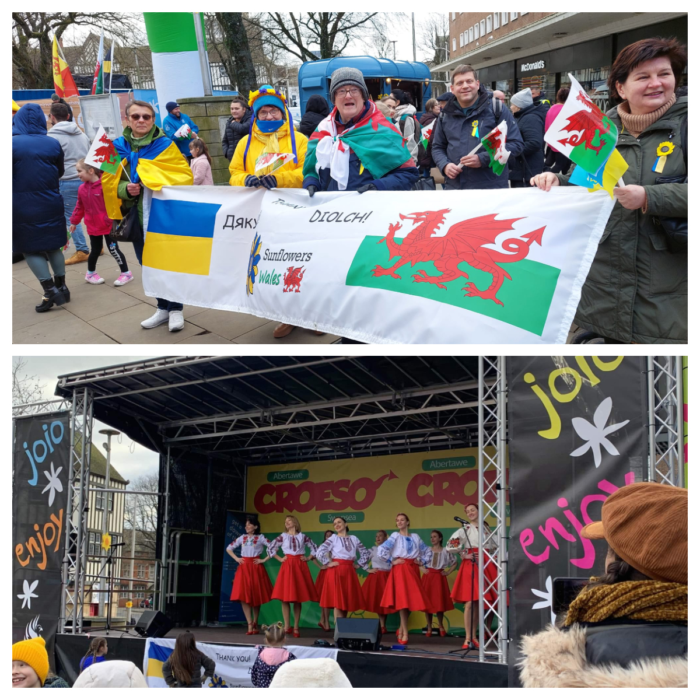
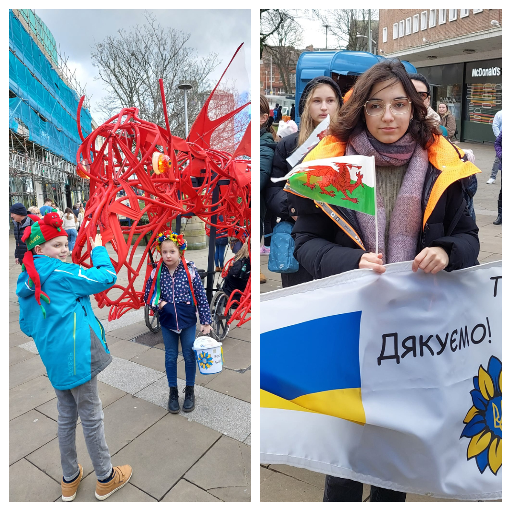
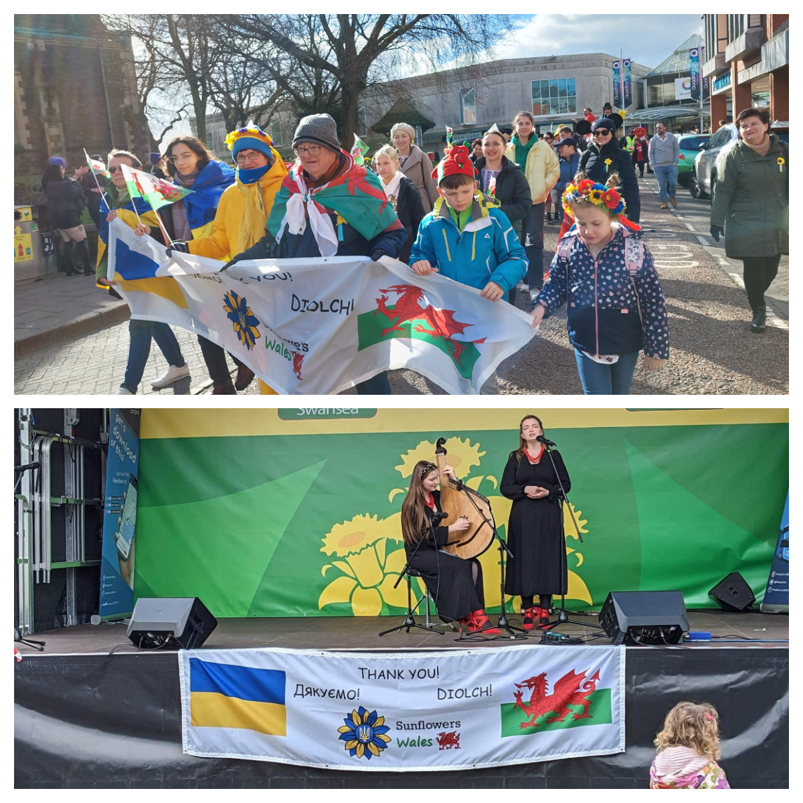
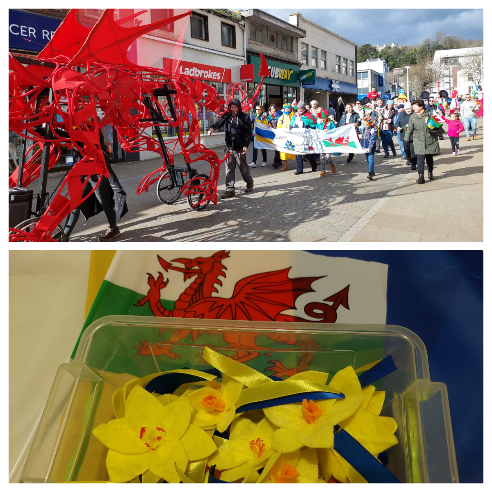

<a href="https://www.facebook.com/groups/601579067497655" target="_blank">Sunflowers Wales (Соняшники)</a> took part in the celebration of St. David's day in the course of Croeso Festival in Swansea. We joined the parade and made performance at the concert!

It was our gratitude to the Welsh people for their hospitallity and support! 
Hir oes Cymru! 

Many thanks to all Ukrainians who joined us at the parade and suppoprted our performance!
Together we are strong!

Many thanks to our little suns — Vlad, Lidia, Oleksandra, Milana, and Alisa, — who sold daffodils, collected donations and distributed our flyers! Overall they have collected £150. 

