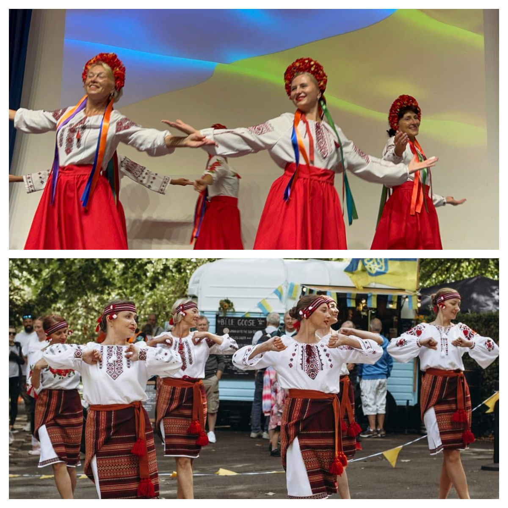
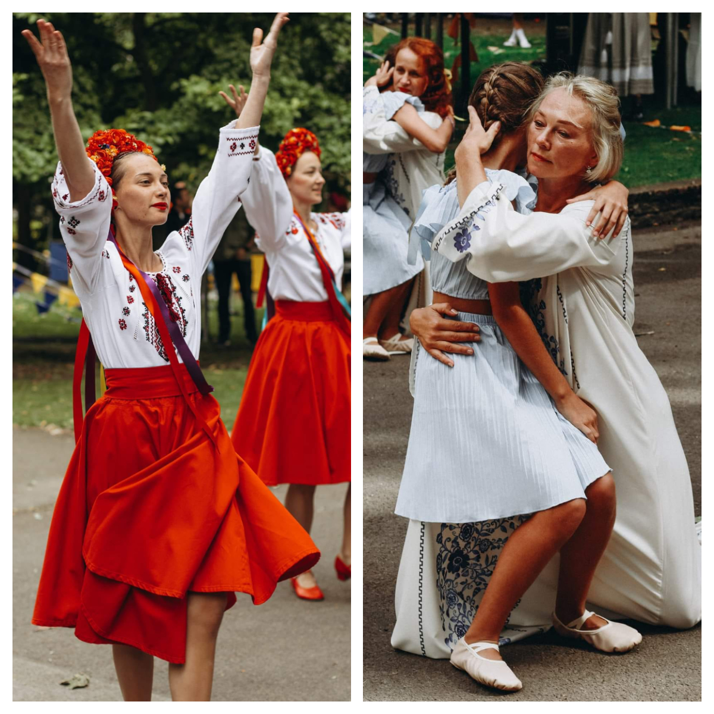
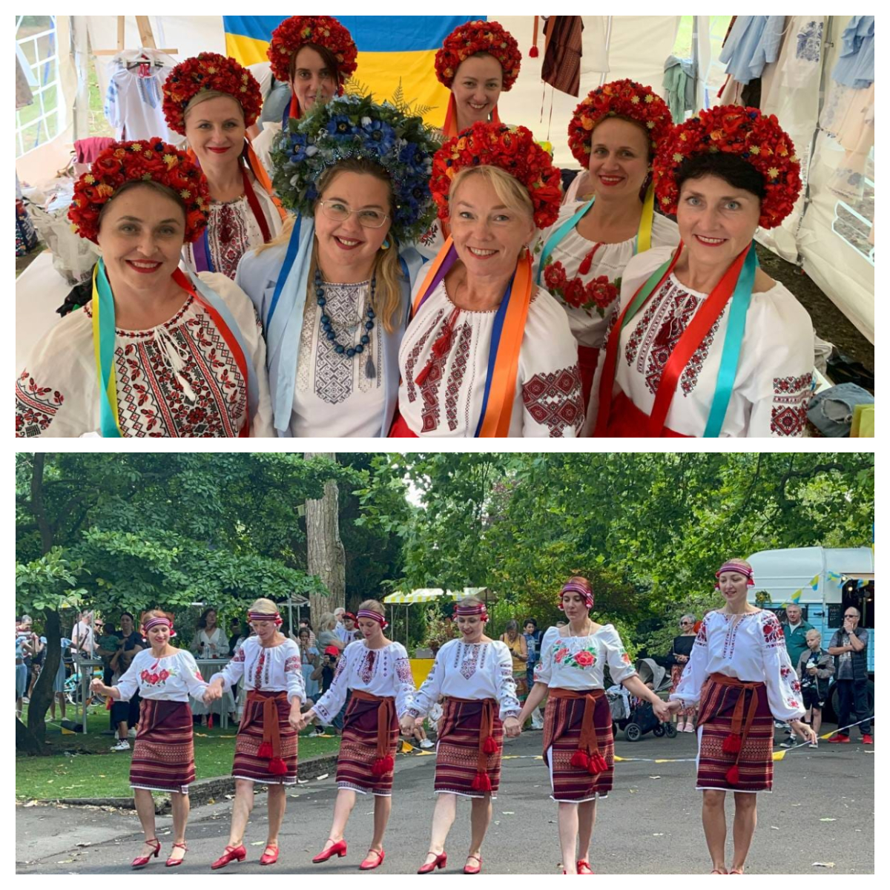
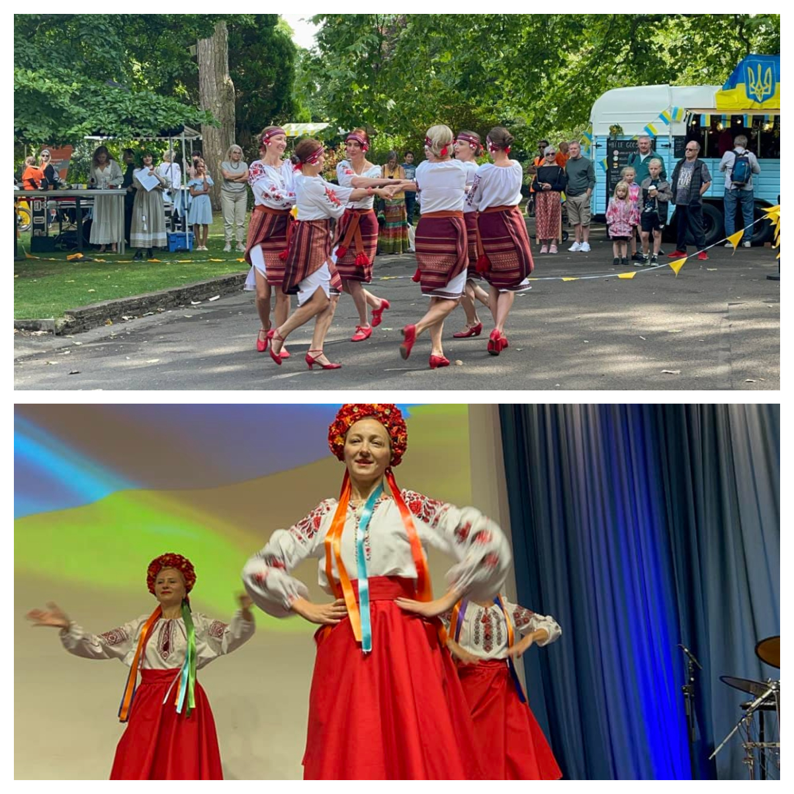
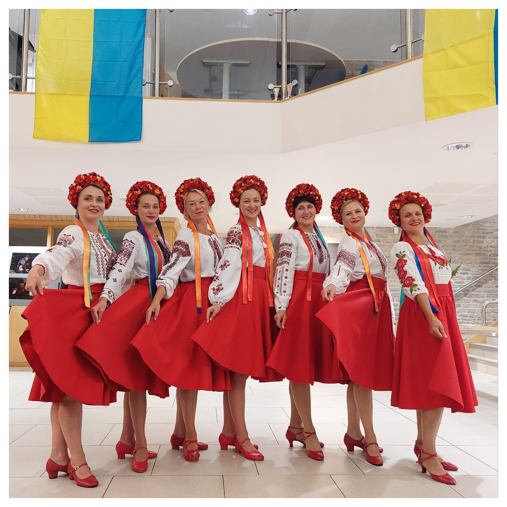
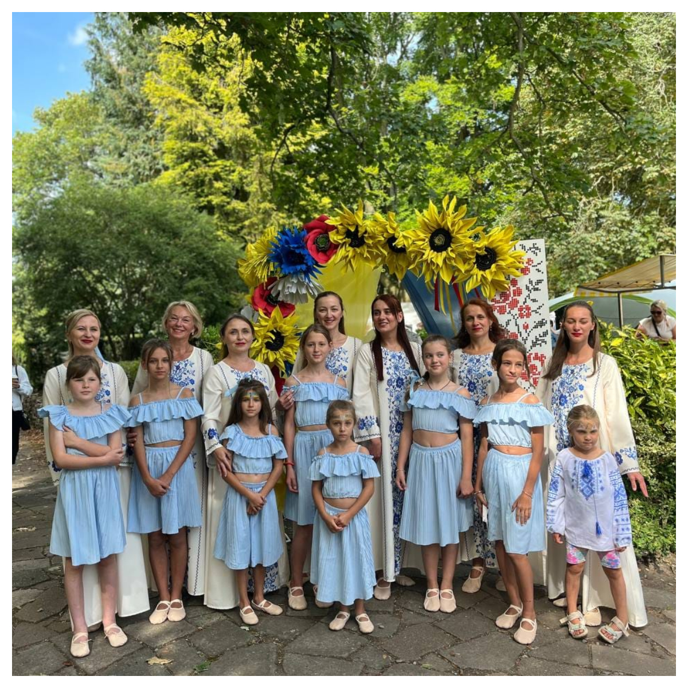
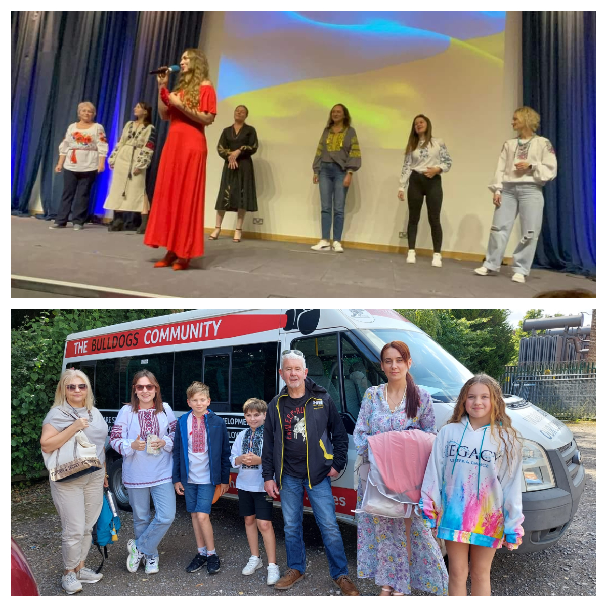
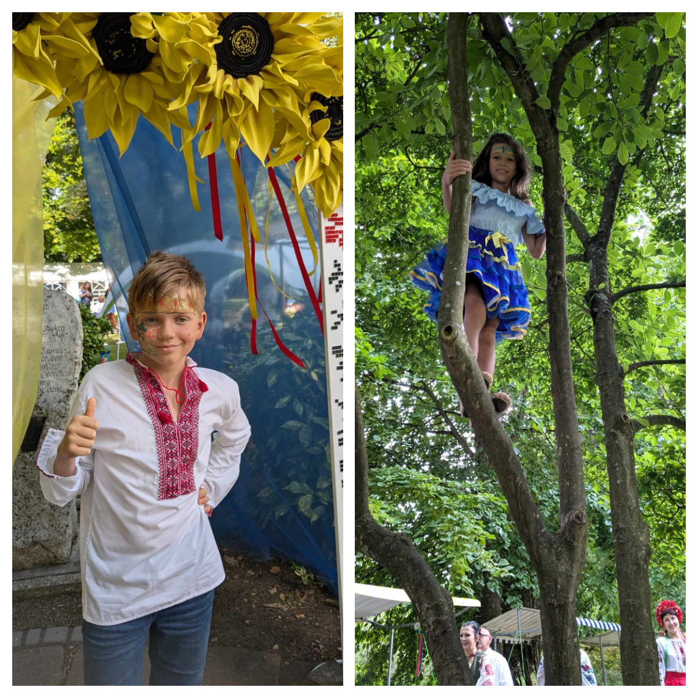

Ukrainians start celebrating Ukraine's Independence Day a couple of days in advance. Our dance group "Sunflowers" has already been on tour for two consecutive days. 

On August 22, we were warmly welcomed in Bristol, where we performed at the invitation of the local Ukrainian community. We greatly appreciate the opportunity to be part of the festivities, thanks to the incredible efforts of the organizers, who took care of the performance, transportation, and even accommodations for our dancers and their children. 

Thank you! 

And the borscht, varenyky, and nalysnyky after the concert left no one indifferent!

The Sunflowers dance group celebrated Flag Day even farther from our home in Swansea, but together with many other talented Ukrainians. 

The Ukrainian festival in Swindon, **Swindon Welcomes Ukraine**, gathered a vast array of talented Ukrainian groups and performers, creating a cosy and warm atmosphere for all its participants and guests.

Lively dances, folk songs, famous Ukrainian melodies, and touching moments of the event were skilfully combined by the hosts and complemented by the aromas of Ukrainian (and other) delicacies, coffee, and the creative spark of masterclasses.

We sincerely thank the organizers for the invitation and for the warmth with which we were welcomed! Six hours flew by almost unnoticed. Why almost? Because they passed quickly but left behind unforgettable memories and emotions.

It was an honour to be with you!

