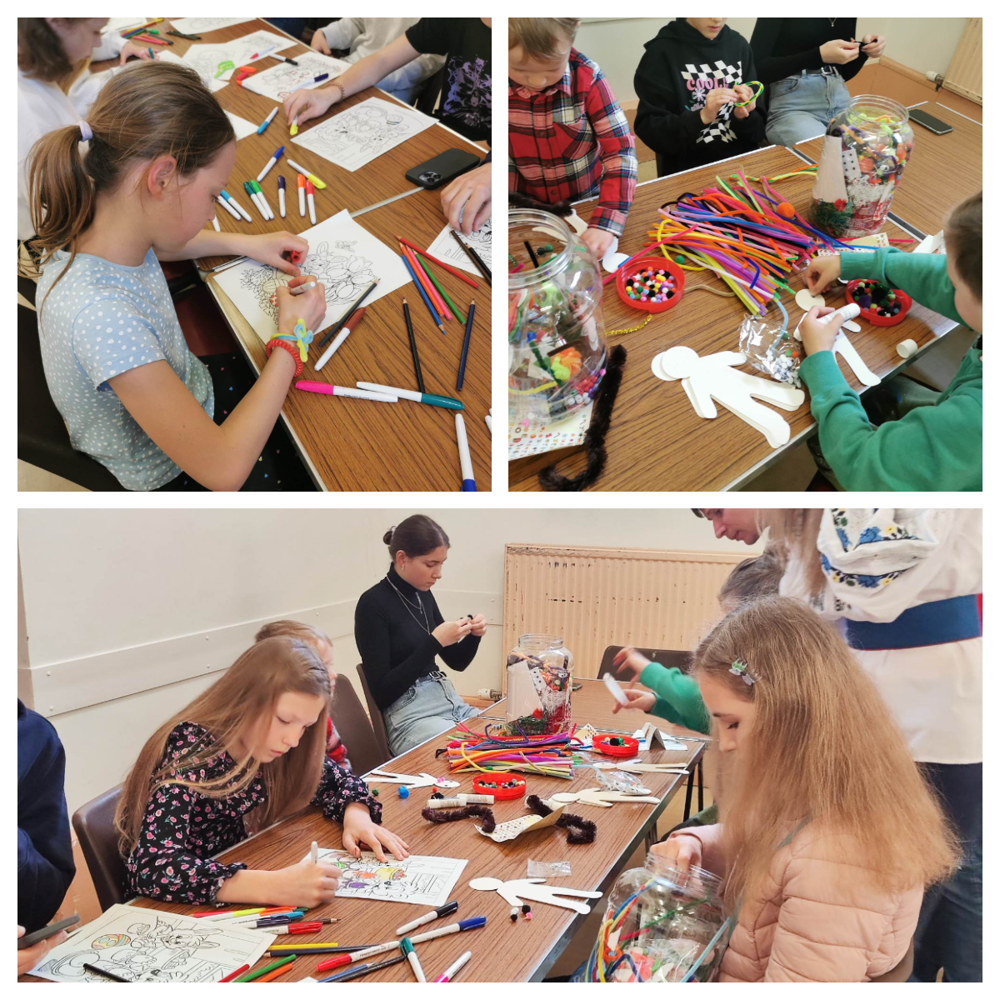
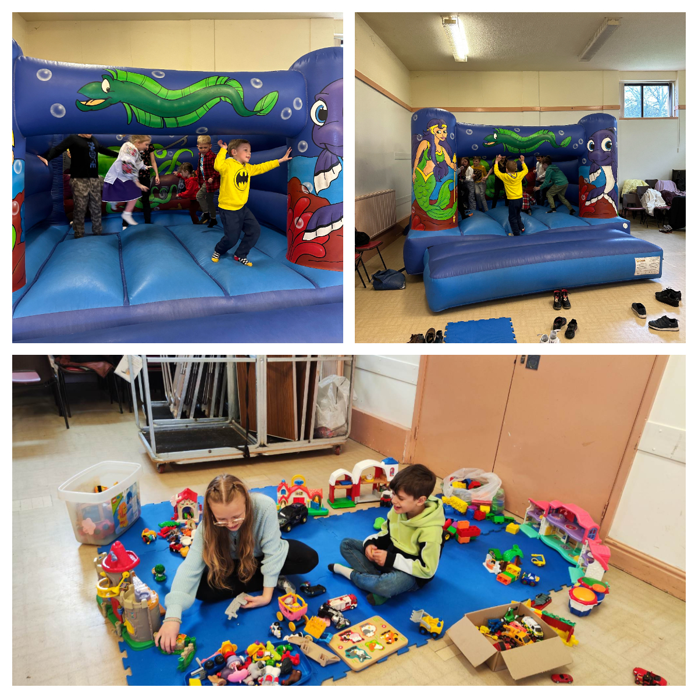
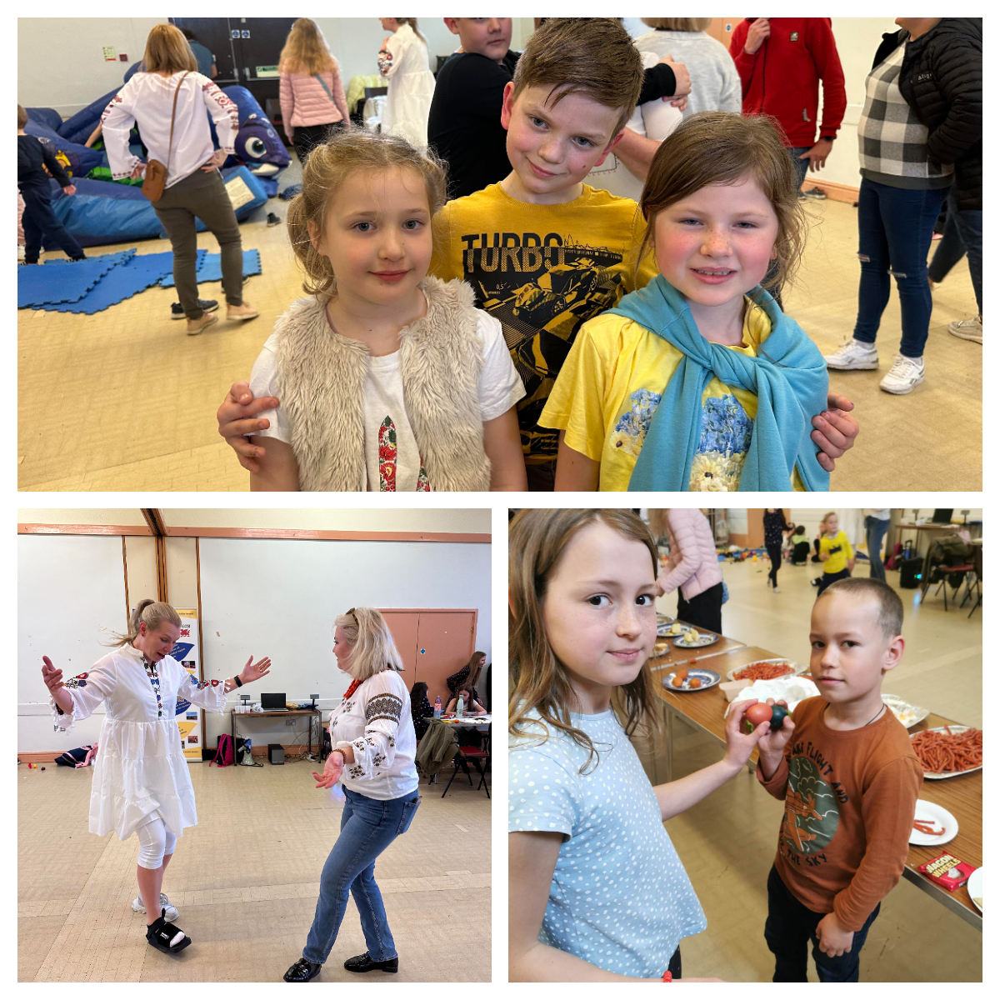
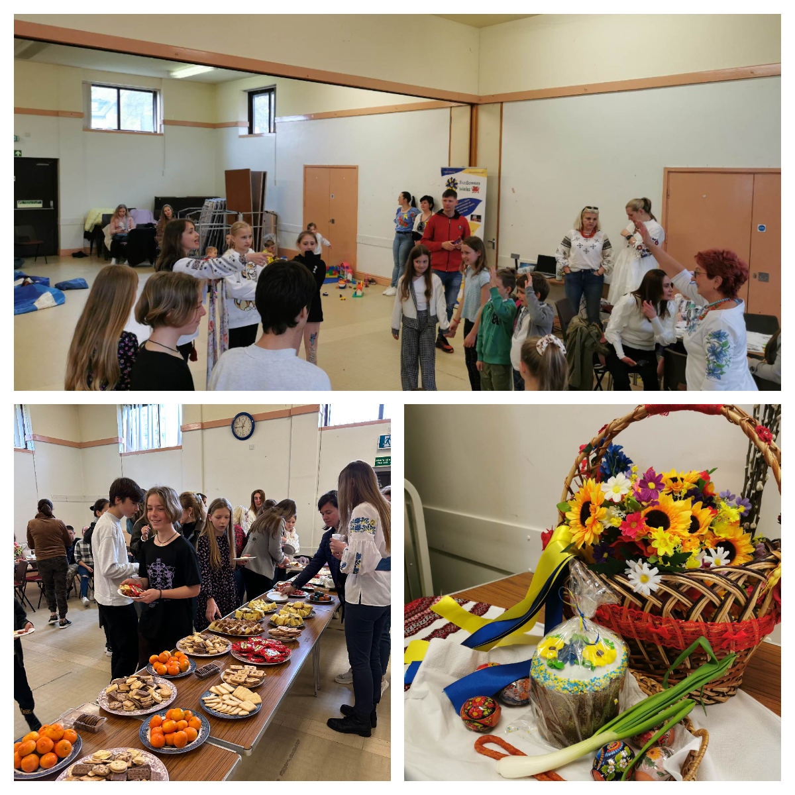

Ukrainian children and their parents from <a href="https://www.facebook.com/groups/601579067497655" target="_blank">Sunflowers Wales (Соняшники)</a>  had an amazing day at the Sketty Park Community Centre celebrating our Easter! 

The day was full of positive emotions, child smiles and memorable impressions! Happy children and happy parents! 🙂

We had fun with the bouncy castle, games, quizzes, music, traditional Easter food, and of course with the conversations. 

We are a community, and we are strong together!

Glory to Ukraine!

Many thanks to <a href="https://neu.org.uk/" target="_blank">National Education Union</a> for funding and <a href="https://www.facebook.com/groups/601579067497655/user/100057427360503/" target="_blank">Cymru Coaches</a> for the transfer!

