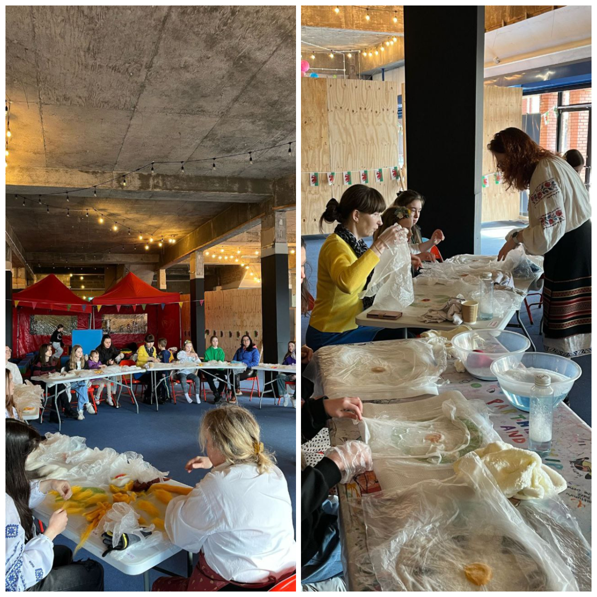
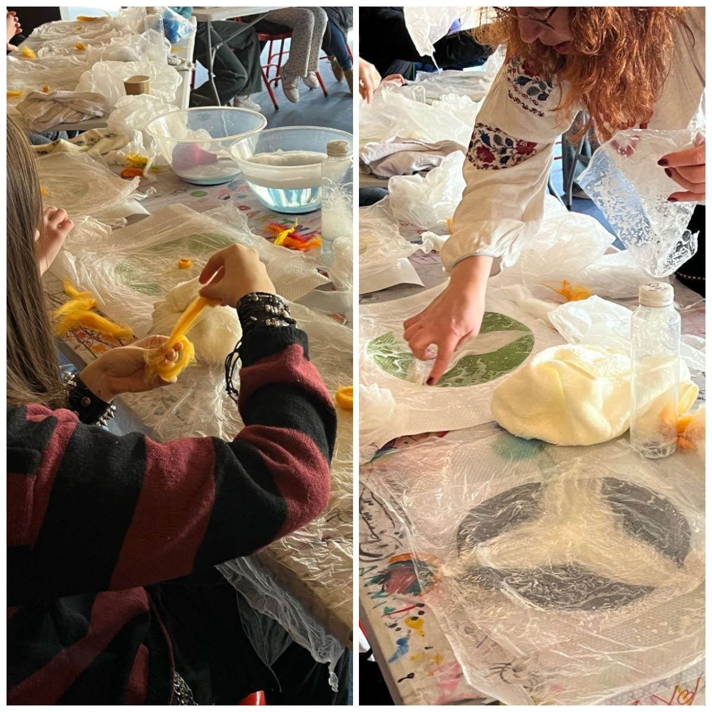
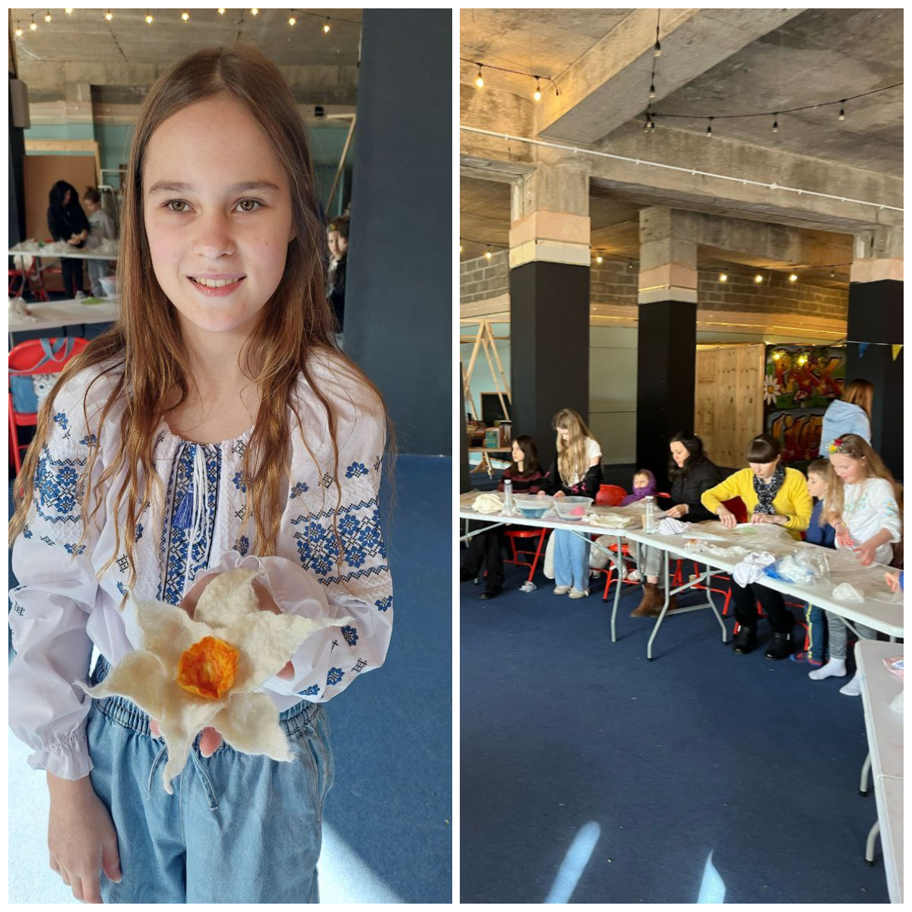

This winter, Sunflowers Wales organized various events where children had the opportunity to sing, dance, paint, play in the pool, cook varenyky and make cookies. But on Tuesday, there was a special event — a felting masterclass by the incredible <a href="https://www.facebook.com/svetlana.lilley" target="_blank">Svitlana Lilley</a>. The children not only learned the art of felting but also discovered the history of this ancient craft from Svitlana. Happy children took home daffodils they made with their own hands!

Many thanks to <a href="https://www.swansea.gov.uk/" target="_blank">Swansea City Council</a> for funding that made these activities possible!

