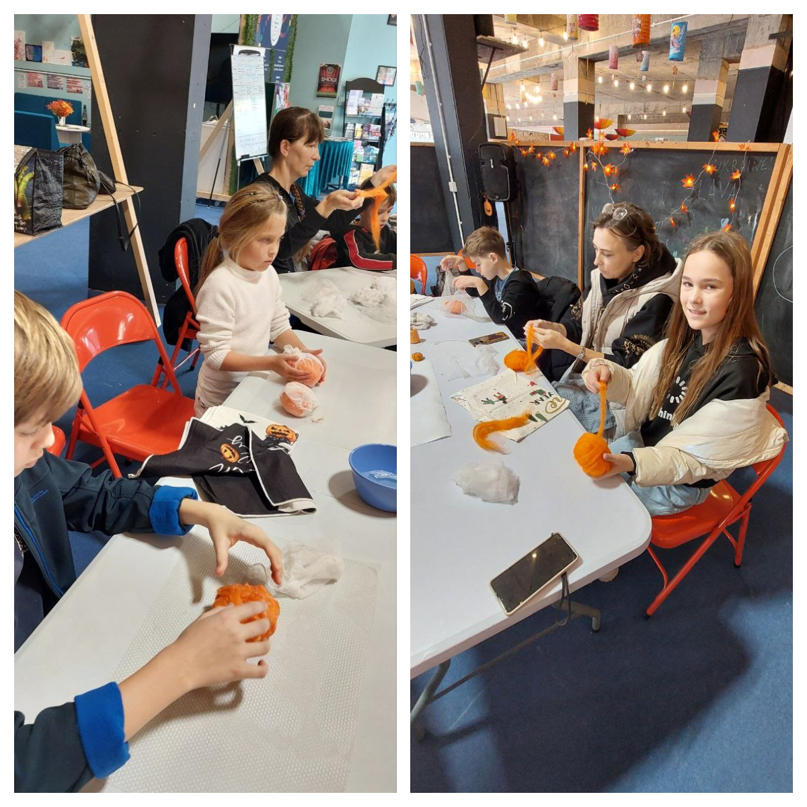
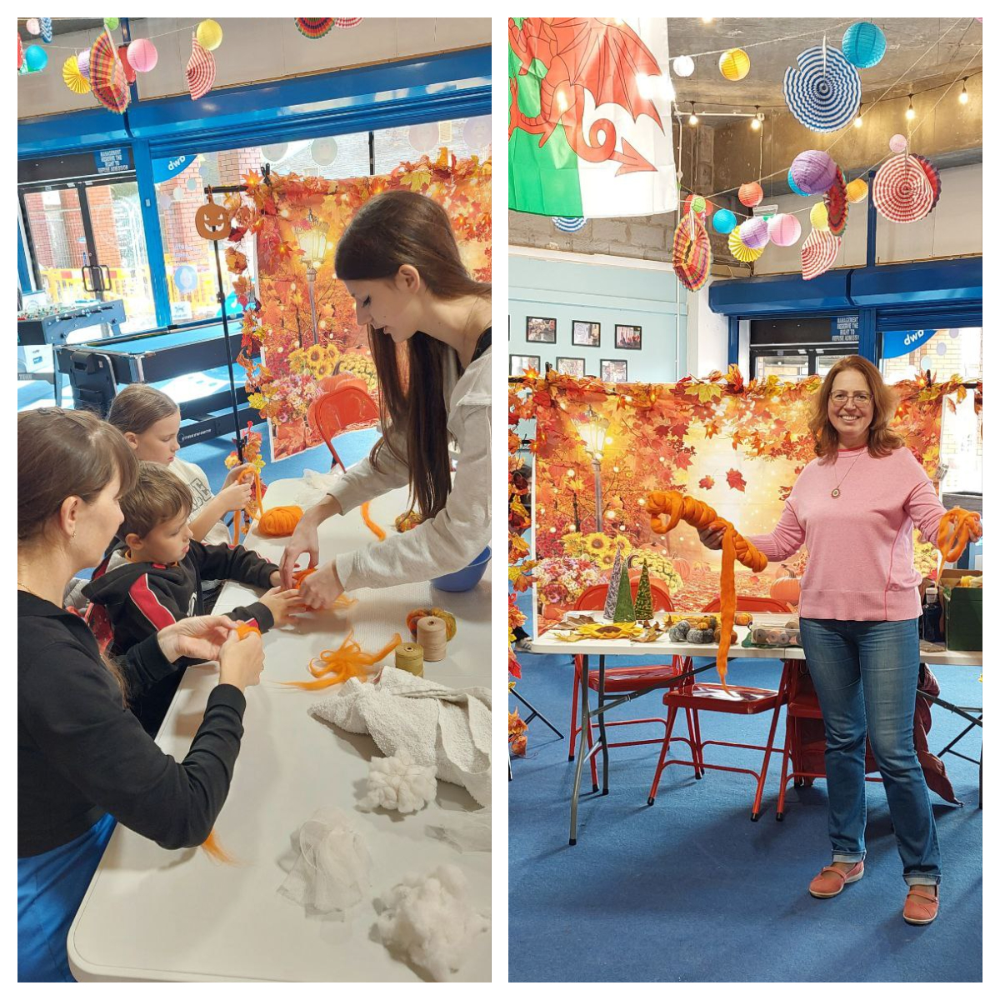
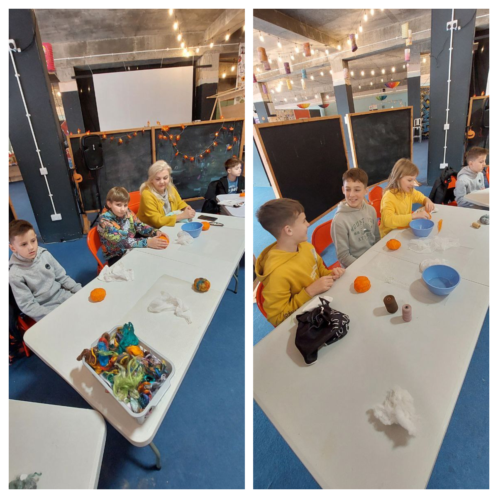
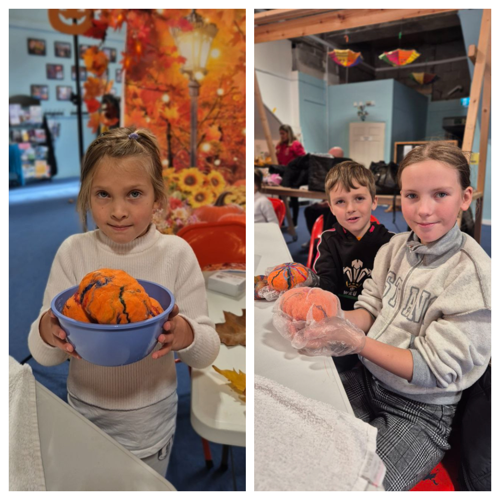
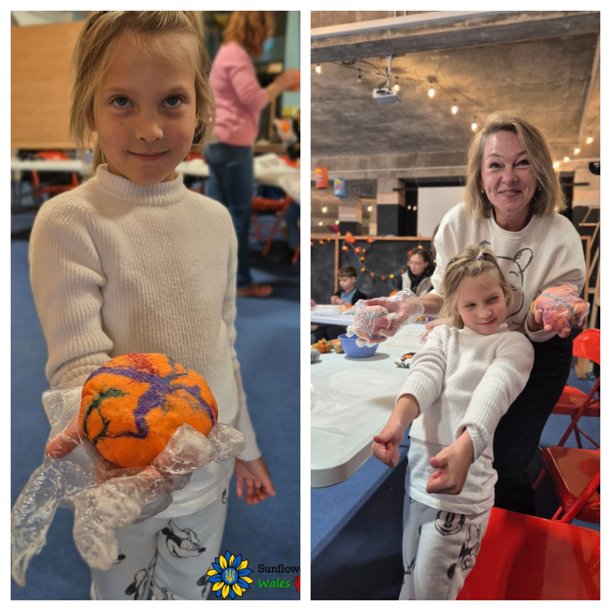
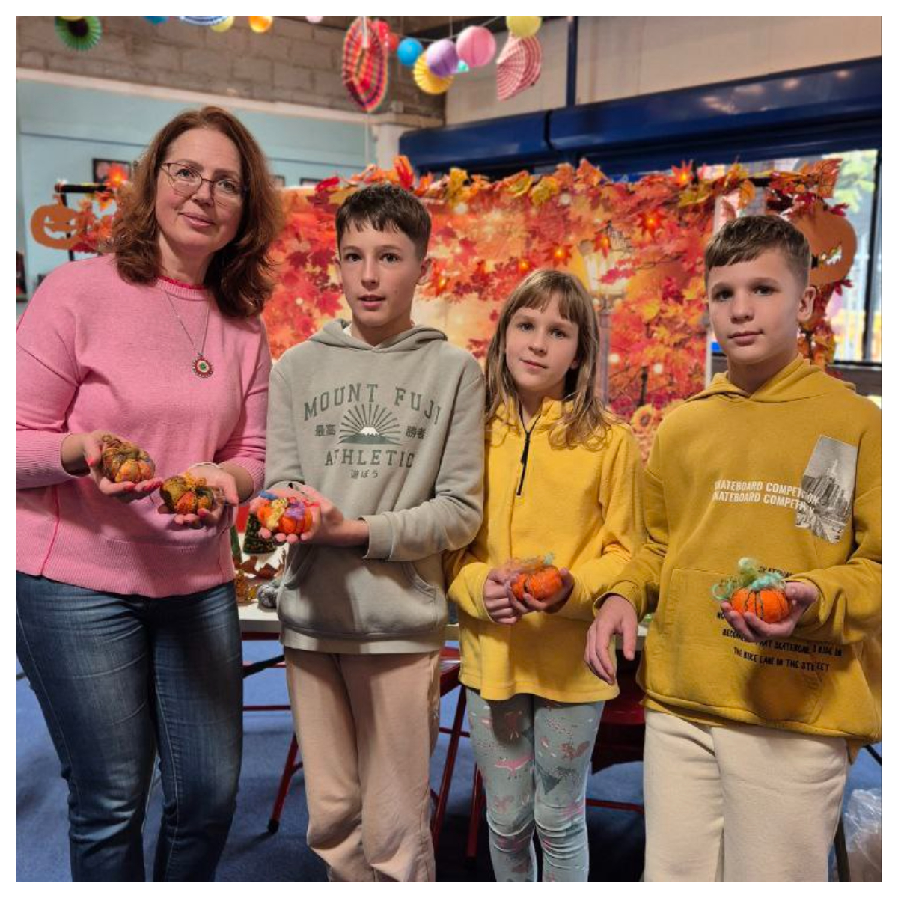
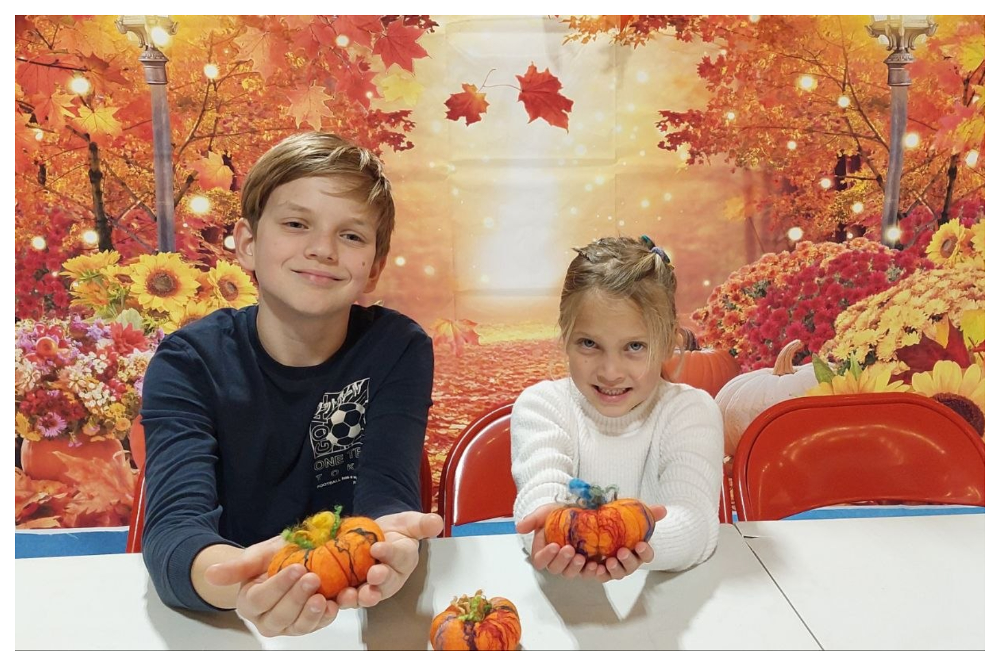

Our traditional but always new felting class from the incredible <a href="https://www.facebook.com/groups/601579067497655/user/100001687011241/" target="_blank">Svetlana Lilley</a>.

<!--more-->

Hours of art when every child could feel themselves a creator!

Many thanks to Swansea City Council for hosting the event at the Collaboration Station and the financial support through the Coast Grant. 

<iframe width="560" height="315" src="https://www.youtube.com/embed/dohVCMT8FyE?si=qlVTCodtR5yoHugo" title="YouTube video player" frameborder="0" allow="accelerometer; autoplay; clipboard-write; encrypted-media; gyroscope; picture-in-picture; web-share" referrerpolicy="strict-origin-when-cross-origin" allowfullscreen></iframe>

