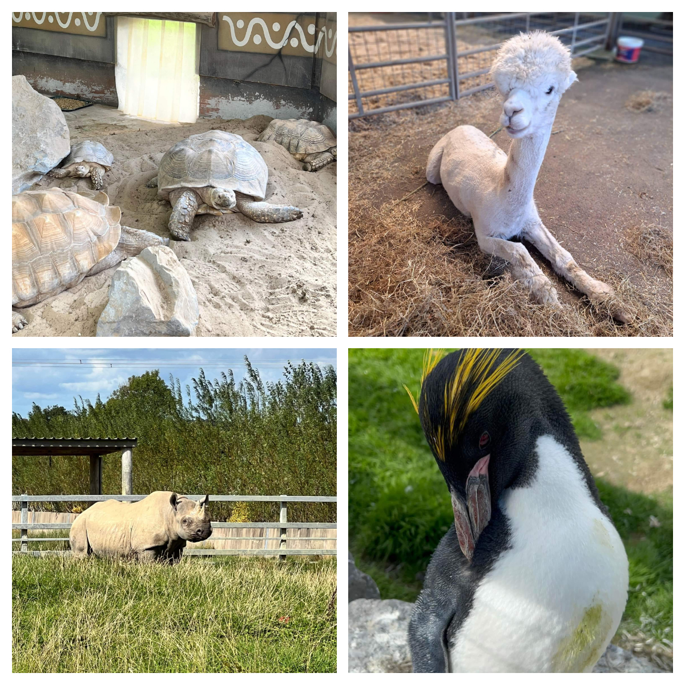

Ukrainian hildren and their parents from <a href="https://www.facebook.com/groups/601579067497655" target="_blank">Sunflowers Wales (Соняшники)</a>  had an amazing day at <a href="https://www.folly-farm.co.uk/" target="_blank">Folly Farm</a>. 

The day was full of positive emotions, child smiles and memorable impressions! Happy children and happy parents! 🙂

Many thanks to <a href="https://neu.org.uk/" target="_blank">National Education Union</a> for funding and <a href="https://www.facebook.com/groups/601579067497655/user/100057427360503/" target="_blank">Cymru Coaches</a> for the transfer!

