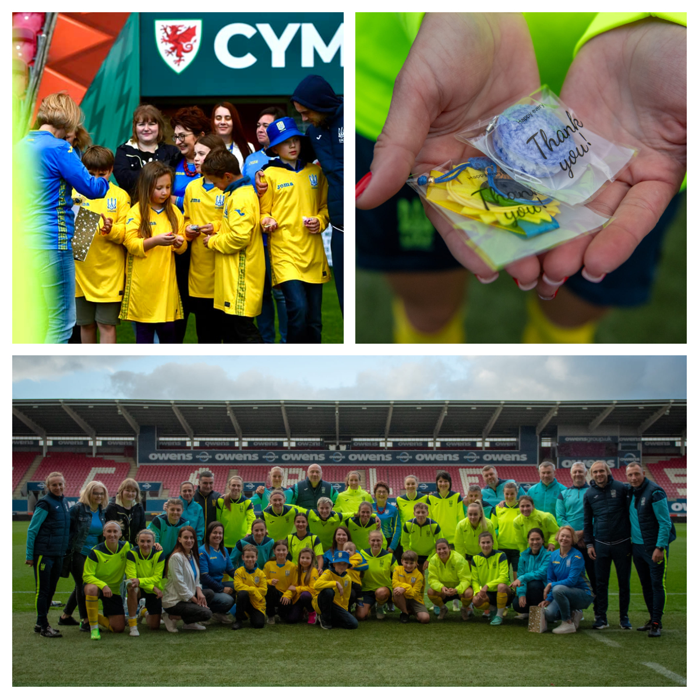
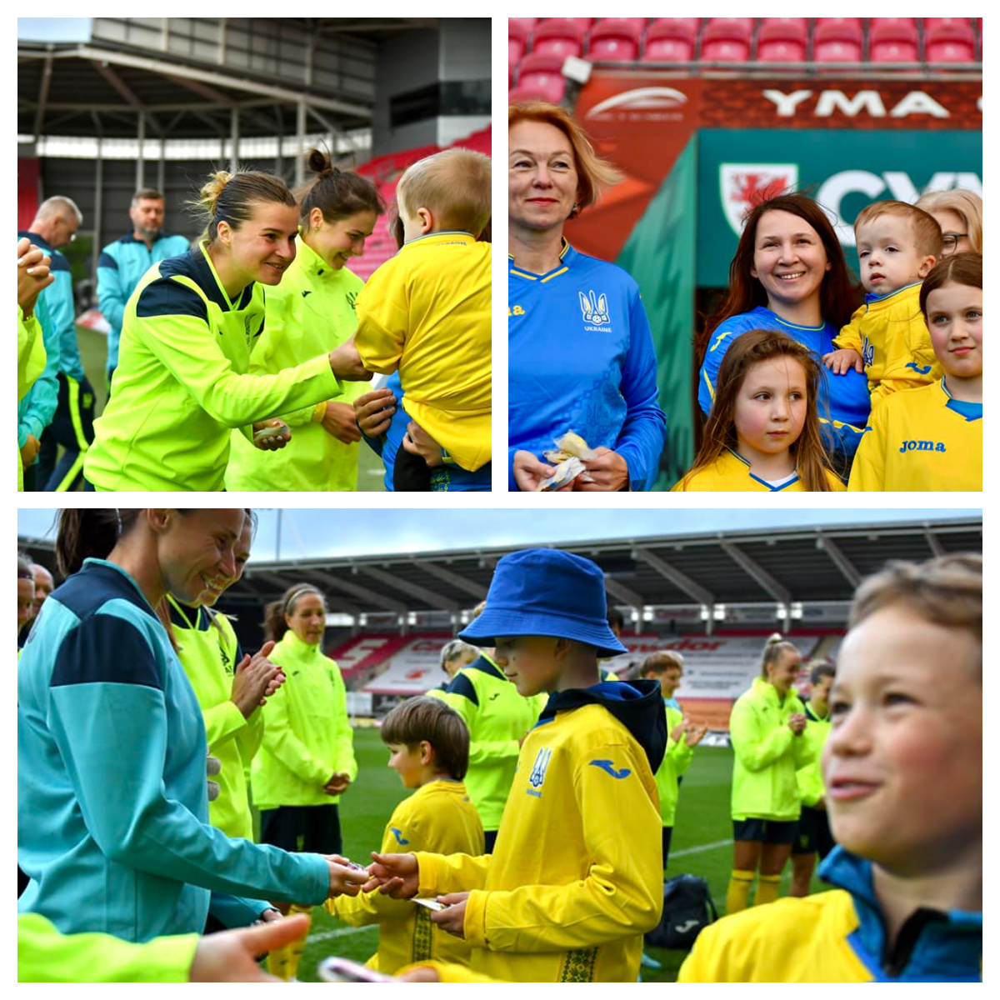
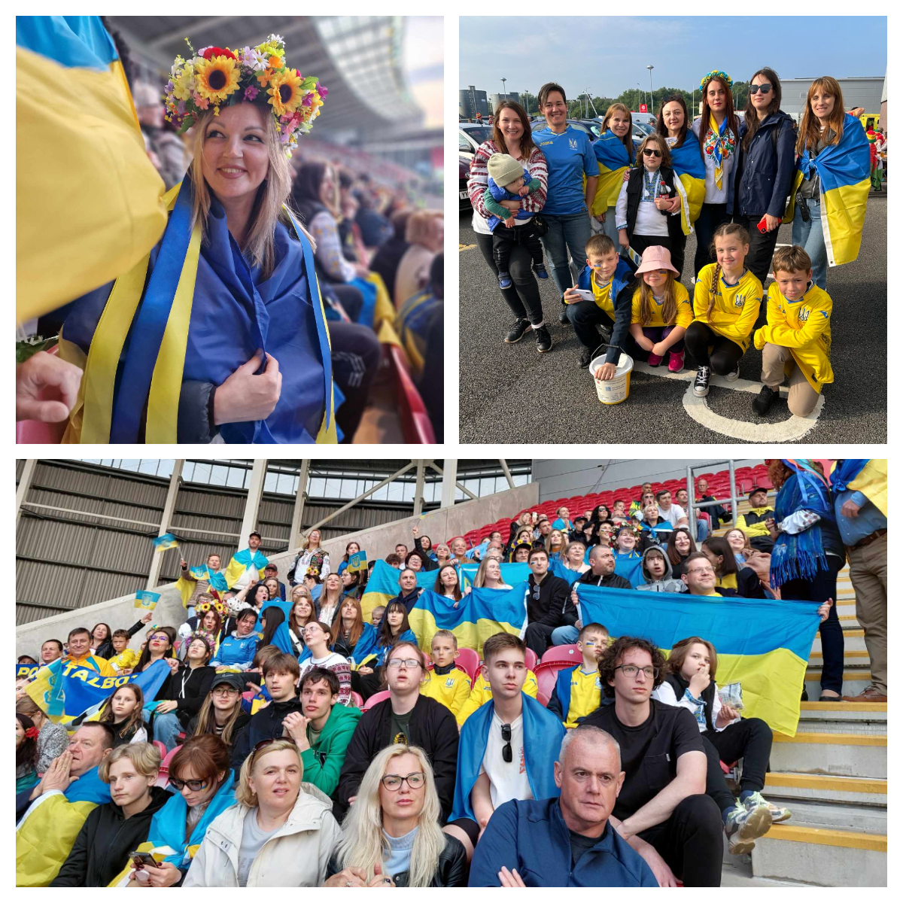
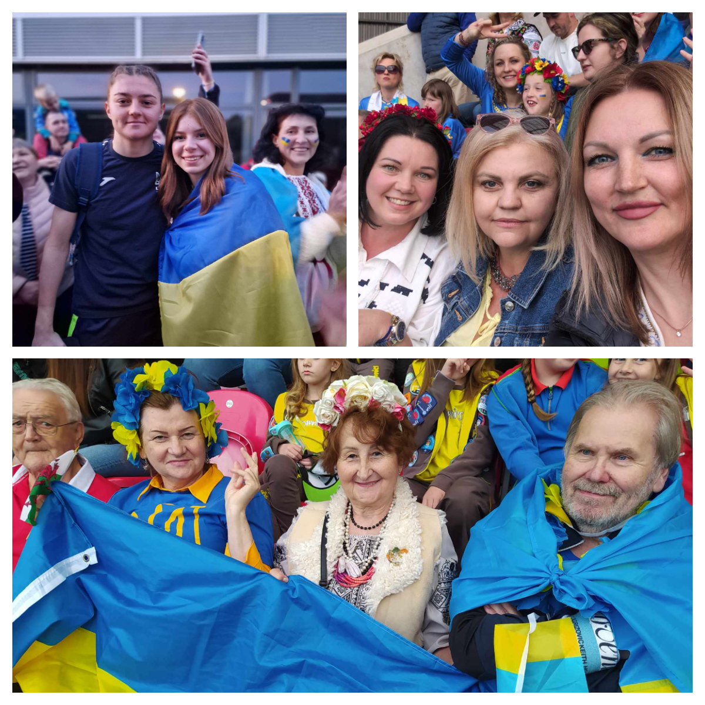
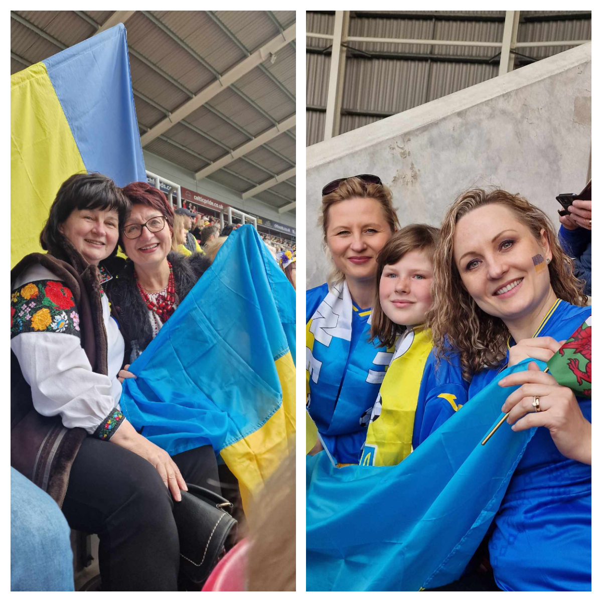
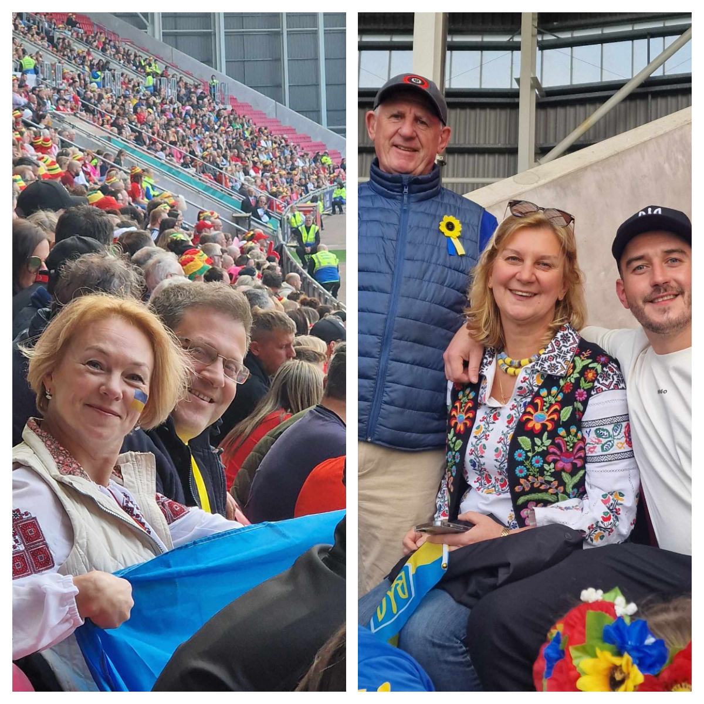
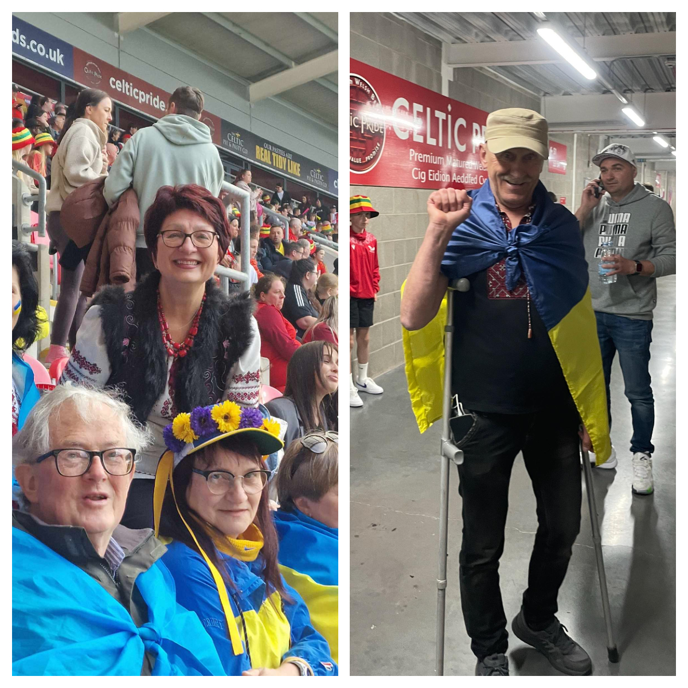
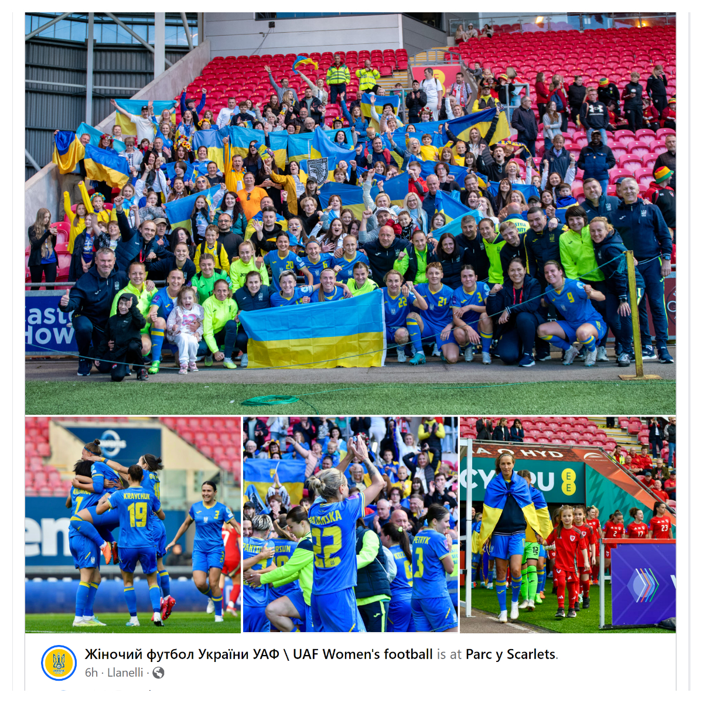

Sunflowers Wales members were privileged to attend the training of the Ukrainian national women's football team, meet the players, and present small Ukrainian sunflowers souvenirs! On the next day, we enjoyed the game Wales vs Ukraine and had a wonderful time speaking with the team thereafter!

The atmosphere at Parc y Scarlets stadium in Llanelli was incredible. The Ukrainian sector flourished with blue-and-yellow flags, and Ukrainian chants and songs sounded clearly and loudly.

We are extremely grateful to <a href="https://www.facebook.com/parcyscarlets/" target="_blank">Parc y Scarlets</a> for making these events possible and for the generously donated 100 tickets for Ukrainians! And of course, many thanks to <a href="https://www.facebook.com/uafwomen/" target="_blank">UAF Women's football</a> team for having us! 

Thank you!

Diolch!

Дякуємо!

