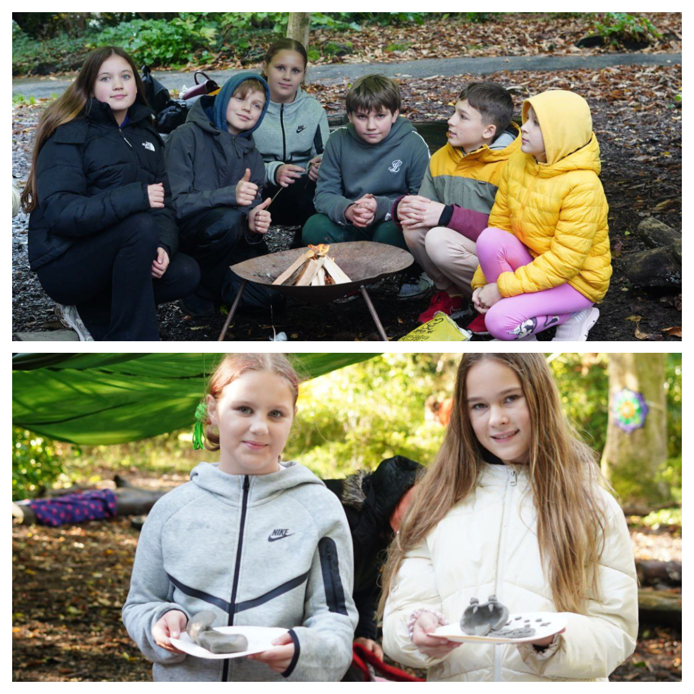
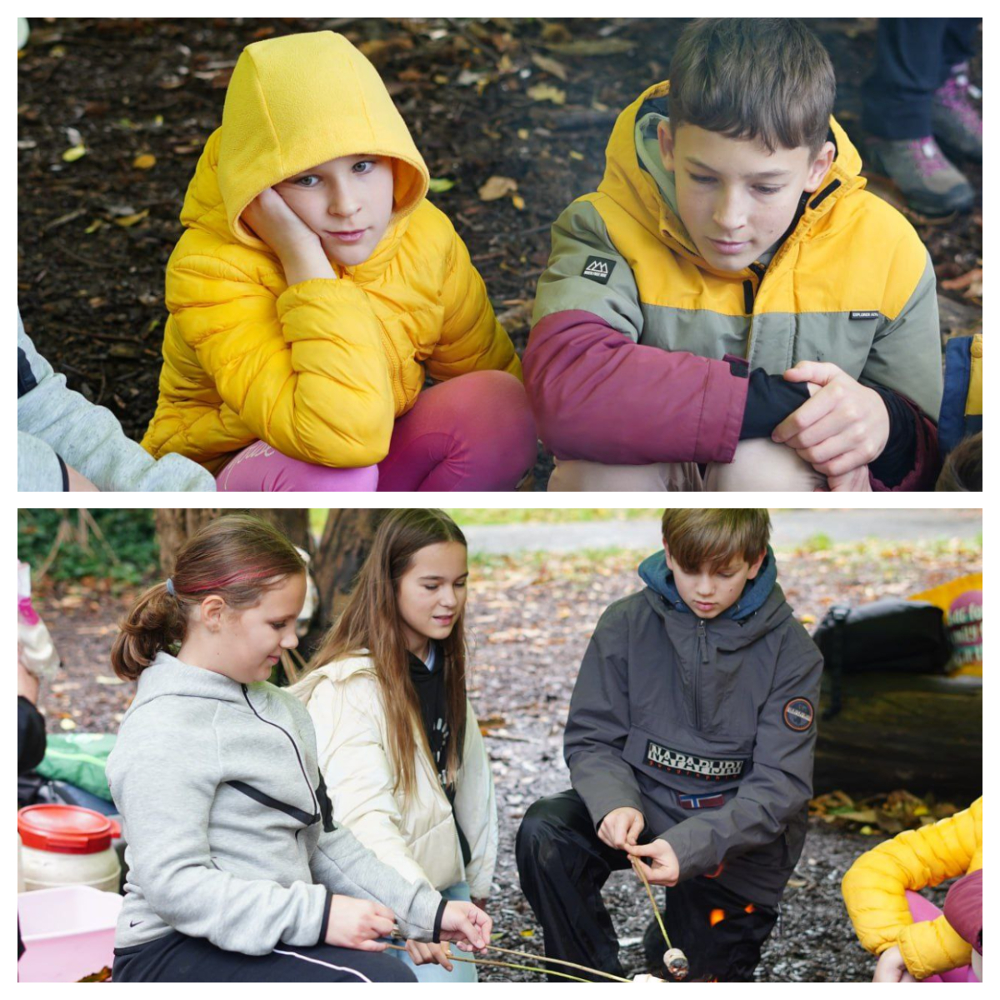
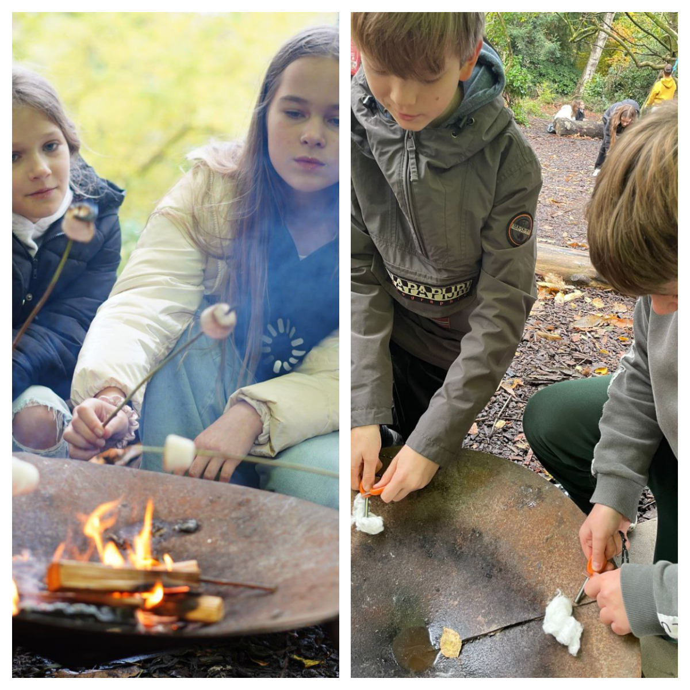
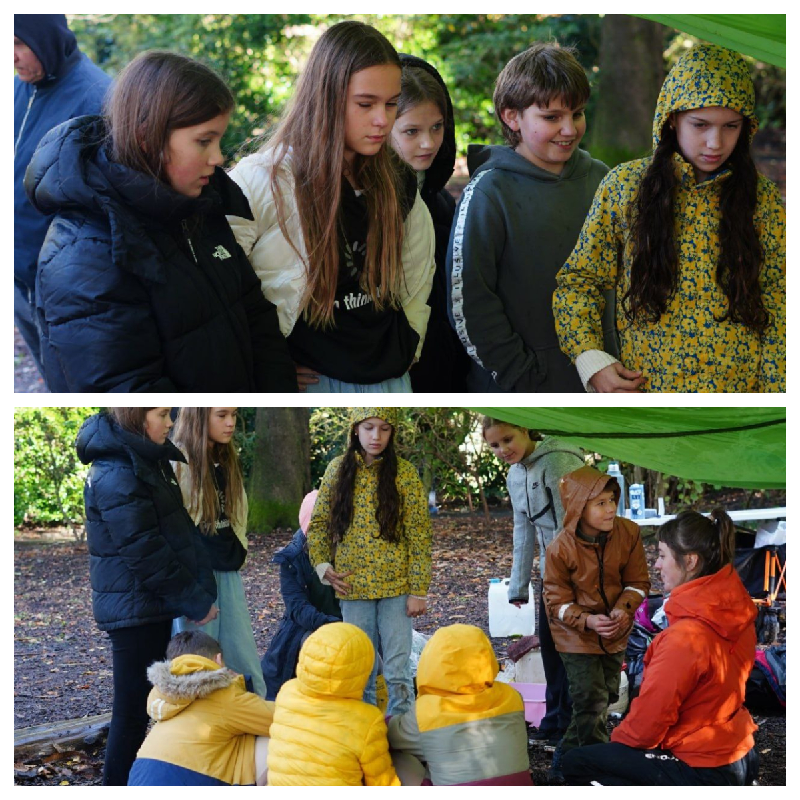

We had a long day today, full of positive emotions and children’s joy!

<!--more-->

In the morning, we were kindly hosted by the amazing and dedicated team of the <a href="https://www.facebook.com/ForestSchoolSNPT/" target="_blank">Forest School Swansea Neath & Port Talbot</a> at Singleton Park. When true enthusiasts are at work, even bad weather steps aside! We enjoyed our time in the forest — two hours flew by in a blink! The children learned many practical skills and had a lot of fun. We’re already looking forward to the next meeting!

Many thanks to the whole team, and especially to Cath and Fay, for such an incredible event!

<iframe width="560" height="315" src="https://www.youtube.com/embed/LWq6_OkaQRM?si=A7EdjAQ1DtFIxAdb" title="YouTube video player" frameborder="0" allow="accelerometer; autoplay; clipboard-write; encrypted-media; gyroscope; picture-in-picture; web-share" referrerpolicy="strict-origin-when-cross-origin" allowfullscreen></iframe>

