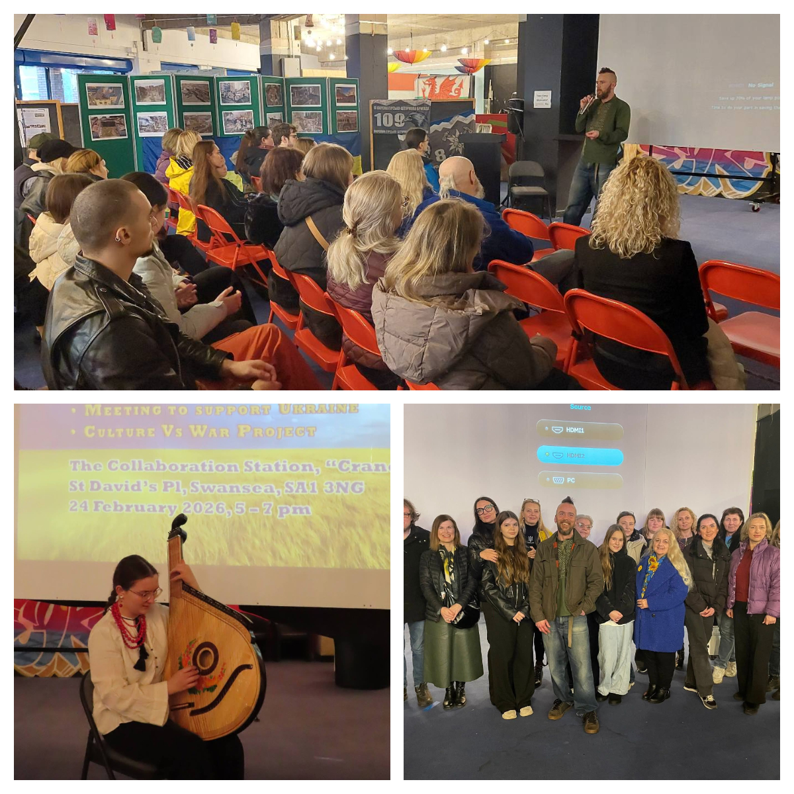
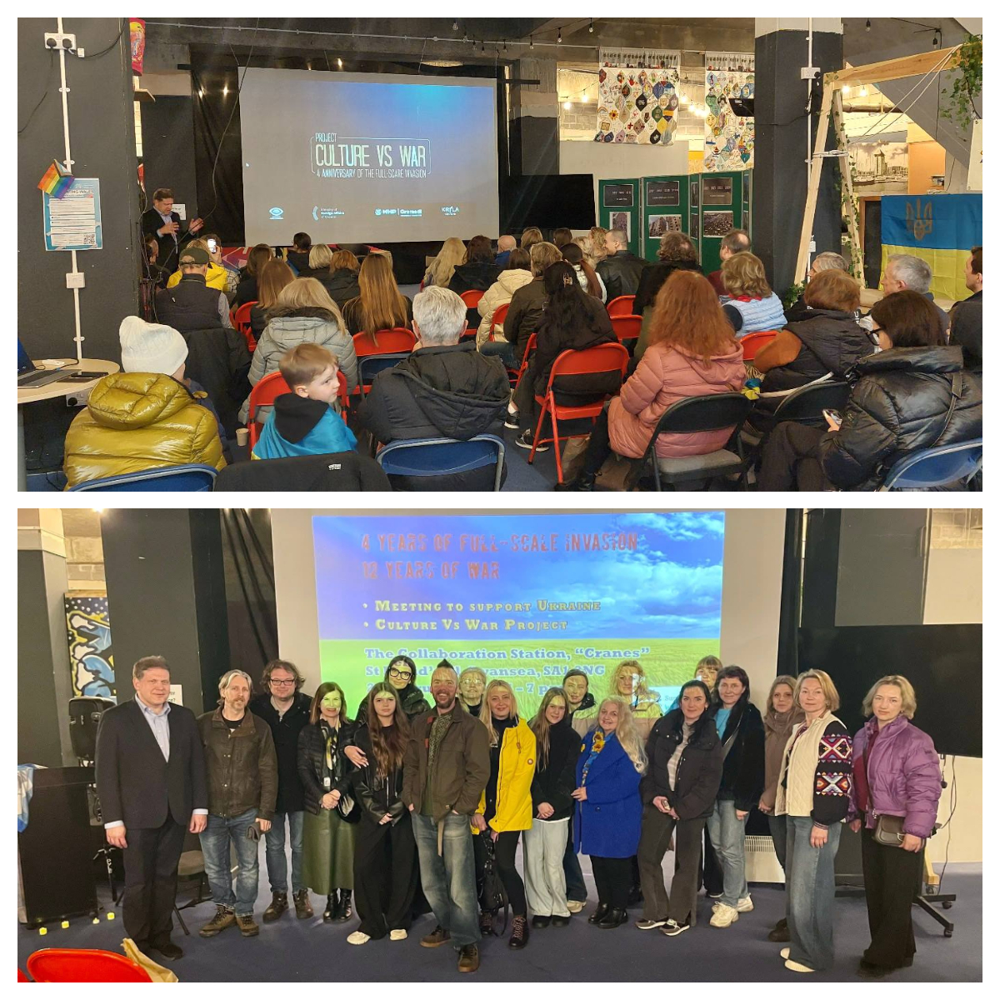
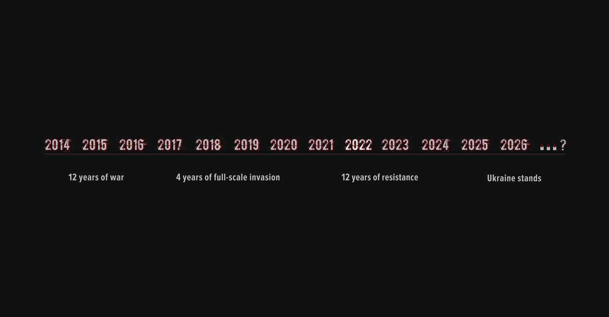

For the fourth year in a row, we gathered in Swansea city centre to mark the anniversary of the full-scale invasion and to honour the victims of a war that has now lasted 12 long, painful years.

Today, together with our Welsh friends, we watched the deeply moving documentary “Palyanytsia” — a powerful story of foreign street artists who came to Ukraine and, through their art, faced the stark and heartbreaking reality of war.

It meant so much to come together — to see familiar faces, to share the weight of these years, to speak about loss and resilience, and to remind one another that we are not alone. In unity, we find strength.

We are sincerely grateful to <a href="https://www.facebook.com/swanseacitycouncil/" target="_blank">Swansea Council</a> for hosting us at the Collaboration Station.

Heartfelt thanks to <a href="https://www.facebook.com/groups/601579067497655/user/61579718392008/" target="_blank">KRYLA Culture - Community & Art Organisation</a>  and their partners for giving us the opportunity to watch this important film.

The screening of the documentary film “Palyanytsia” took place as part of the International Film Marathon Culture vs War, dedicated to the fourth anniversary of Russia’s full-scale invasion of Ukraine.

The marathon is initiated by the association “Watch Ukrainian!” with the support of the MHP-Gromadi Charitable Foundation and the Ministry of Foreign Affairs of Ukraine.

