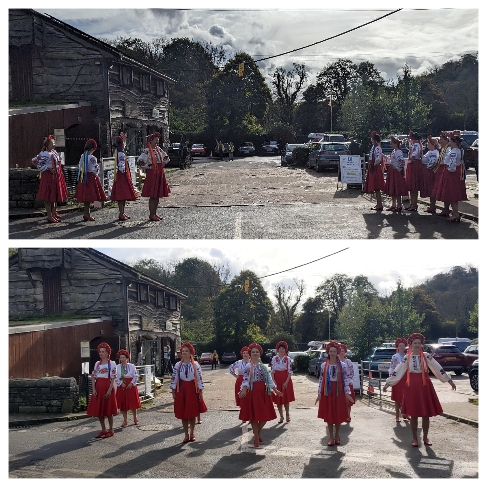
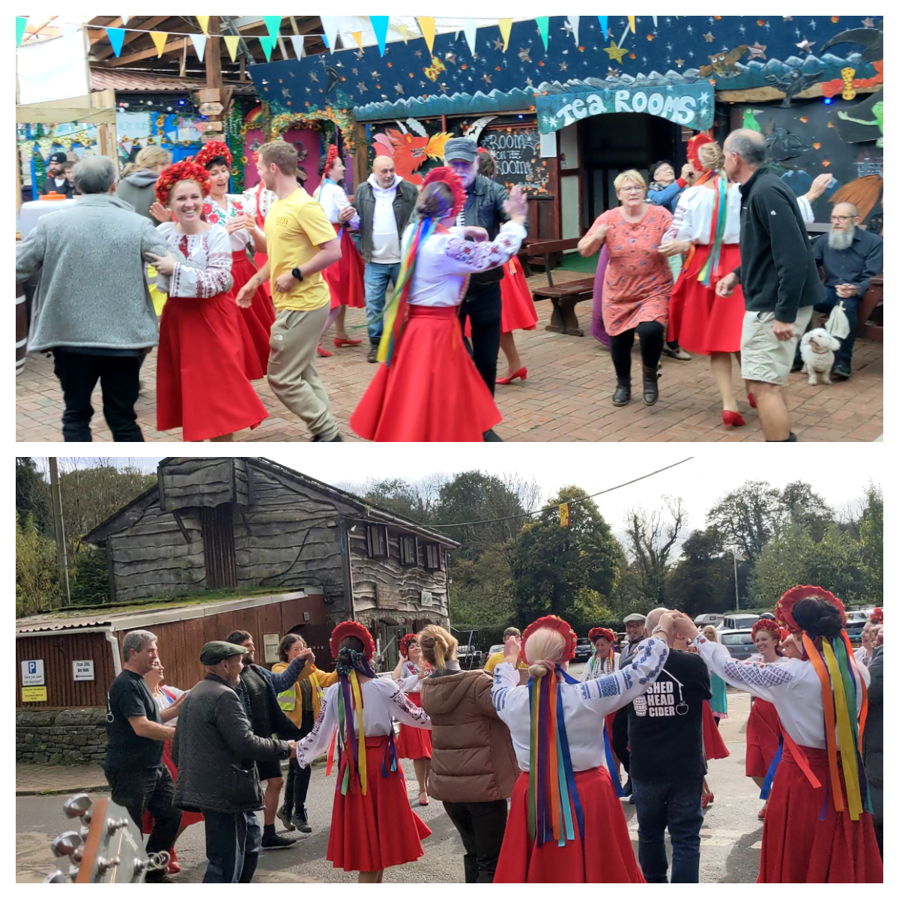
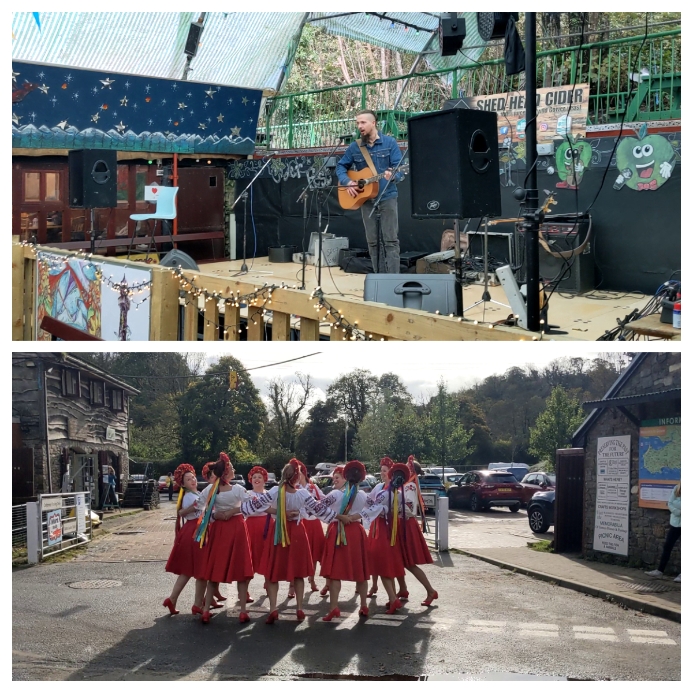
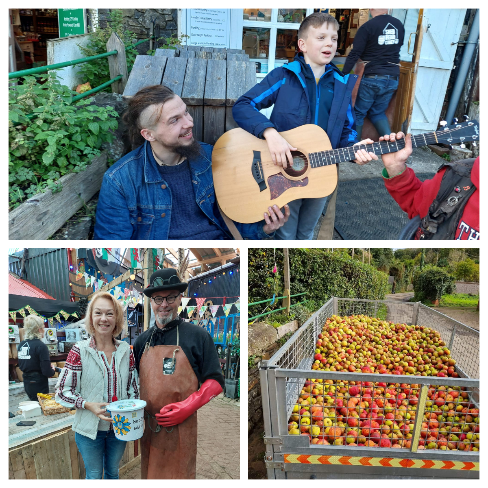

This weekend, Sunflowers Wales enjoyed lovely atmosphere and nice people at <a href="https://www.facebook.com/events/210578691978460/" target="_blank"> Gower Cider Festival 💯 % Juicy 🍎</a>   in <a href="http://www.gowerheritagecentre.co.uk/" target="_blank"> Gower Heritage Centre</a> ! 

Our dancing group presented Ukrainian dancing culture. No-one could stay aside of dancing with us while <a href="https://www.facebook.com/groups/601579067497655/user/100001928153814/" target="_blank"> Kacper Cipó Nowak</a>  were playing his guitar!

Many thanks to Richie and Shed Head Cider Mill Shop for having us there and for your kind donation!

