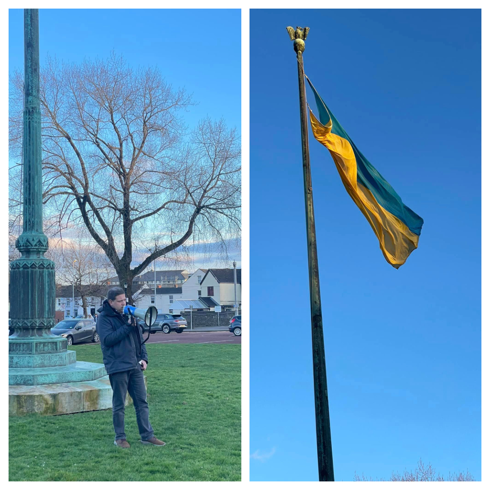

Tonight Ukrainians over the world mark the year of ruZZia's invasion and commemorate the victims of the war.

<a href="https://www.facebook.com/groups/601579067497655" target="_blank">Sunflowers Wales (Соняшники)</a> ran a meeting at Swansea near Guildhall. Dozens of people came to show respect to Ukrainian guardians, to light candles for the dead, and to pray for Ukraine and victory.

