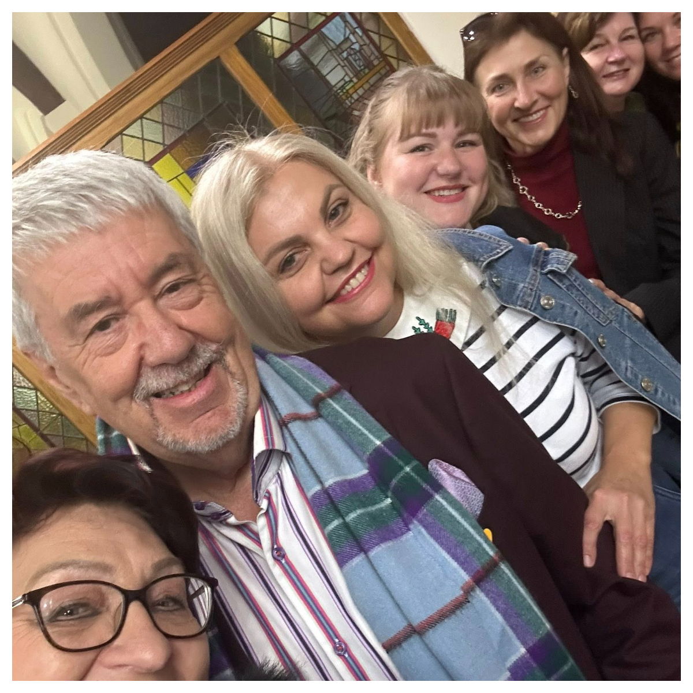
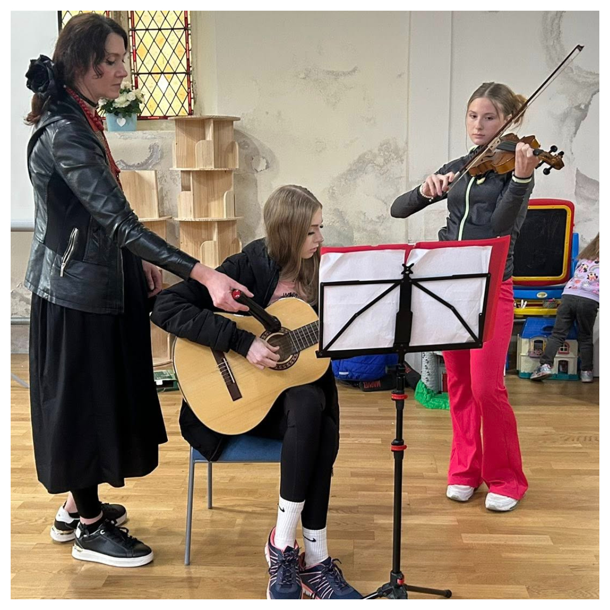

On Saturday the 27/09 Sunflowers Wales took part in International Day of Peace in Llanelli.

<!--more-->
The event was organised by <a href="https://www.facebook.com/profile.php?id=100075695632917" target="_blank">Llanelli Multicultural Network - LMCN</a>. 
We all prayed for the peace in Ukraine and around the world. 
Thanks a lot <a href="https://www.facebook.com/paolo.piana.923" target="_blank">Paolo Piana</a> and all our Ukrainian friends who participated in the event.

