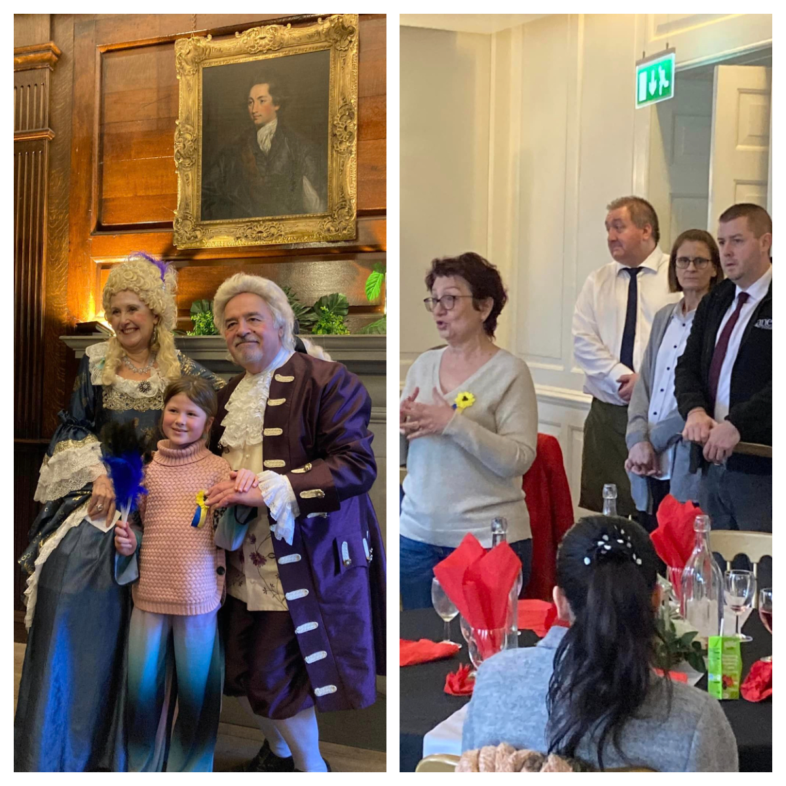
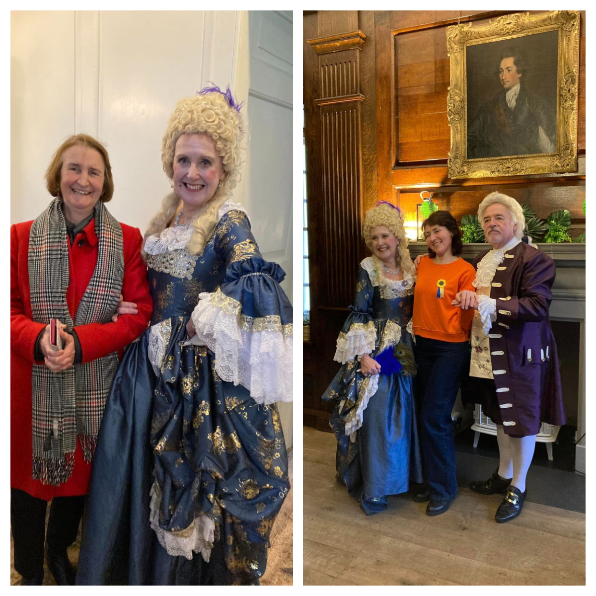
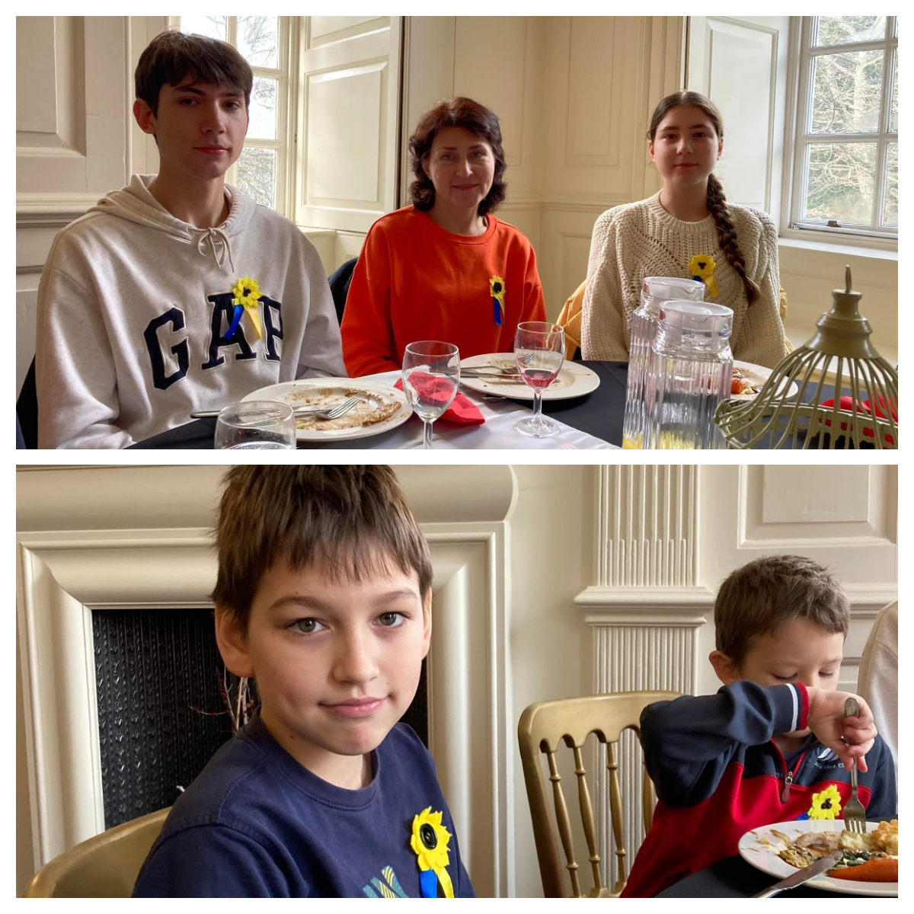
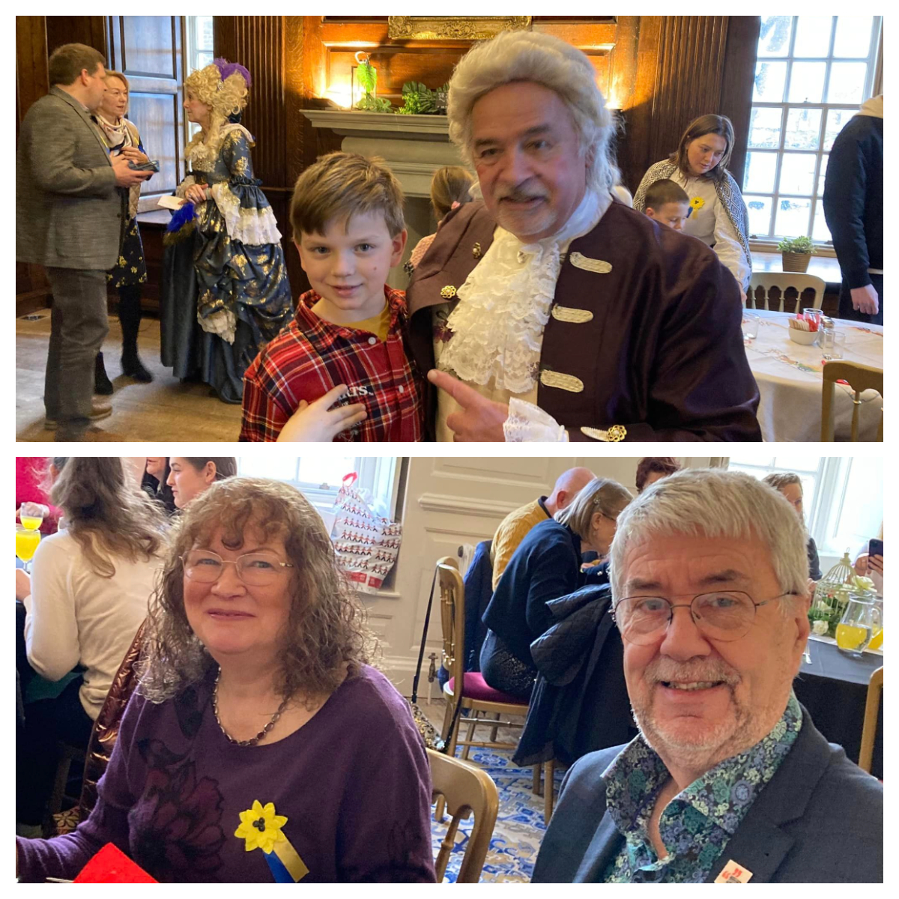
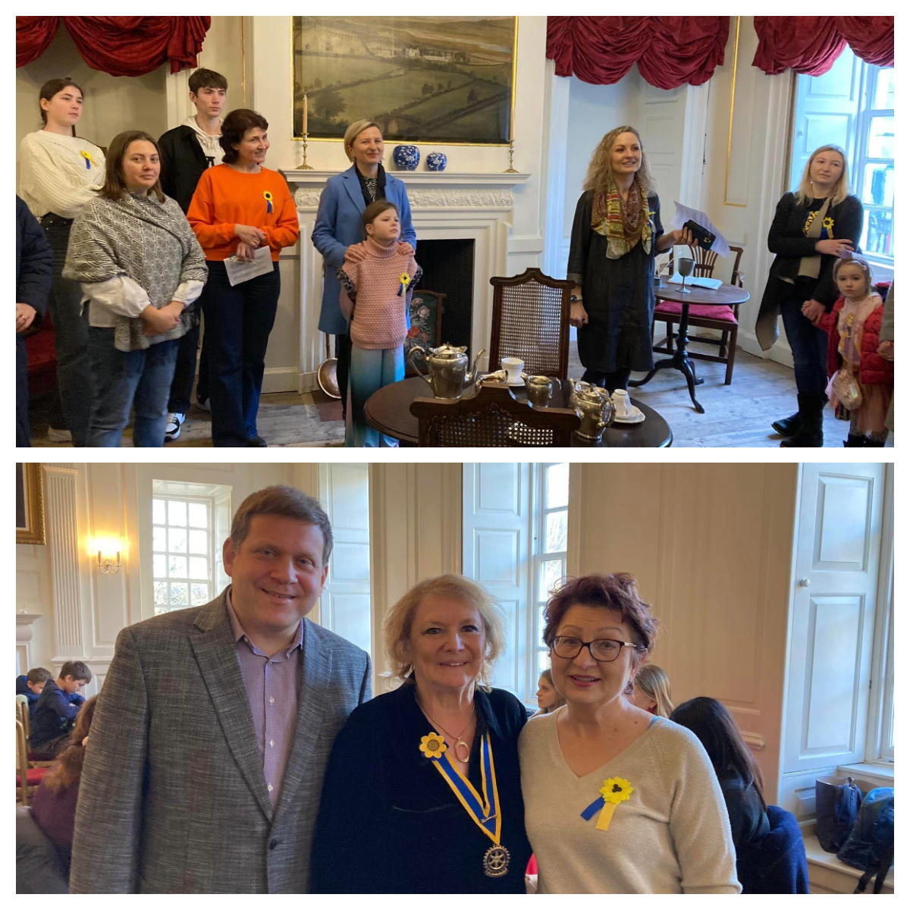
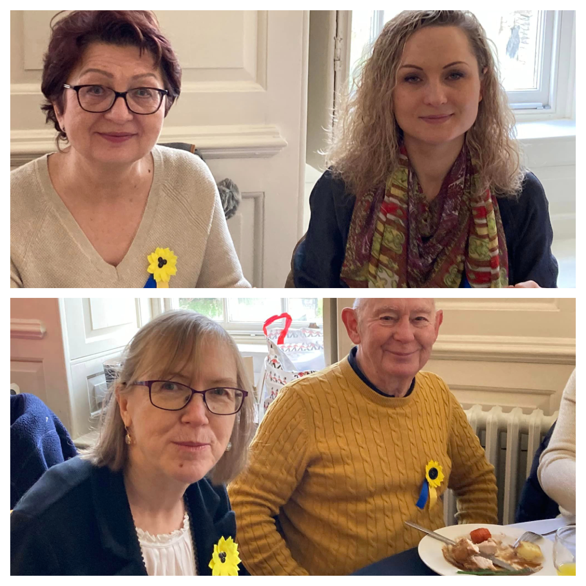

<a href="https://www.facebook.com/groups/601579067497655" target="_blank">Sunflowers Wales (Соняшники)</a> were kindly invited by <a href="https://www.facebook.com/LlanelliRotaryClub" target="_blank">Llanelli Rotary Club</a> to New Year’s lunch for Ukrainian families at <a href="https://www.facebook.com/llanellyhouse" target="_blank"> Llanelli House</a>.

In addition to delicious food, we had a wonderful tour of the House! It was so great to learn about the history of the House and Llanelli and see the authentic items from the past.

Kids and adults --- they all were excited!

