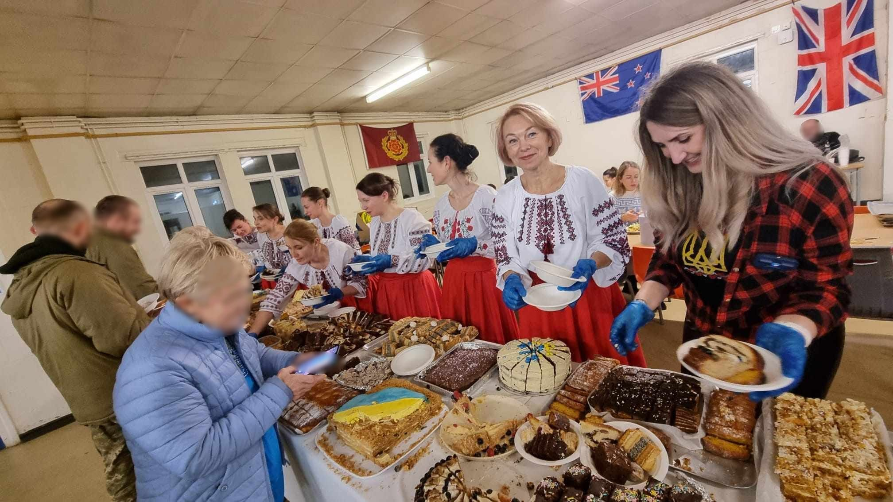

Is it difficult to be a volunteer? No!

But that's on the condition that you know what you are doing it for.

And Ukrainians know well what all their efforts are for — for Victory! That is why many people have helped, are helping, and will continue to help our guys in the Armed Forces of Ukraine. Those whom they have never seen, whose names they don't even know, but they know that they are all awaited at home, and they all must live!

In December, our dance group Sunflowers Wales had a great honour — to dance for our guys who were in Britain for training. It's hard to describe the whirlwind of emotions that overwhelmed each participant on the way there, but everyone understood one thing - we needed to give as much warmth, joy, and positive emotions as possible to those who would soon be fighting for us on the battlefield.

So, in addition to dancing, we brought small gifts and delicious homemade cakes baked by our skilled housewives. We had the opportunity to personally distribute all the treats to our warriors, and it was an unforgettable chance to communicate, share jokes, and sincere smiles!

Every dance was received with great enthusiasm, and the dancers received a storm of applause and exclamations of delight, but the most grandiose performance was the dance "Pidmanula, pidvela", during which the girls drew half of the audience into the dance, and for over 6 minutes everyone danced our Ukrainian wedding polka!

For one evening, we became one big family. The guys couldn't stop smiling and thanking us.

So, is it possible not to help after seeing those grateful eyes? Impossible!

Is it possible not to help, knowing that all the warriors need our help? Various help depending on the circumstances. Impossible!

Thank you, <a href="https://www.facebook.com/irina.creeger/" target="_blank">Irina Garmash-Creeger</a> and Ukraine UK Unity, for involving us in this project, and we look forward to new meetings!

So, let's not stop!

Together we are strong!

