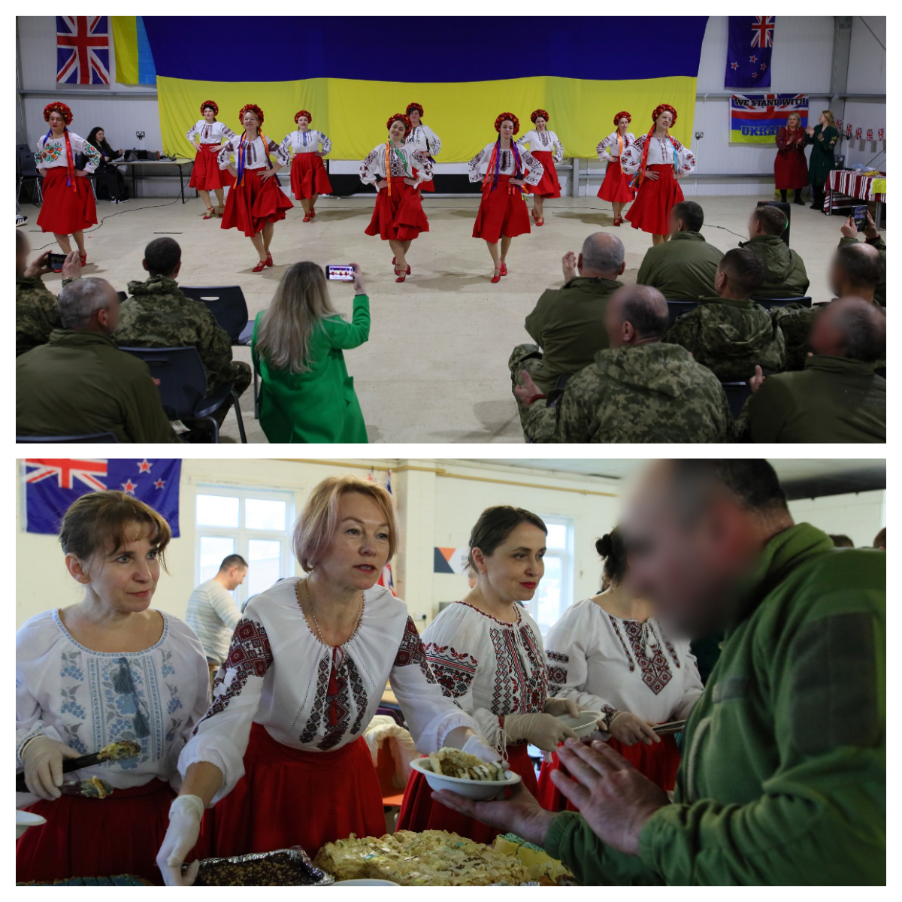
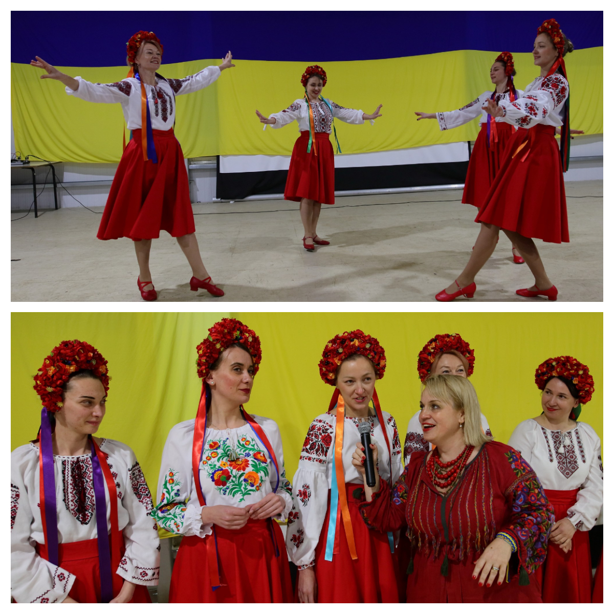
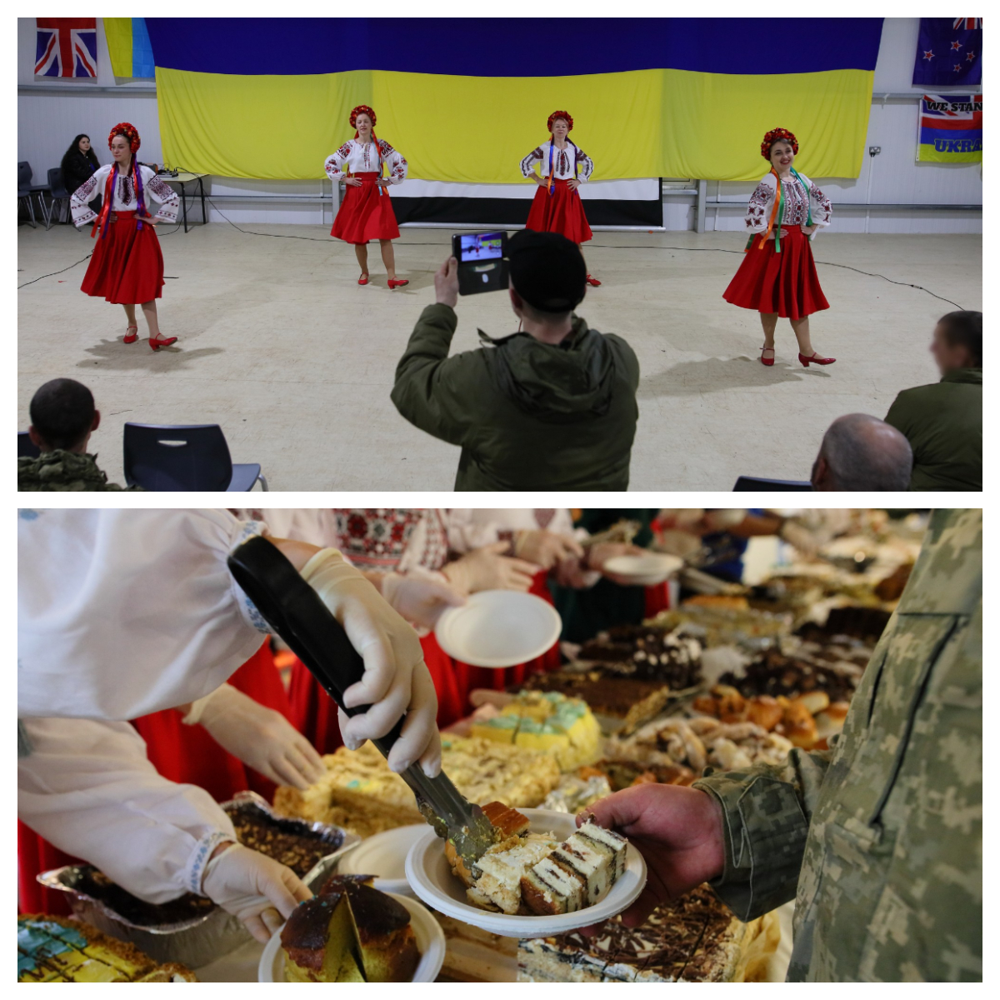

We were invited again to visit a military base where our Ukrainian soldiers take their training in the UK! Our dancing group was warmly welcomed, and we tried to give as much warmth, joy, and positive emotions as possible to those who would soon be fighting for us on the battlefield. Also, the singing of our beautiful <a href="https://www.facebook.com/VikaDzhons" target="_blank">Victoria</a> was very touching and impressive! 

In addition to dancing and singing, we brought small gifts and delicious homemade cakes baked by our skilled housewives. We had the opportunity to personally distribute all the treats to our warriors, and it was an unforgettable chance to communicate, share jokes, and sincere smiles! Every dance was received with great enthusiasm, and the dancers received a storm of applause and exclamations of delight.

For one evening, we became one big family. The guys couldn't stop smiling and thanking us.

We were proud to see this Facebook post of <a href="https://www.facebook.com/GeneralStaff.ua/posts/pfbid0NmYrbDaeQUvNshpc6vQMpiE5a5cBQ6KpsMkpxEFRYUmUvxwb2zqznAEwtnQ2edWTl" target="_blank">the General Staff of the Armed Forces of Ukraine</a> with our photos and with warm thankful words.

Thank you, <a href="https://www.facebook.com/irina.creeger/" target="_blank">Irina Garmash-Creeger</a> and <a href="https://www.facebook.com/UkraineUKUnity" target="_blank">Ukraine UK Unity</a>, for involving us in this project, and we look forward to new meetings!

So, let's not stop!

Together we are strong!

