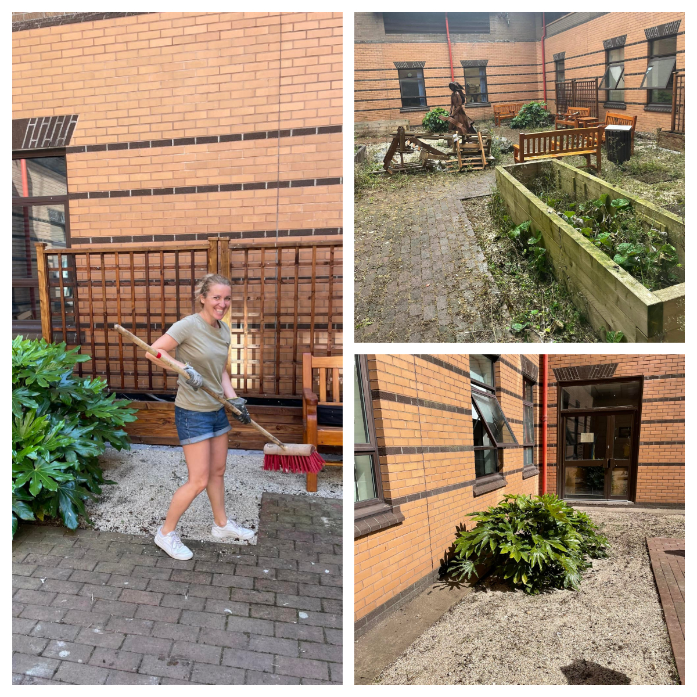
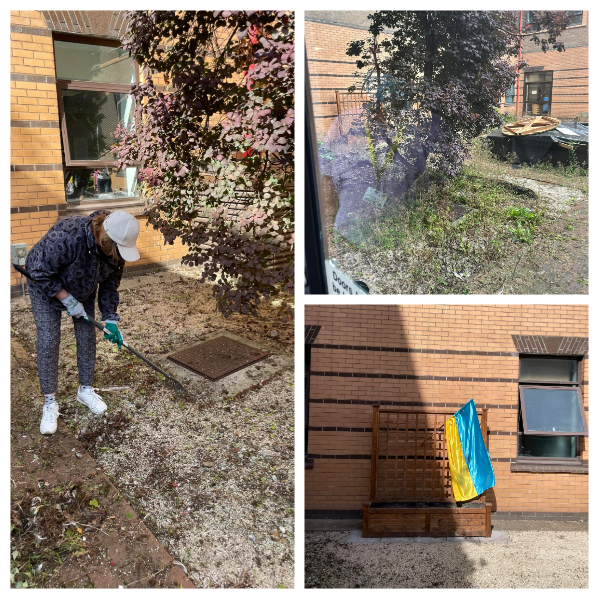
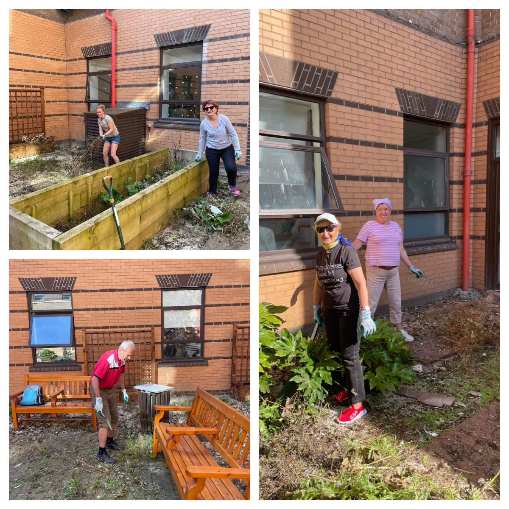

<a href="https://www.facebook.com/groups/601579067497655" target="_blank">Sunflowers Wales (Соняшники)</a> worked hard today in Morriston hospital, Swansea. We cleaned up little courtyard next to burns and plastic ward.

So patients who are unwell can be taken outside to enjoy sunshine, sky, trees and plants and get better through the medium of nature.

It was our way to say Thank you to Welsh people for opening their homes and their hearts for Ukrainians who fled their country due to ruSSian invasion.

Thank you to Mark Humphreys, Assistant Technical Services Officer (Energy & Environment), who helped us to organise this day.

We are looking forward to see this courtyard in a full use.
If you need us to help again — we are  ready!

Mark suggested that we can devide this job for two days. We all laughed  and said: you are dealing with Ukrainians now!! We have  cleaned everything in 3 hours!!! :-) And had coffee break too! :-))

We all left happy that we could help and it will be appreciated 

Together we are strong!

 

