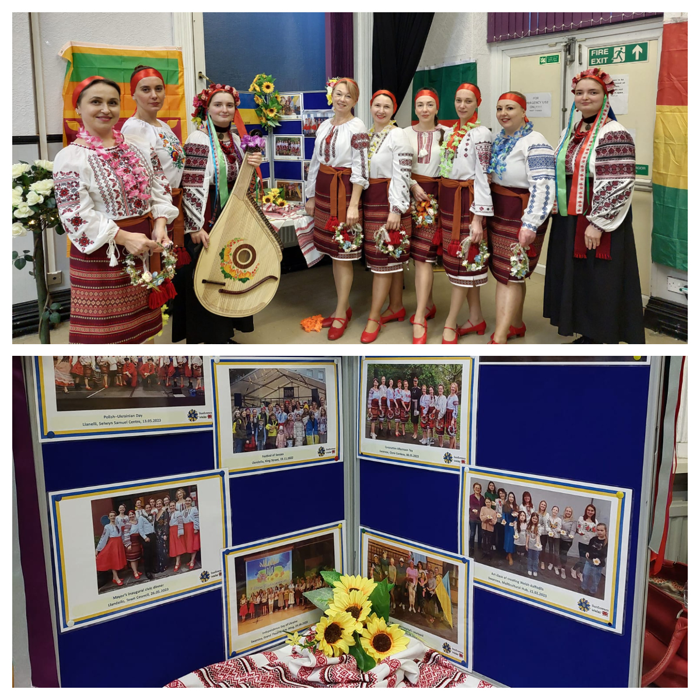
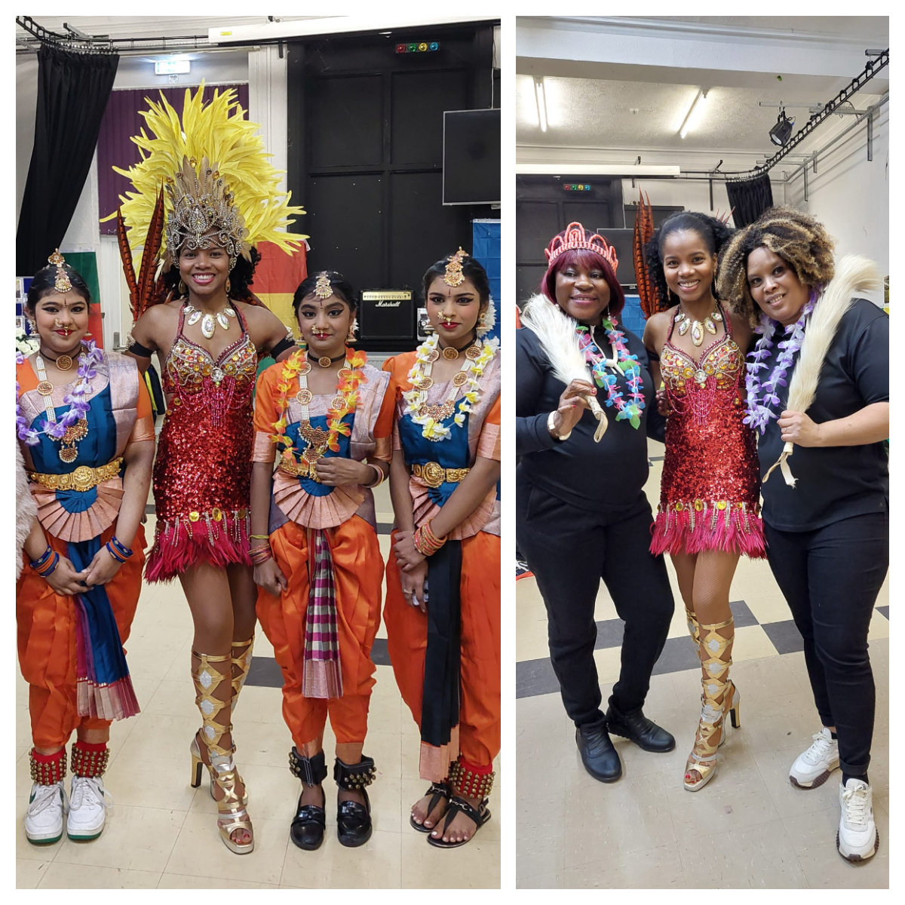

It was a pleasure to be part of the Multicultural Rhythm Event at the WUEZZA Center. 

Our Ukrainian dancing group and musicians shared the floor with Indian, African, Brazilian, and Breton dancers.

We enjoyed the evening and delicious food, made new friends, and learned new dances.

