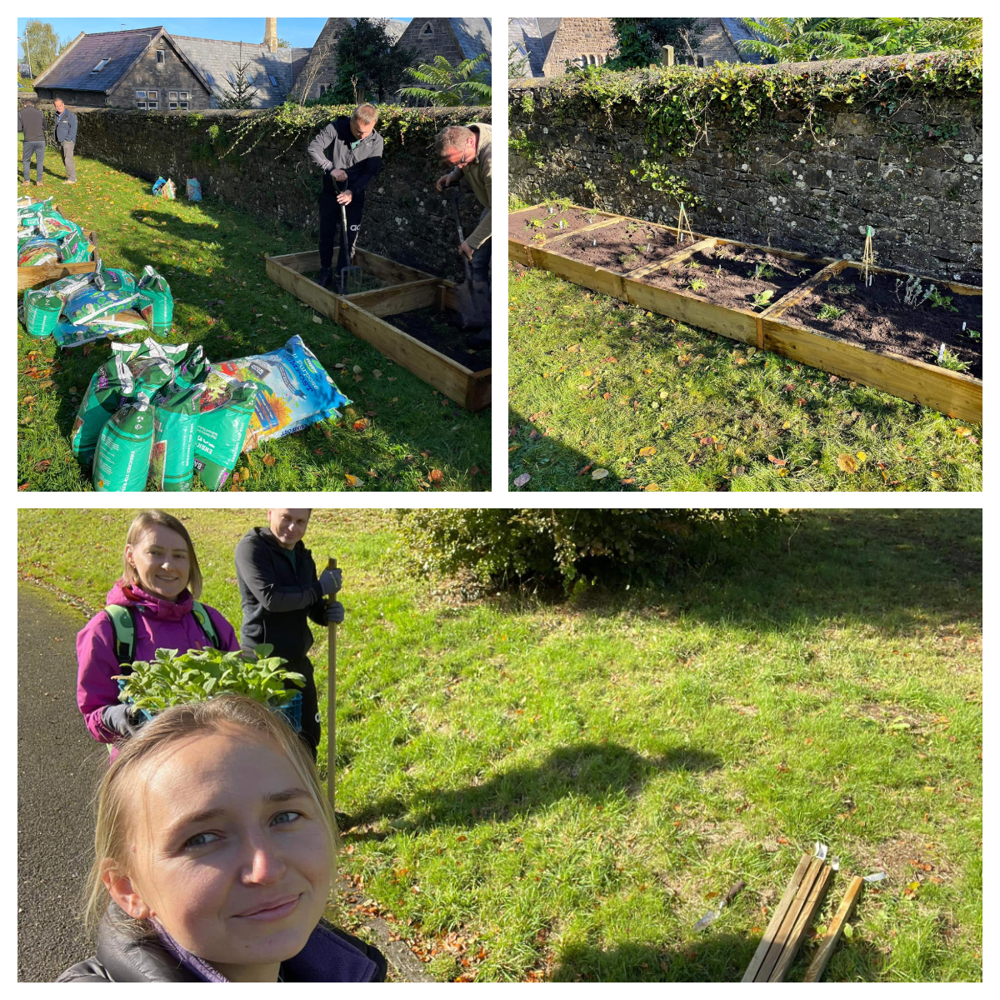

<a href="https://www.facebook.com/groups/601579067497655" target="_blank">Sunflowers Wales (Соняшники)</a> members helped to clean Penlan park in Llandeilo as a “thank you” to Welsh people for their kind and generous support since the ruZZia invaded our country.

It's the least we can do and would be happy to do it again in other towns and villages where our members were welcomed by Welsh families.

Nice day with nice people in nice place!

❤️🇺🇦🏴󠁧󠁢󠁷󠁬󠁳󠁿🙏

Thank you <a href="https://www.facebook.com/groups/601579067497655/user/1233606156/" target="_blank">Olga Nagornaya</a>, <a href="https://www.facebook.com/groups/601579067497655/user/100002989480029/" target="_blank">Pochasova Alena</a> and all the lovely kids.

