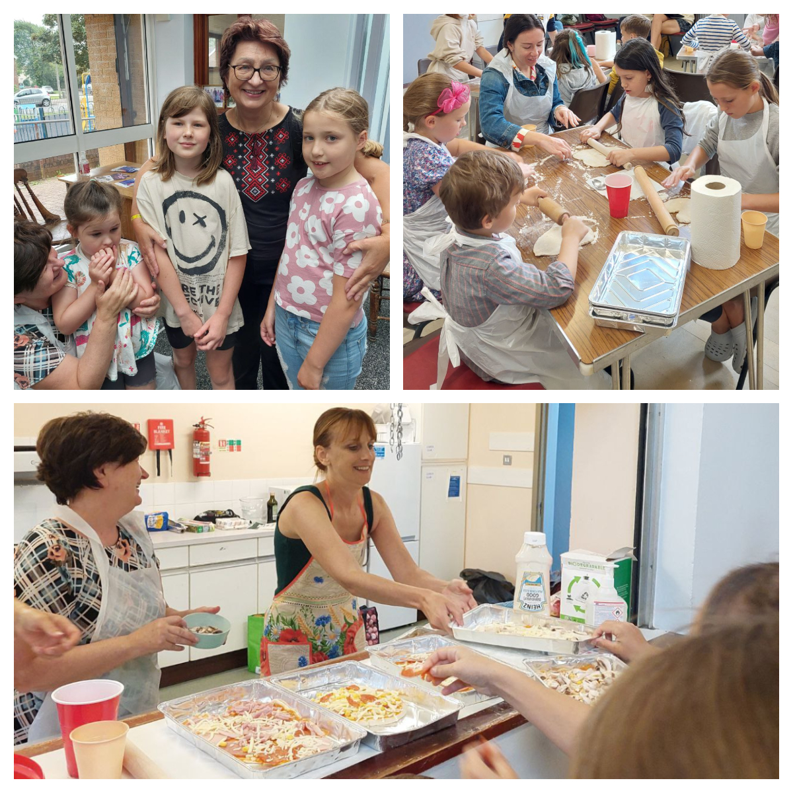
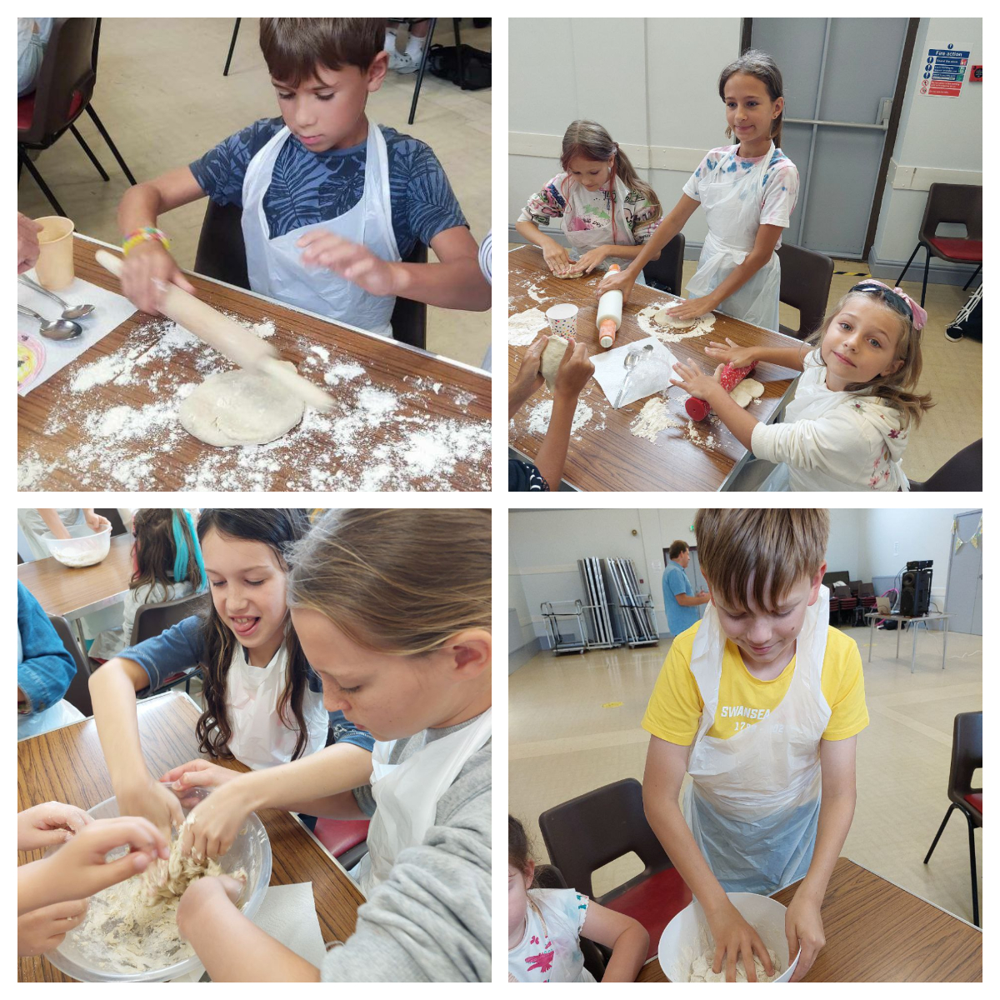
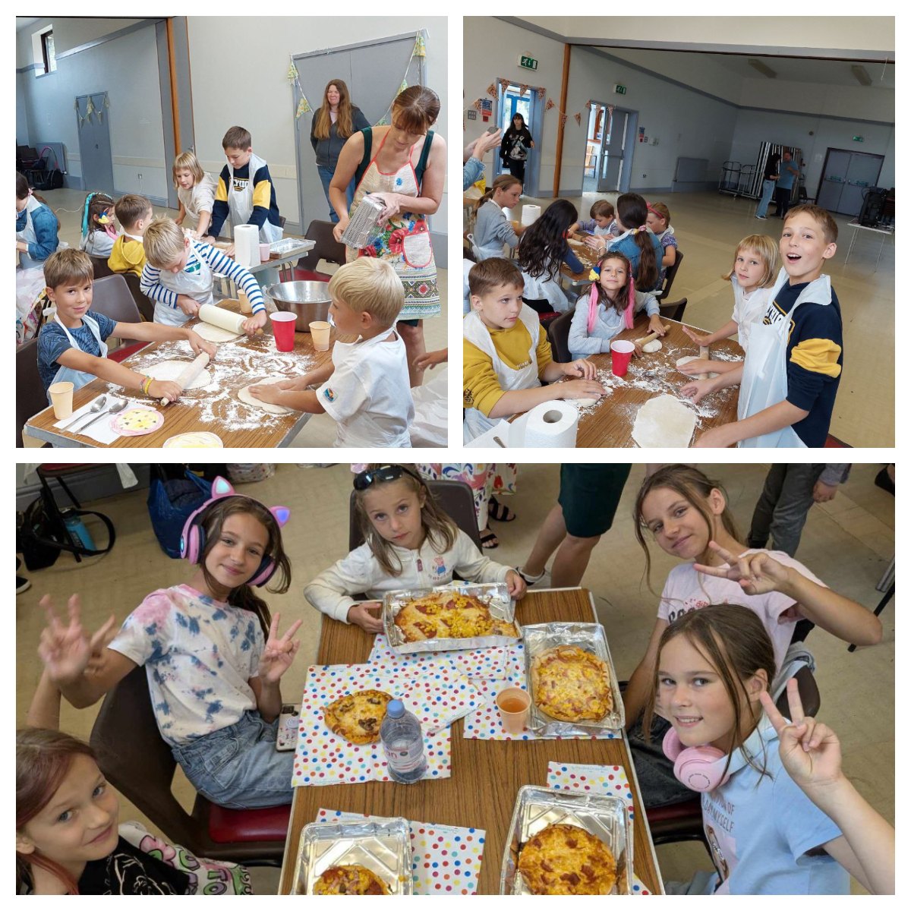
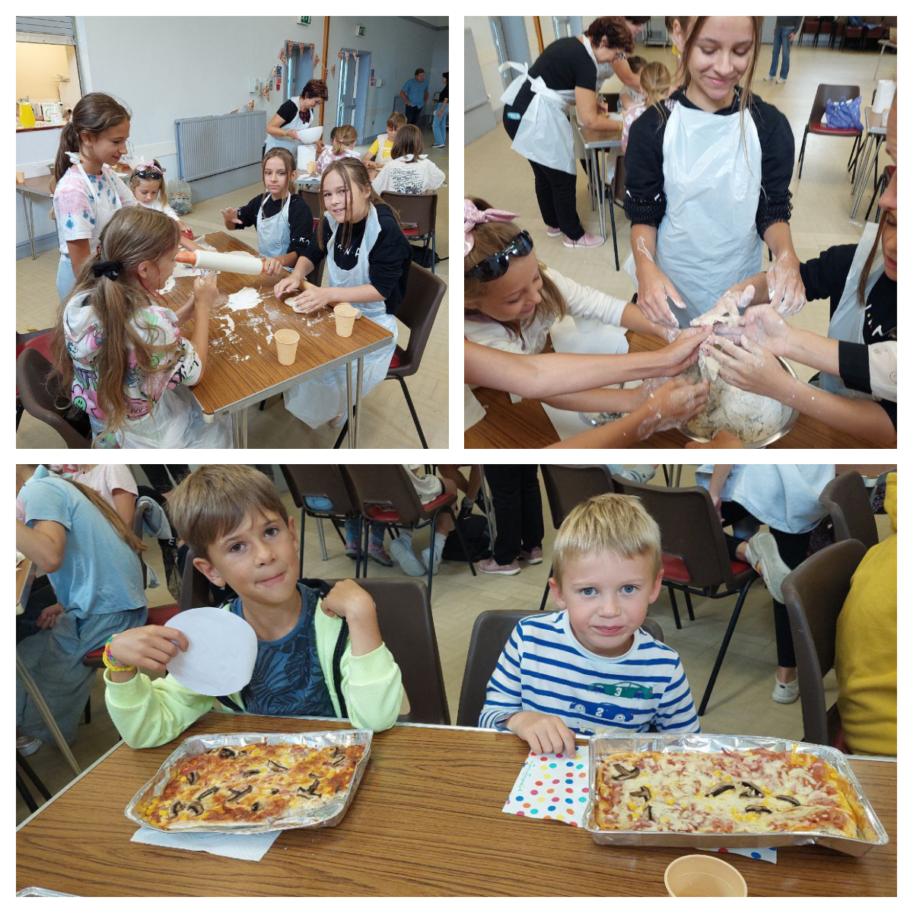
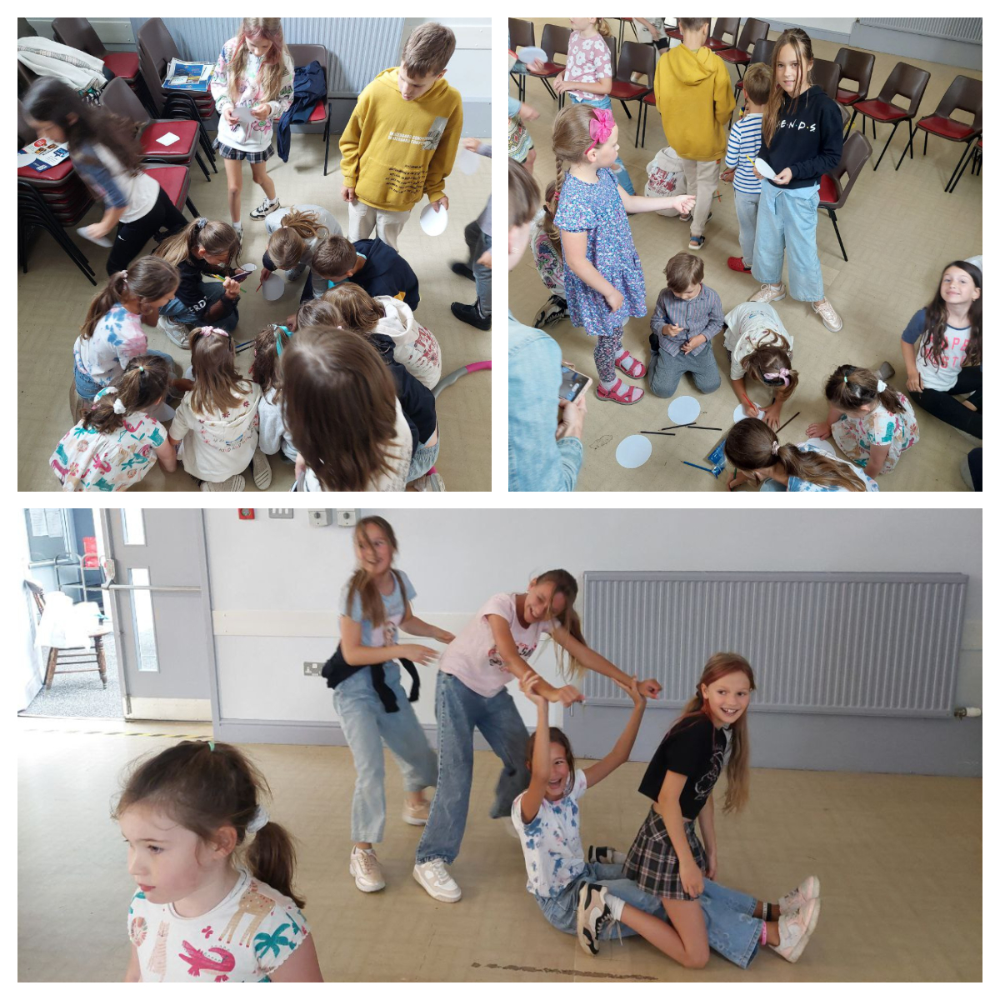
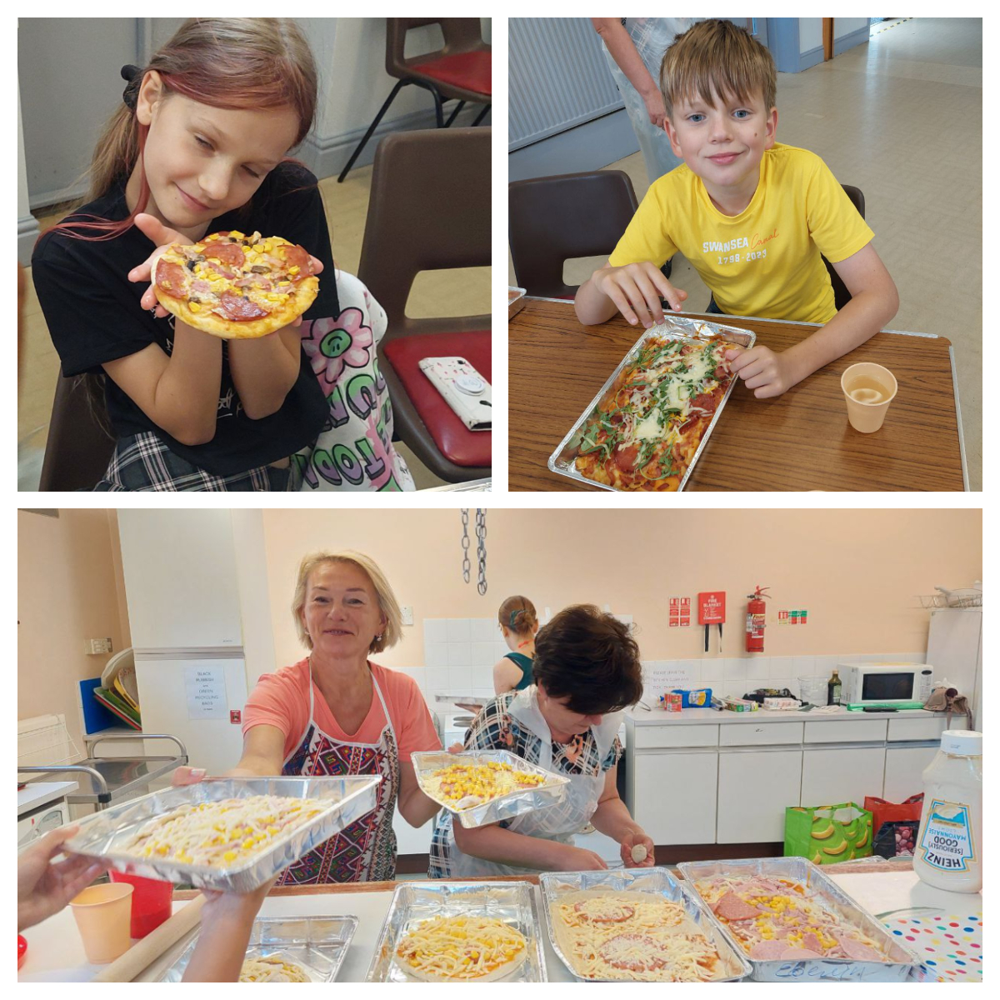
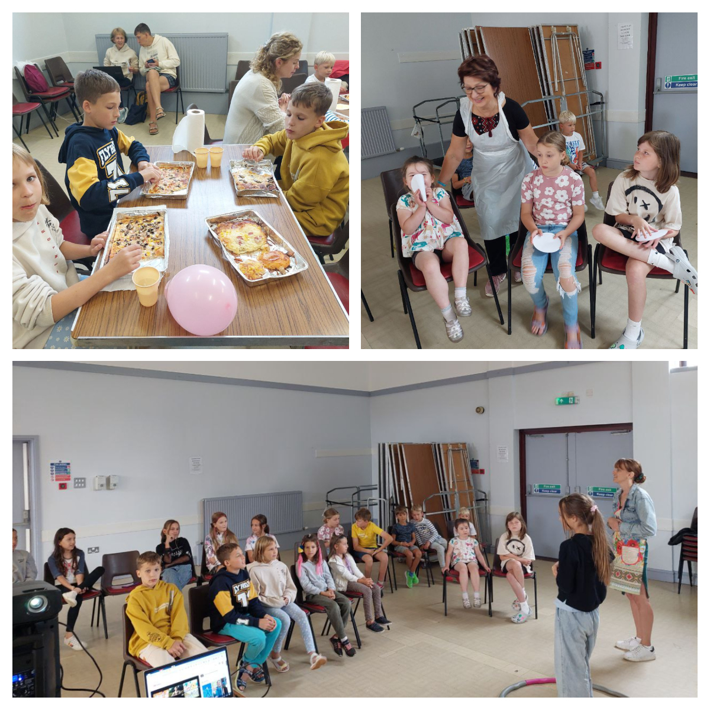
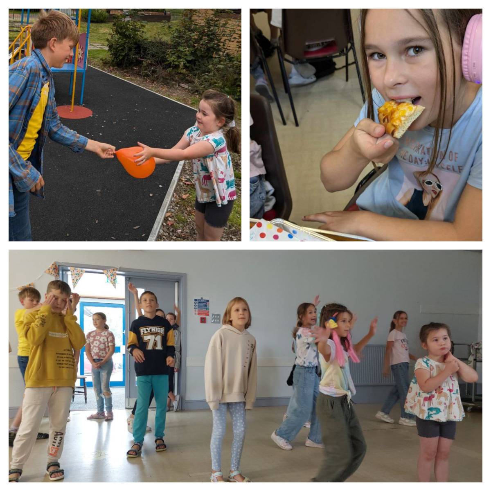

Today was an unforgettable day filled with laughter, learning, and lots of pizza-making magic as we hosted an incredible cooking class for Ukrainian children! 

These little chefs transformed into pizzaiolos, diving into every step of the pizza-making process with enthusiasm and joy. Guided by the wonderful <a href="https://www.facebook.com/profile.php?id=100065221683874" target="_blank">Tetyana Efimova</a>, the kids followed instructions like pros, mastering every cooking step.

While the dough was rising and the pizzas were baking, the excitement didn't stop! The children were bursting with energy, enjoying a whirlwind of activities, challenges, dancing, and playtime. The atmosphere was electric, with smiles and giggles echoing everywhere.

And then, the grand moment arrived—each child proudly tasted their handmade pizza, crafted with love and big enough to share with parents and friends. Those three hours of pure joy flew by in a heartbeat!

A massive thank you to everyone who participated today! 

The event was supported by the UK Government and Swansea City Council through the COAST programme.

    

        <iframe src="https://www.youtube.com/embed/lUBphAFnphc" style="position: absolute; top: 0; left: 0; width: 100%; height: 100%;" frameborder="0" allow="accelerometer; autoplay; clipboard-write; encrypted-media; gyroscope; picture-in-picture" allowfullscreen></iframe>
    

 