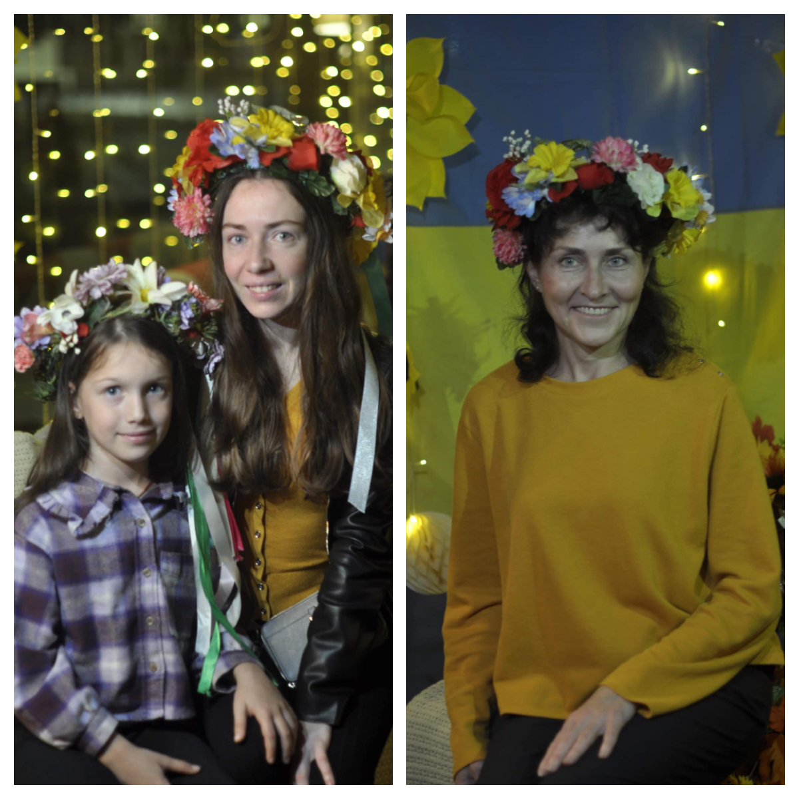
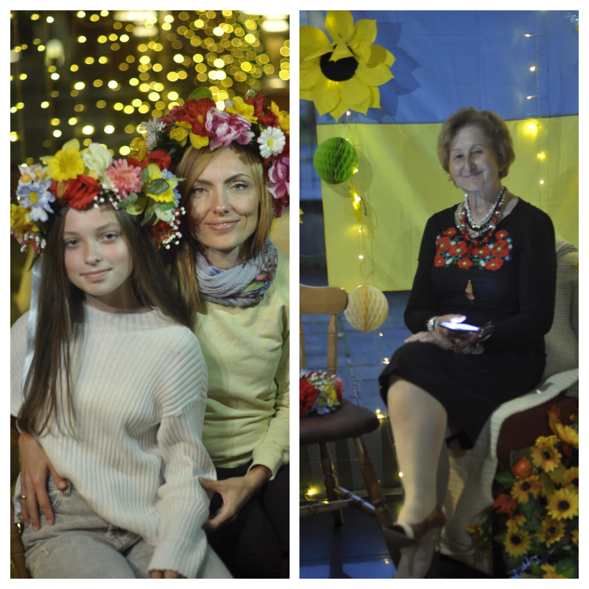
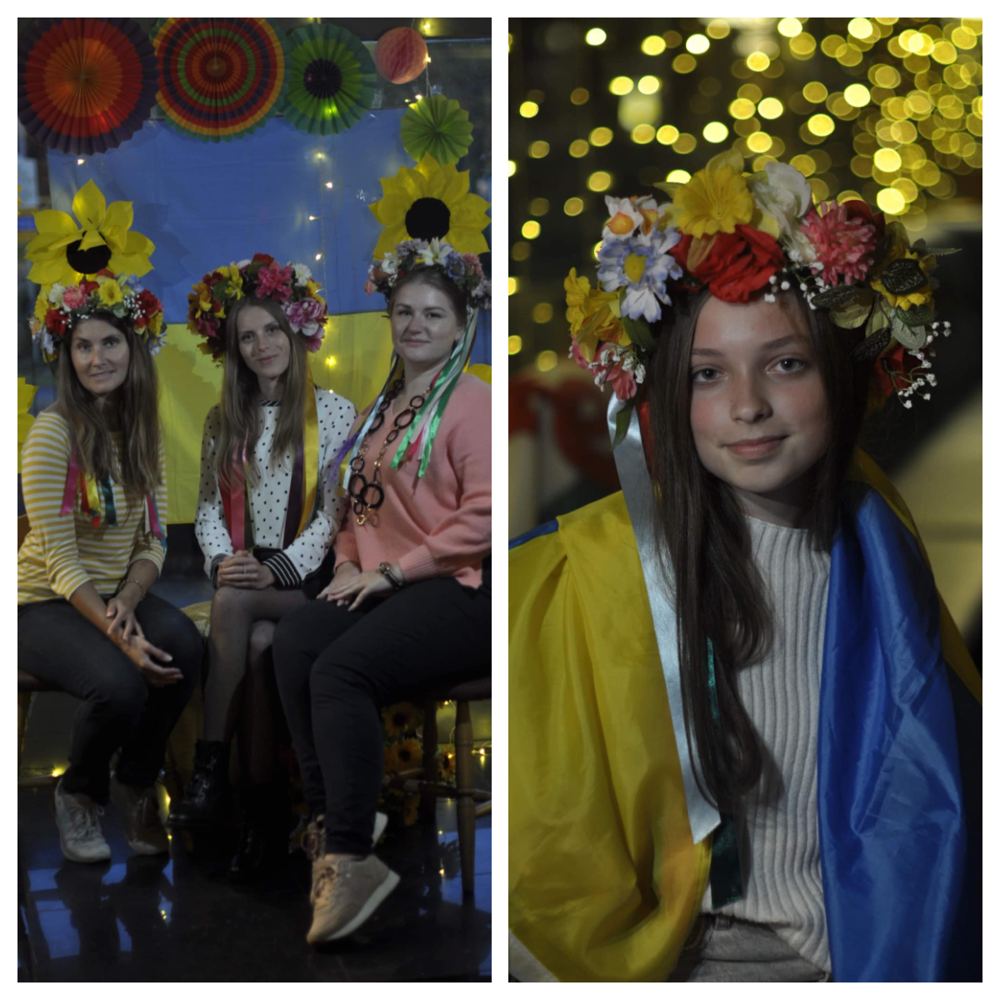
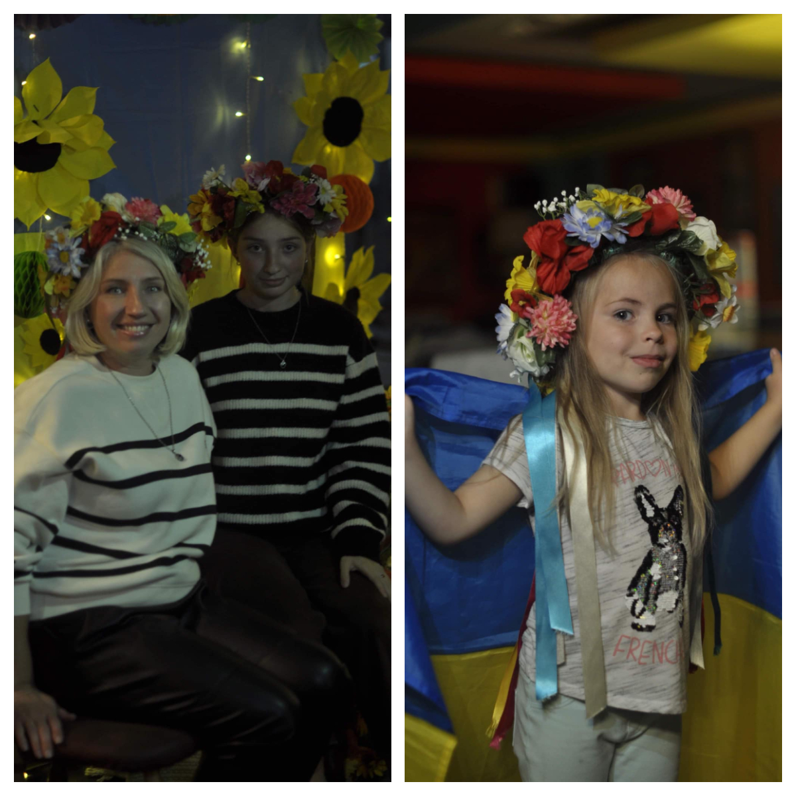
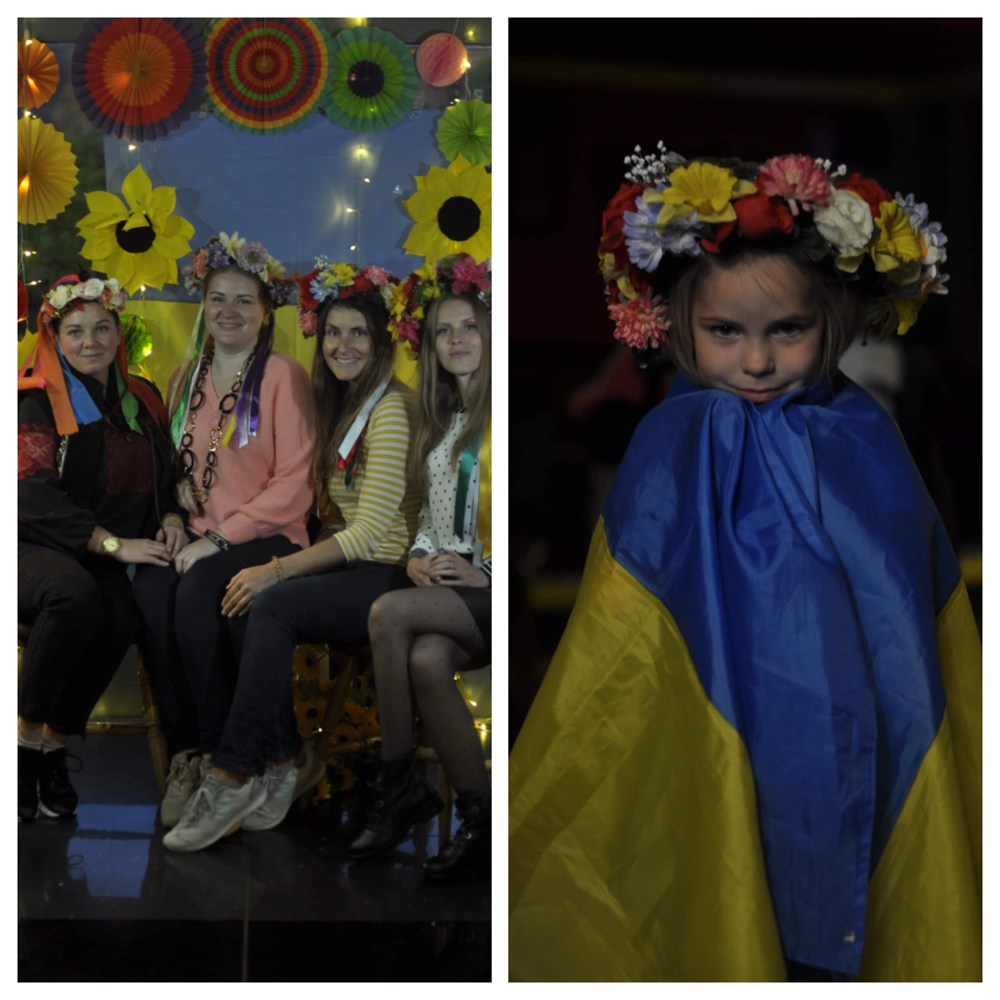
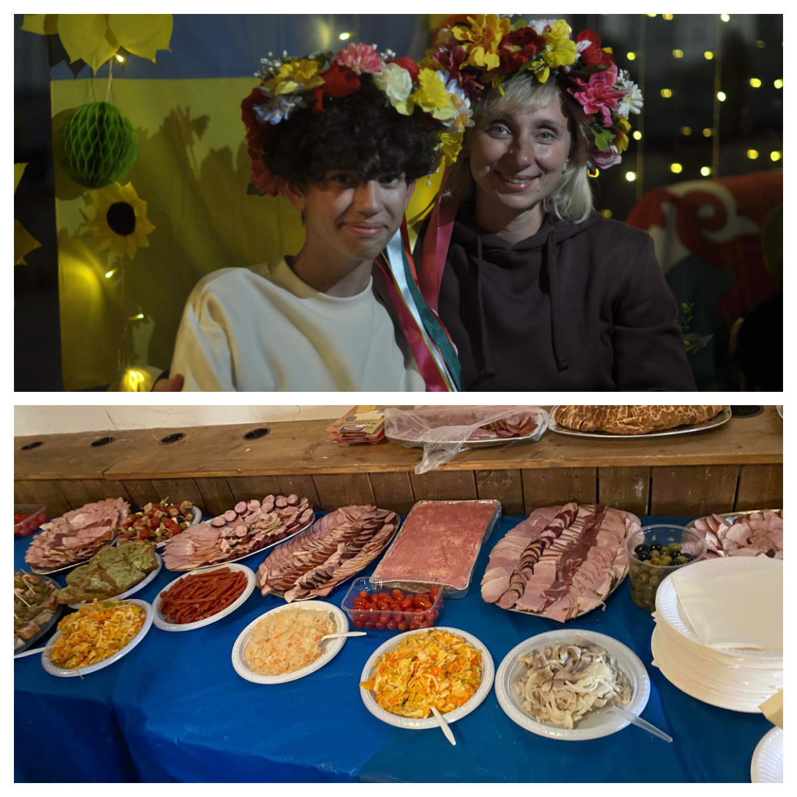

Greetings to everyone who joined us in celebrating (the Intercession of the Theotokos Feast) and the Defenders Day of Ukraine!

Many thanks to <a href="https://www.facebook.com/groups/601579067497655/user/100067665188135/" target="_blank">EJ's Cafe, Bar & Restaurant</a> for the venue, 
<a href="https://www.facebook.com/groups/601579067497655/user/1658253042/" target="_blank">Elena Samotoi</a> for the entertainment for kids, <a href="https://www.facebook.com/groups/601579067497655/user/100007102721701/" target="_blank">Christina Zalutska</a> for photos, and thank you all for tasty Ukrainian meals! 

It was so nice to have you all, our new UKrainian family, chat with you, sing together, laugh and cry together, and say thank together to our defenders who fight for us, for our Ukraine!

Glory to Ukraine!

GLory to the heroes!

See you soon!

