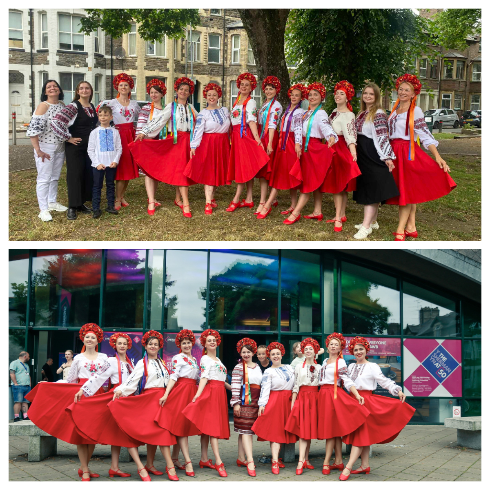
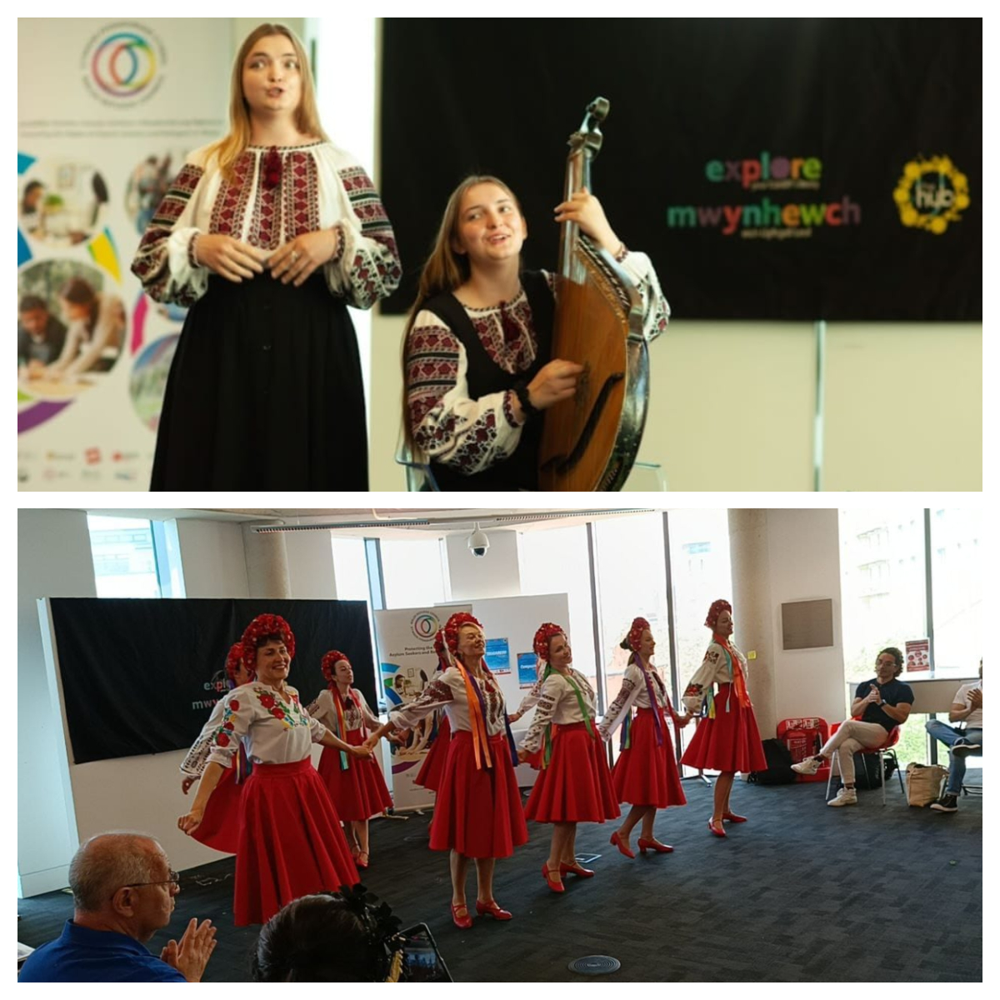
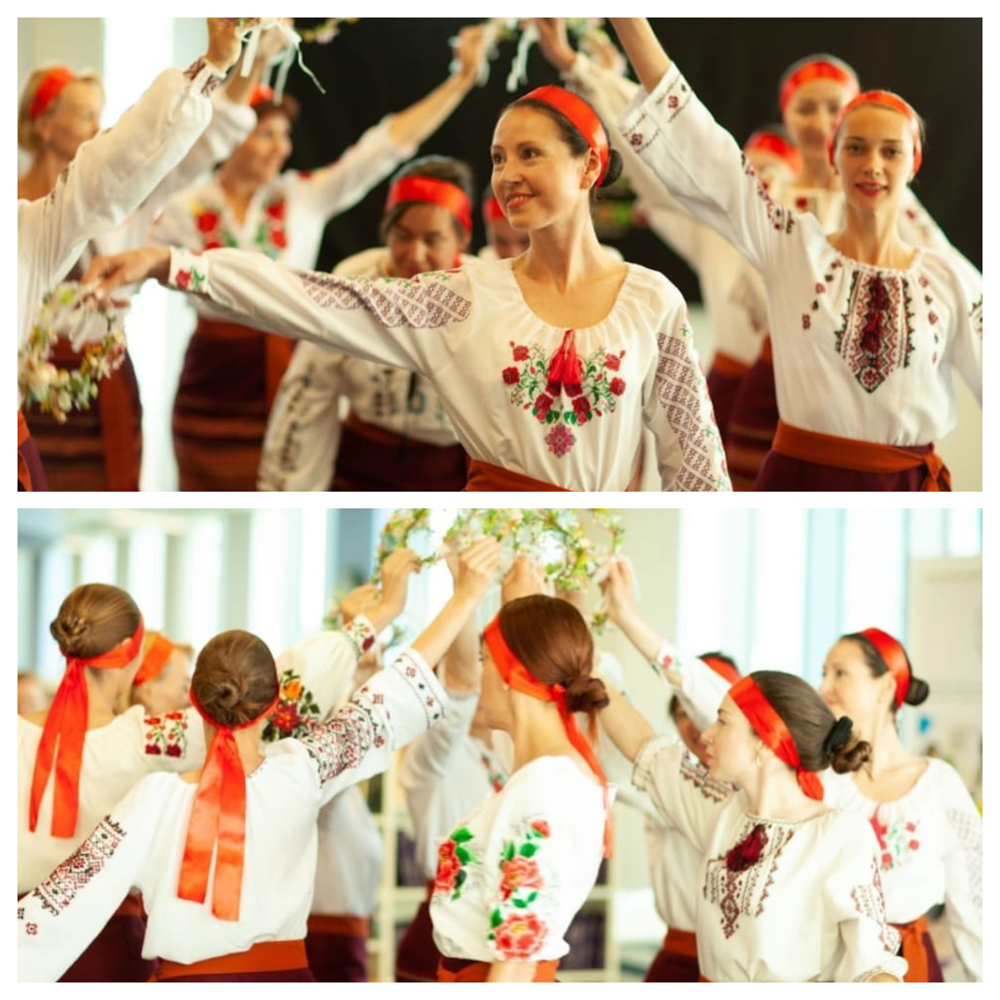
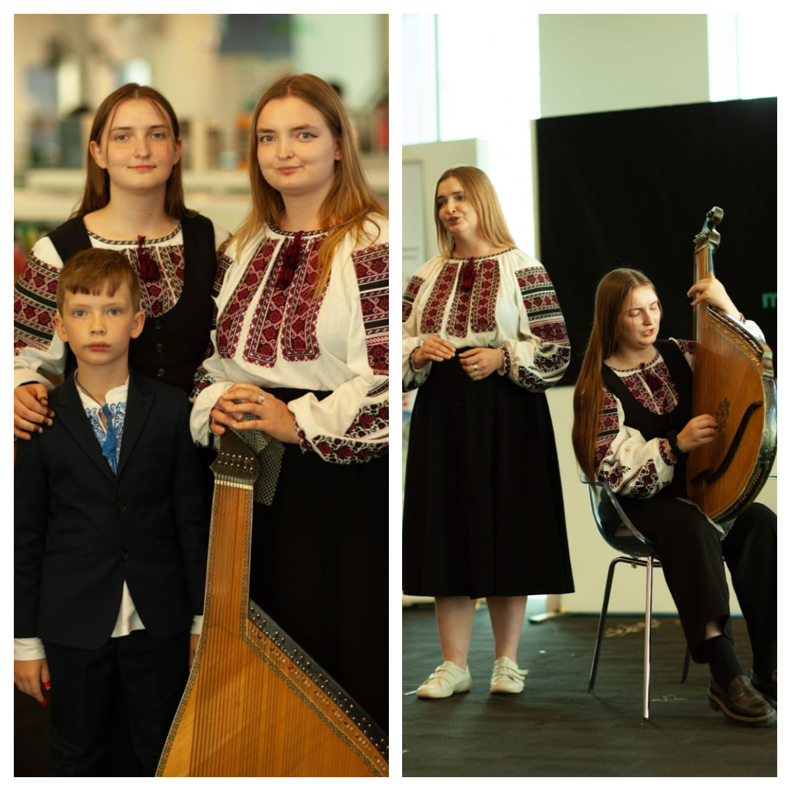
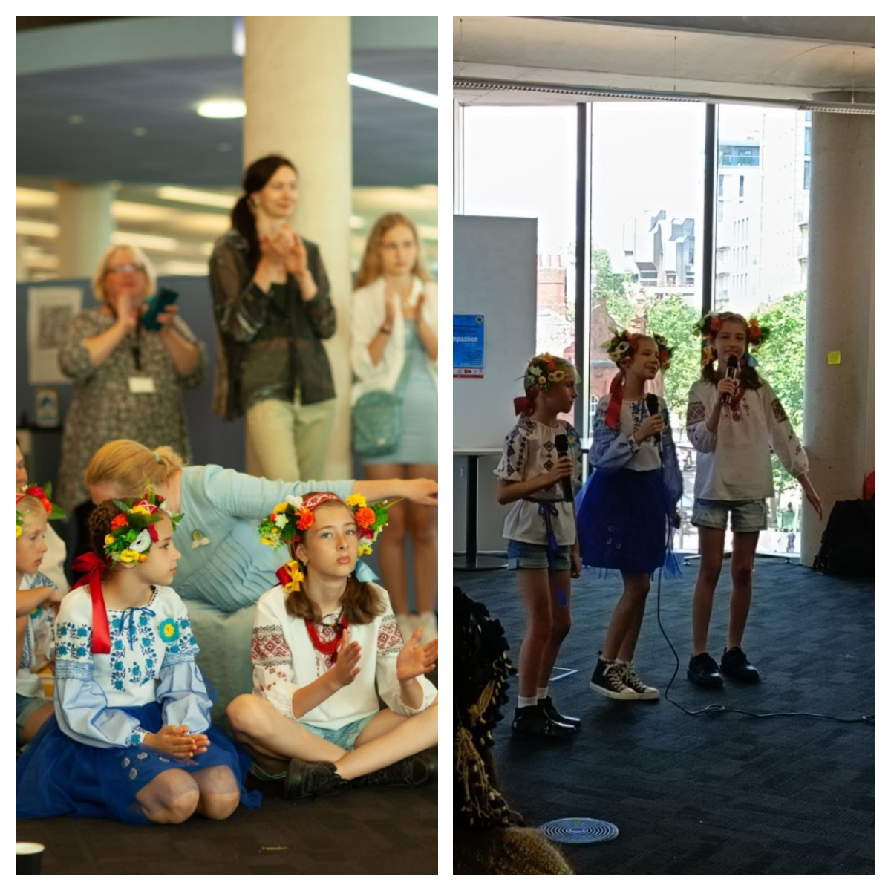
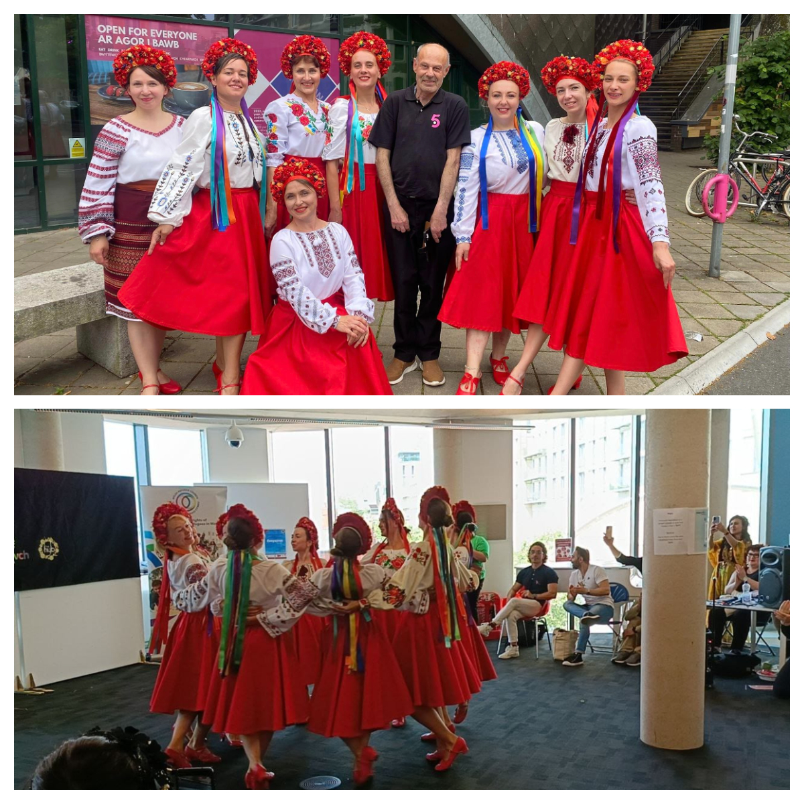
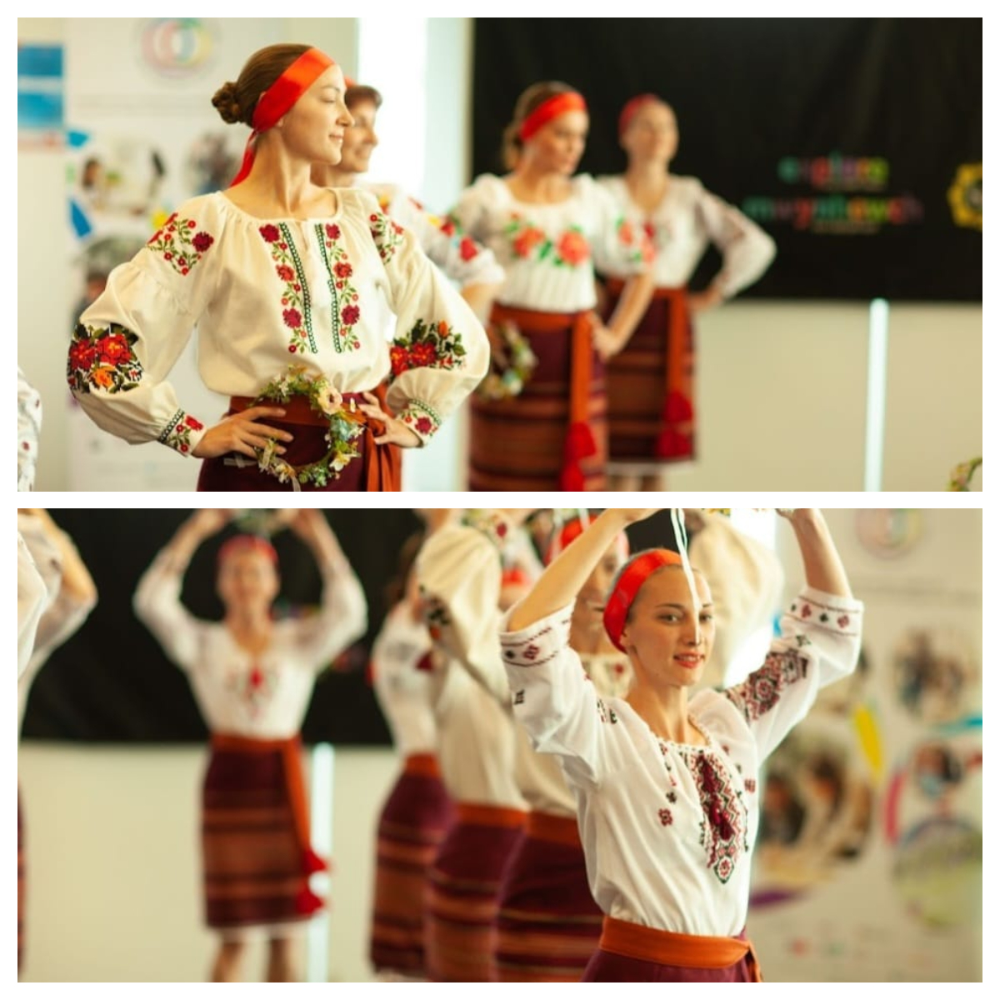
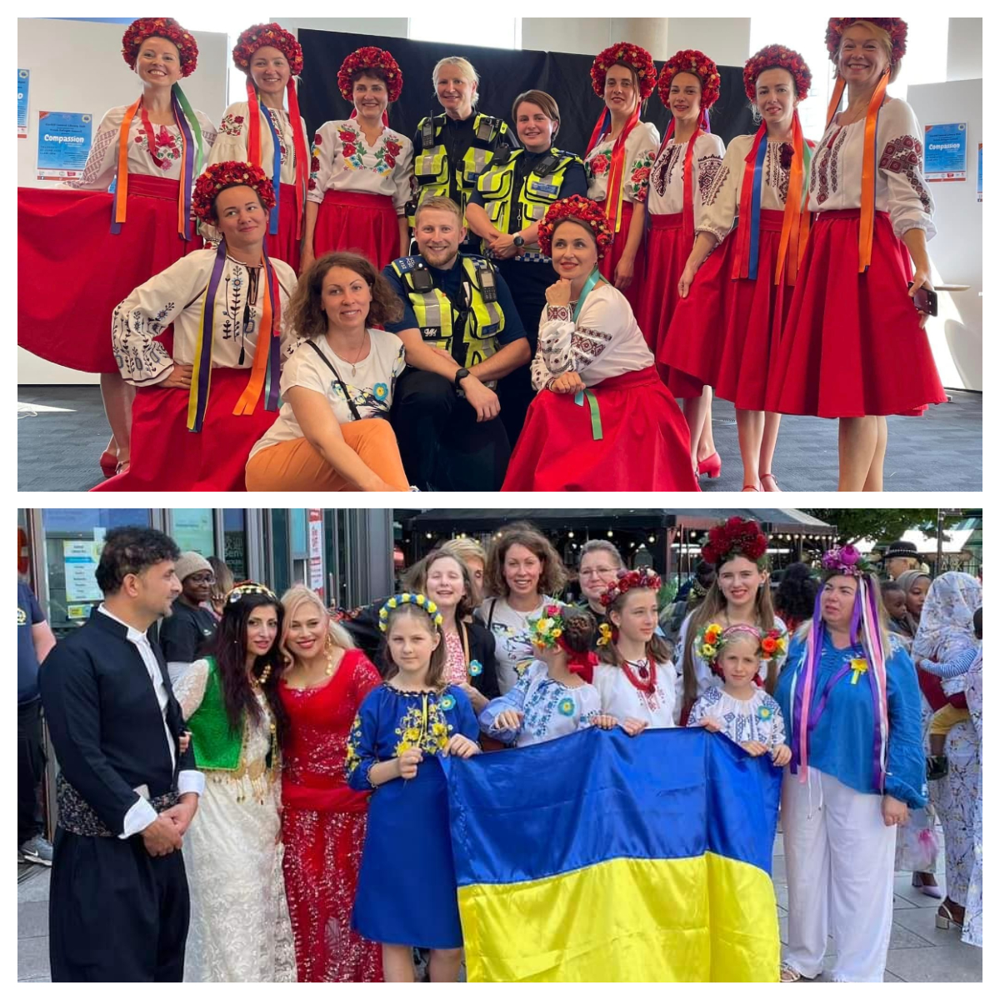

For <a href="https://www.facebook.com/groups/601579067497655" target="_blank">Sunflowers Wales (Соняшники)</a>, it was a great opportunity to participate in the <a href="https://www.shermantheatre.co.uk/festival-of-sanctuary/" target="_blank">Festival of Sanctuary</a> at <a href="https://www.shermantheatre.co.uk/" target="_blank">Sherman Theatre</a> and in the <a href="https://cardiffhubs.co.uk/event/compassion-a-refugee-week-celebration/" target="_blank">Compassion event</a> by <a href="https://wrc.wales/" target="_blank">Welsh Refugee Council</a> at <a href="https://cardiffhubs.co.uk" target="_blank">Cardiff Central Library Hub</a>.

We presented our Ukrainian dances, music, and songs, we found new friends from others refugee communities, we could express once again huge thanks to Wales for the generosity and support.

However, it was also time for sadness and tears. We wish that Ukrainians could have visited lovely Wales solely as tourists. We wish our dancers had never needed to bring their children from their homes, so far away and for such a prolonged period.

The war in Ukraine continues. Everyday russians shell residential areas, destroy civilian infrastructure, kill children, bring blood, tears, and hatred.

We do as much as we can to support Ukrainians on the frontline with medical supplies to save their lives, to help them save others.

Our dancers, musicians, and singers regularly participate in fundraising events to buy and send the vital supplies to Ukraine. 

Please support us with our cause! <a href="/donate/">How to donate</a>.

Selected photos credit to <a href="https://www.instagram.com/noah.bakour" target="_blank">Noah Bakour</a>.