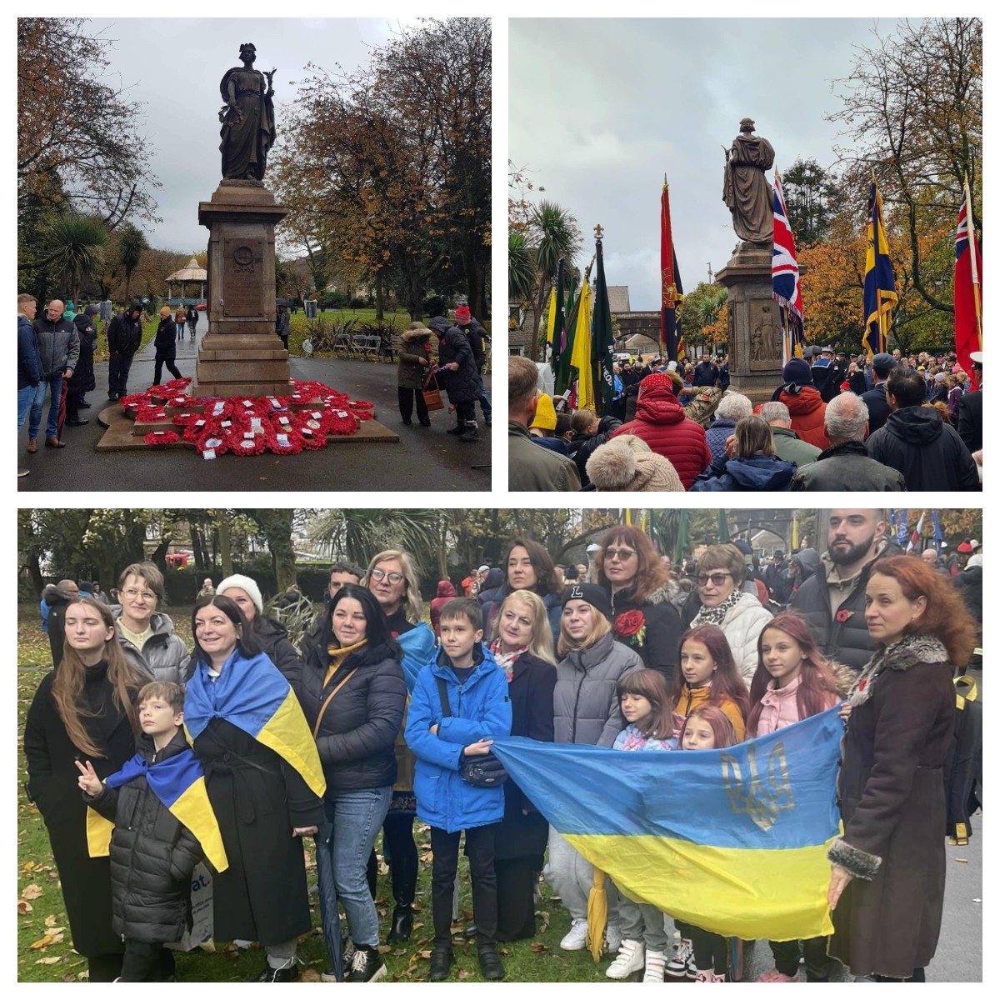
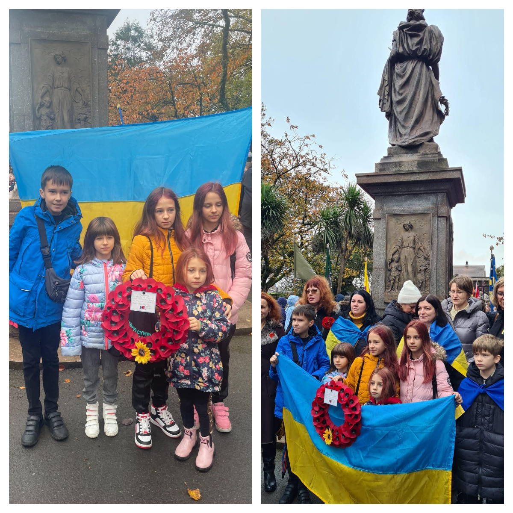
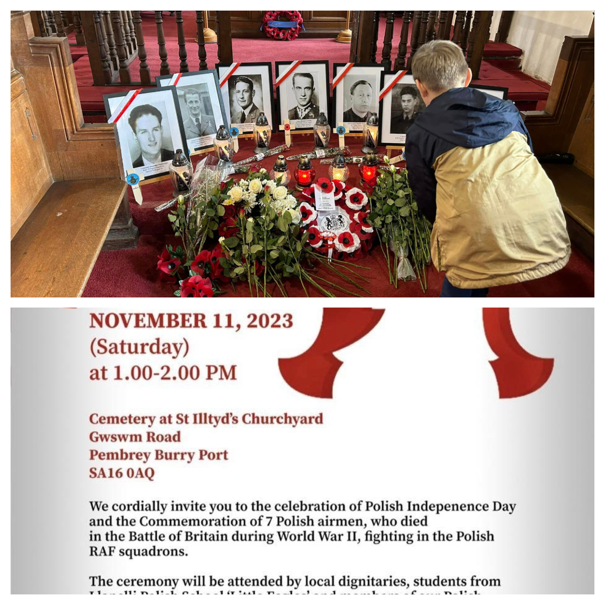

<a href="https://www.facebook.com/groups/601579067497655" target="_blank">Sunflowers Wales (Соняшники)</a>  joined our Polish and Welsh friends in celebration of Polish Independence Day and Remembrance Day. 

The event in Llanelli was well organised by <a href="https://www.facebook.com/joanna.drozdek.58" target="_blank">Joanna Drozdek</a> and <a href="https://www.facebook.com/paolo.piana.923" target="_blank">Paolo Piana</a> with many dignitaries and people from Polish, Welsh and Ukrainian communities attended. We also said prayers for Ukrainian soldiers and civilians who died in Ukraine during russian aggression. On a photo below, Lukian Tykhyi is laying flowers from Ukrainian children to 7 Polish pilots who died during Second World War and are buried at Pembrey Cemetery.

In Port Tarbolt, in somber atmosphere, people got together to pay their respect to the fallen soldiers of many past wars.
And Ukrainians put their wreath too to remember those ukrainian soldiers who died in present war with ruSSia. The  gathering  broke up in applauds that were heart felt by everyone  of us and brought  tears to our eyes… Thank you to our our dear friends Beverley Carver and Peter Ross for this opportunity! And big thank you to John Bamsey, Branch chairman of The British legion and master of ceremony, who in his opening speech talked about  our Great War and our fight for freedom and independence.

We will always remember.

