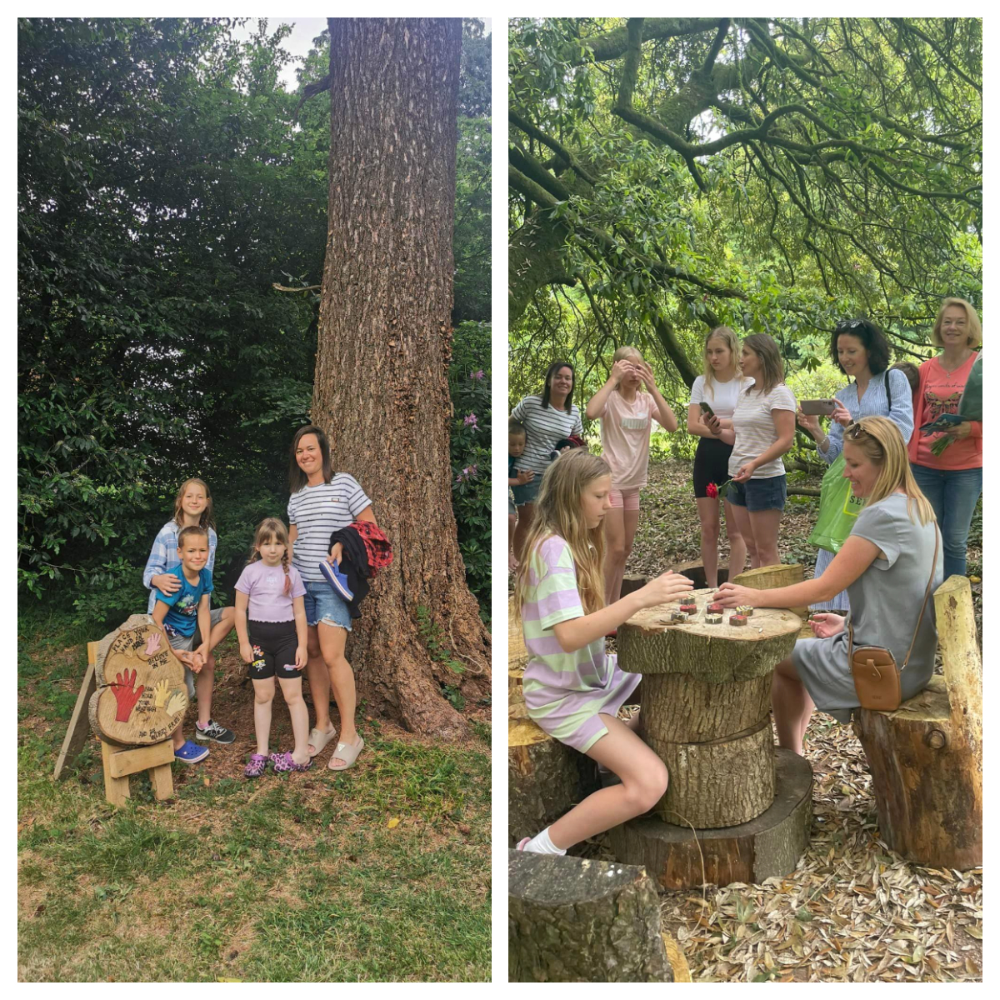
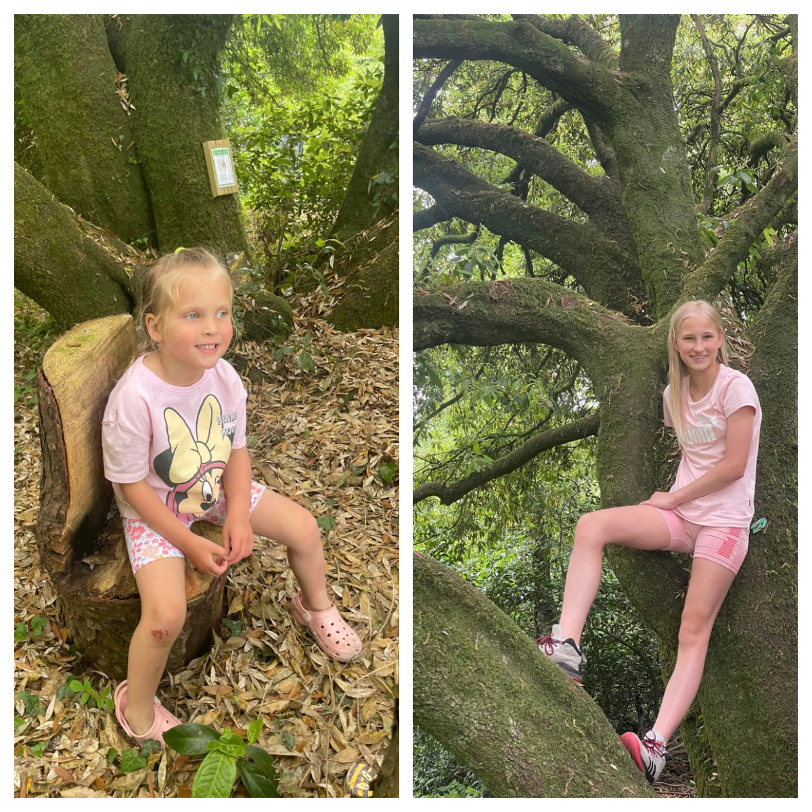
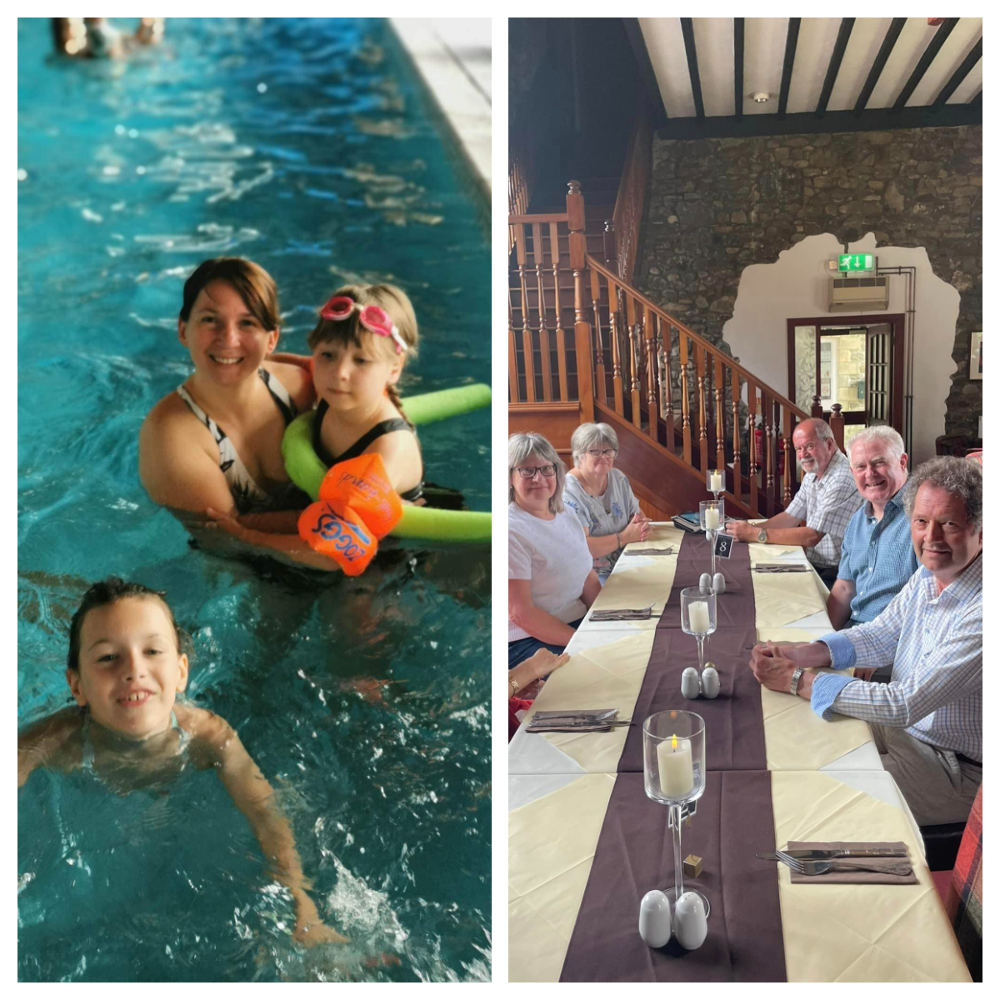
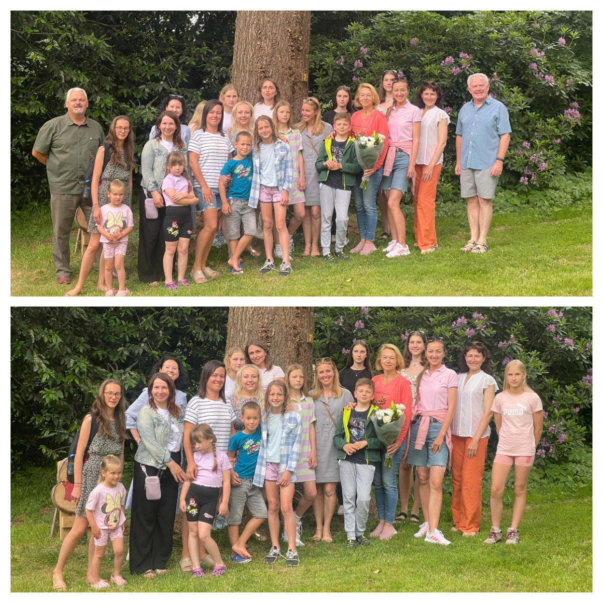

<a href="https://www.facebook.com/groups/601579067497655" target="_blank">Sunflowers Wales (Соняшники)</a> are lucky and privileged to be looked after by <a href="https://www.facebook.com/groups/601579067497655/user/100064940790482/" target="_blank">Llandeilo Rotary Club!</a>

We were invited yet again (5th time now!) to spend a day in Pantglas.

This time our dancing sunflowers had fun in pool, tasty food in restaurant and beautiful walk in fairy forest! :-)

President of Llandeilo Rotary club Colin Jenkins introduced to us Mark Stephens, the Rotary District Foundation Chair. These two gentleman made it possible for us to go and enjoy Pantglas till the end of the year!! What a fantastic news!

We were treated as well to Welsh singing: Mark Stephens sang Welsh National Anthem. And of course we sang  Ukrainian too! :-)

Nice day spent with nice people!

Thank you!

Diolch!

Дякуємо!

