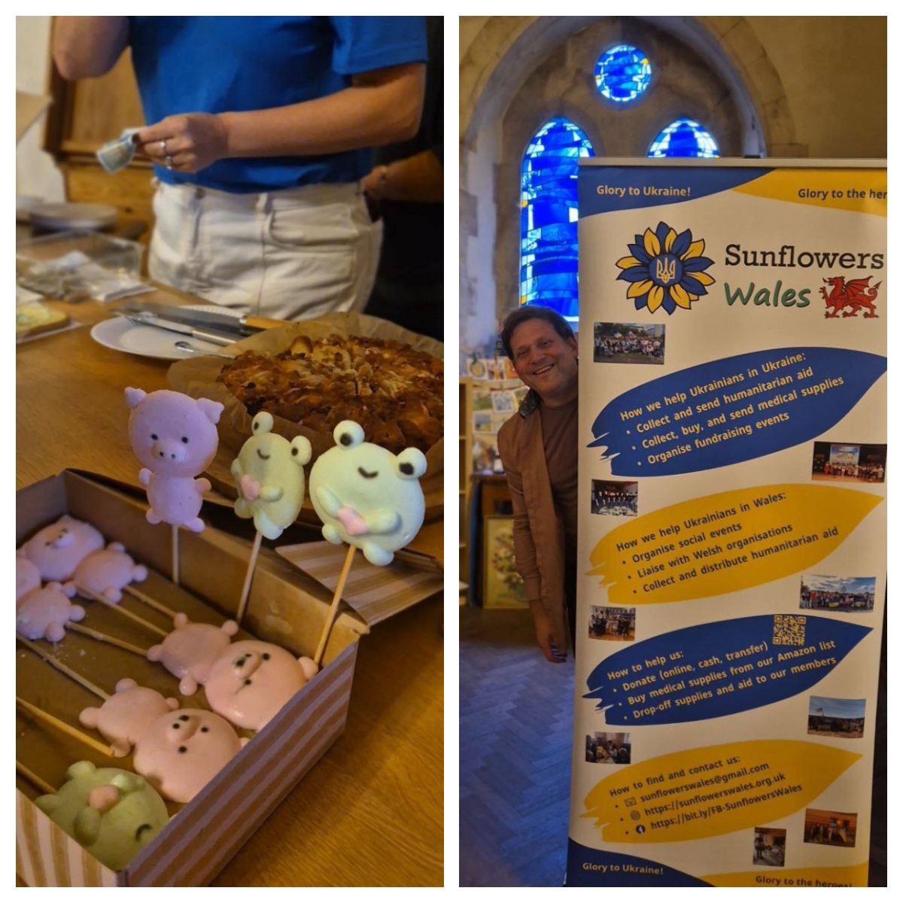

Sunflowers Wales had an incredible, magical, and touching evening, gifted to us by the wonderful <a href="https://www.facebook.com/oksana.ladyko/" target="_blank">Oksana Merhut</a>, the Sand Fairy of Ukraine!

Her sand animation under the dome of the old <a href="https://www.facebook.com/profile.php?id=100071867453531" target="_blank">St. Mary's Church</a> in the centre of Swansea captivated us; her hands scattered sparkling sand and held our attention, emotions, space, and time!

We lived through the story of the Star-Child together. We were proud of our country and cried over the terrible trials it has faced, praying for Ukraine.

We were together, we communicated, we tasted wonderful treats prepared by our amazing culinary masters, our children played together and they even had a small workshop from <a href="https://www.facebook.com/oksana.ladyko/" target="_blank">Oksana Merhut</a>!

So, it was truly a wonderful evening! We are very grateful to Oksana and her daughter Olena for coming to us! We really hope this is not our last meeting!

Thanks to everyone who helped create this evening!
Many thanks to <a href="https://www.facebook.com/profile.php?id=100071867453531" target="_blank">St Mary's Swansea church</a> for the kind hospitality!
And a huge thanks to everyone who came yesterday and bought tickets to support our defenders!

Sunflowers Wales – Standing Strong Together!

Glory to Ukraine!

