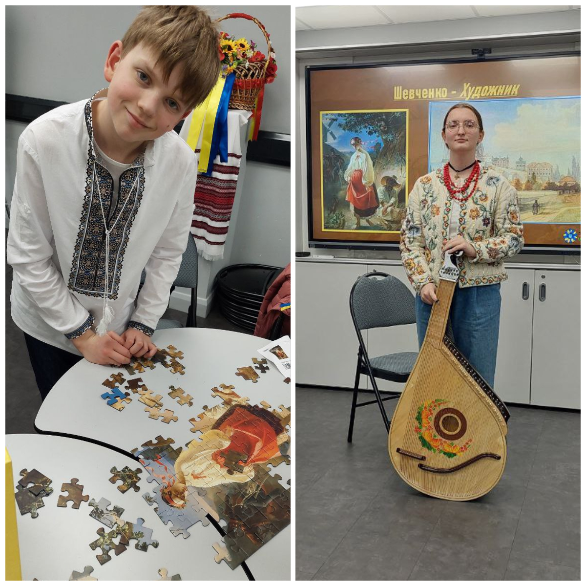
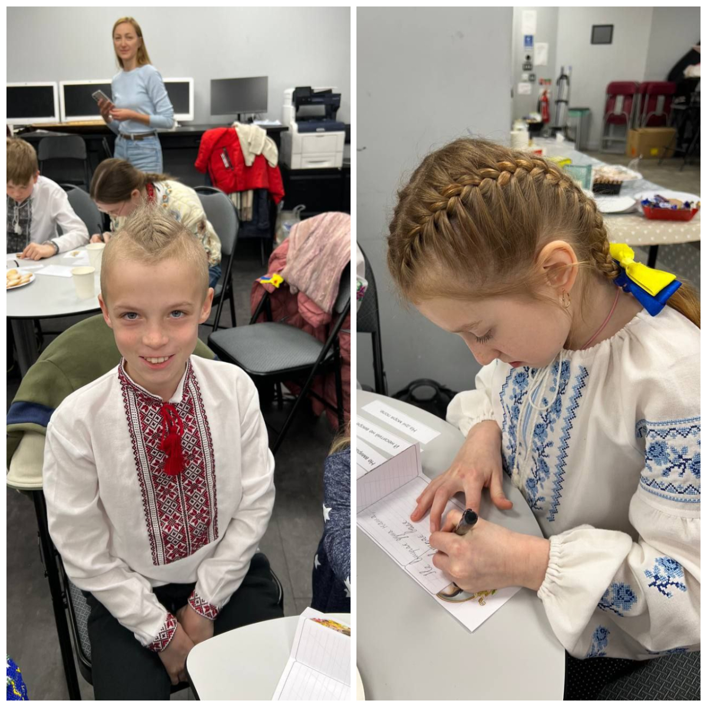
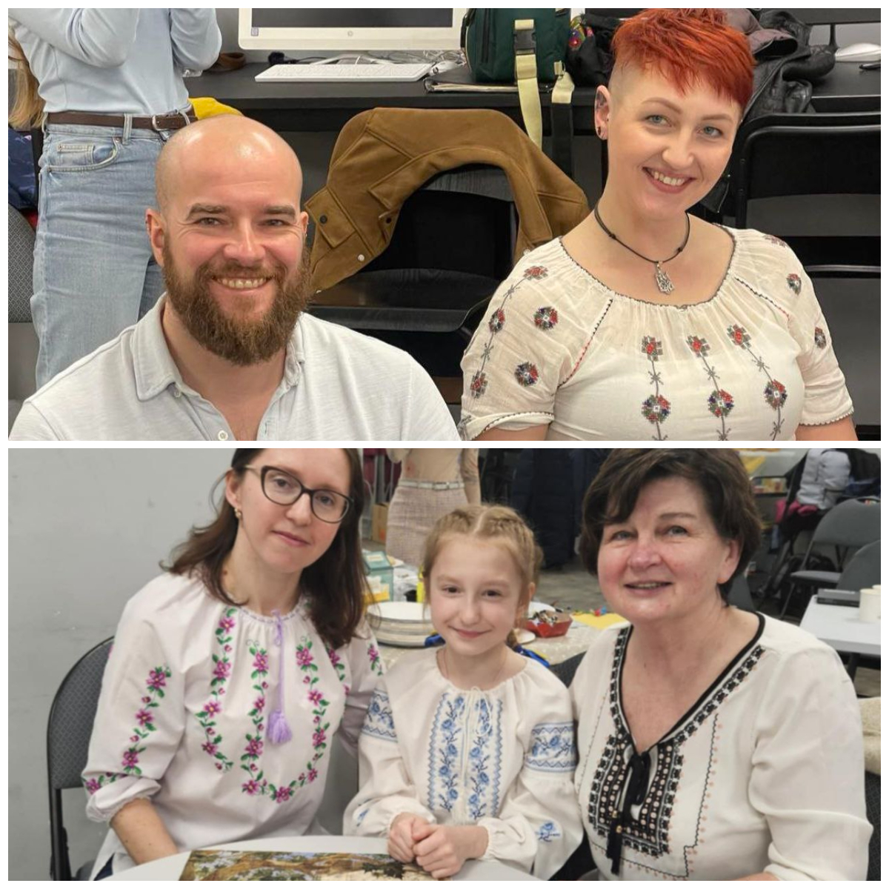
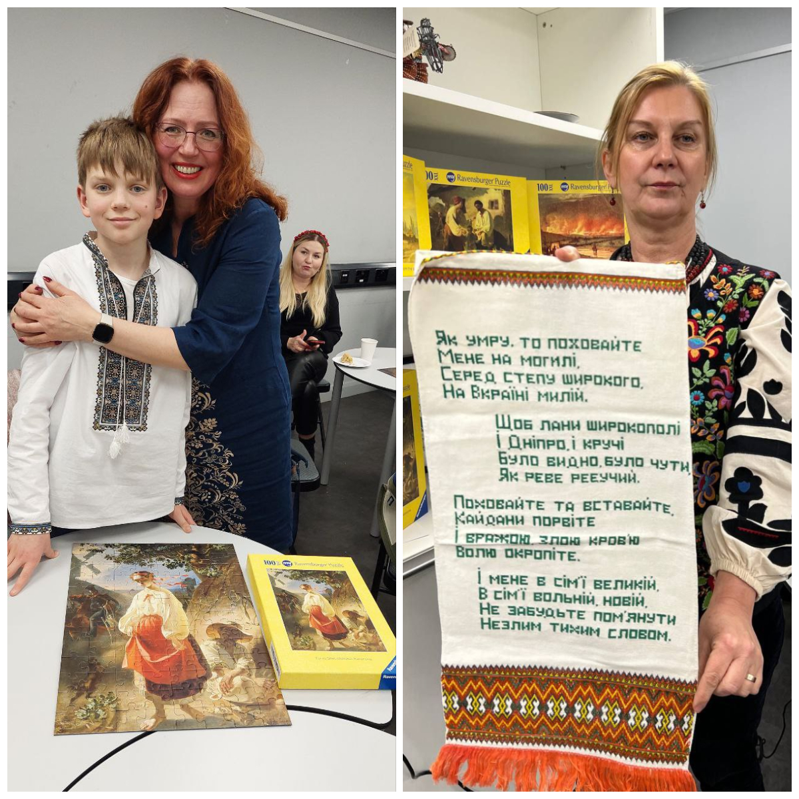

For the third year in a row, Sunflowers Wales has been holding an event to celebrate the birthday of Taras Shevchenko. Saturday's gathering was incredibly warm, friendly, and filled with the magical world of the great Kobzar. Poetry, singing, contests, puzzle assembling, tea drinking—and, most importantly, conversation.

A conversation among people with different stories, from different corners of Ukraine, yet united by a common country, a shared culture, and a mutual point of support—Taras Shevchenko. Nearly two hundred years ago, he spoke to us, the unborn then, and to those who are now outside of Ukraine. And that is why his words resonate so accurately and powerfully today.
Thank you to everyone who was with us!

Let us fight – and we shall prevail!
Борімося – поборемо!

    <iframe width="318" height="566" src="https://www.youtube.com/embed/TE2u1S1hqzY" title="Шевченко знаний і незнаний (Shevchenko known and unknown), 8/03/2025, Swansea" frameborder="0" allow="accelerometer; autoplay; clipboard-write; encrypted-media; gyroscope; picture-in-picture; web-share" referrerpolicy="strict-origin-when-cross-origin" allowfullscreen></iframe>

