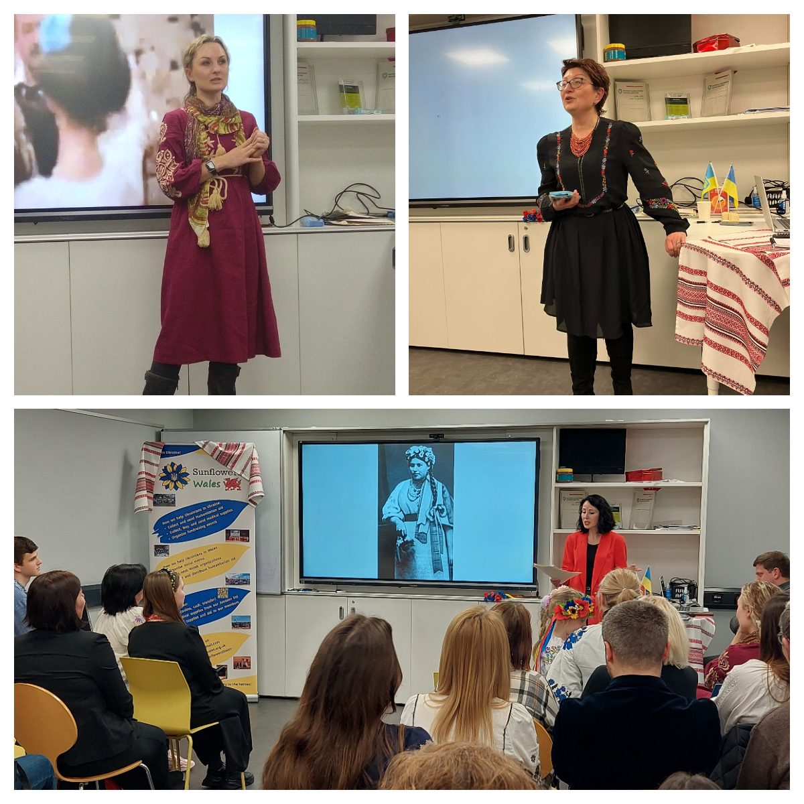
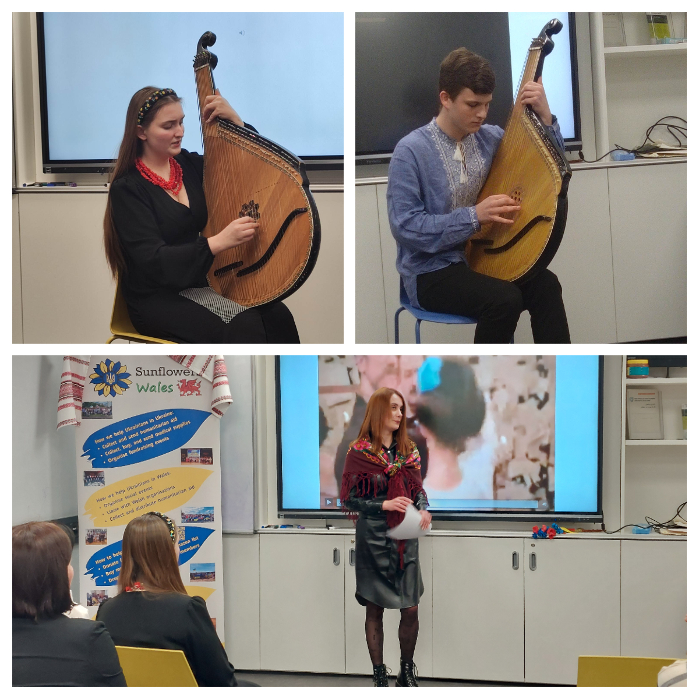
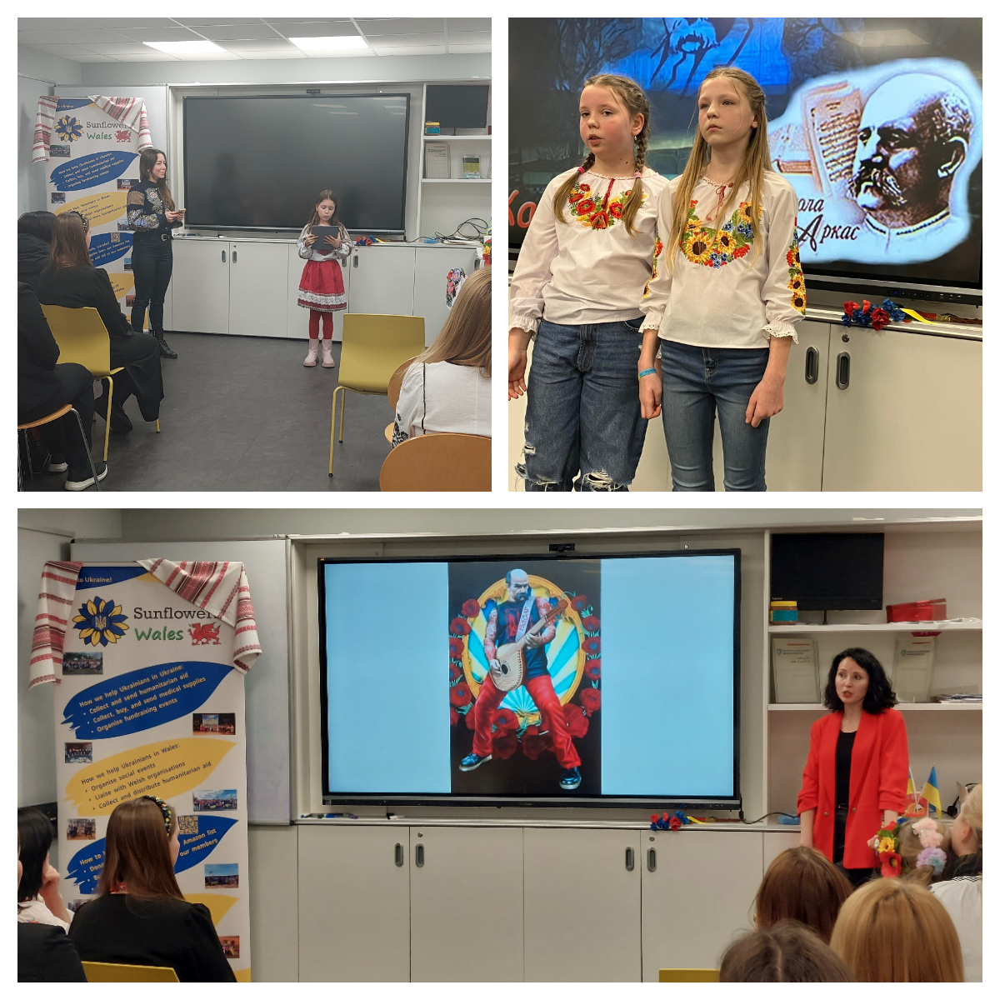
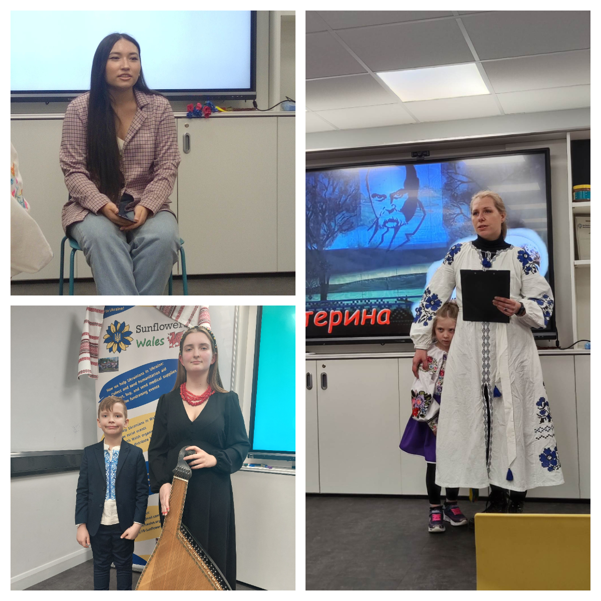
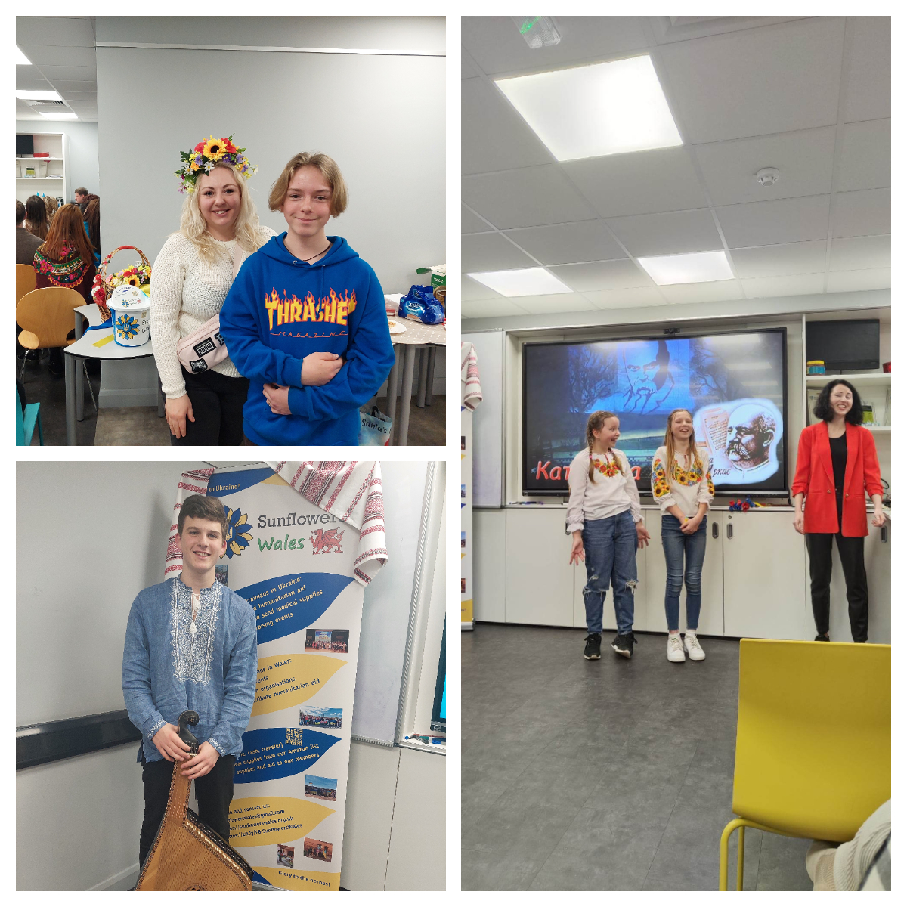
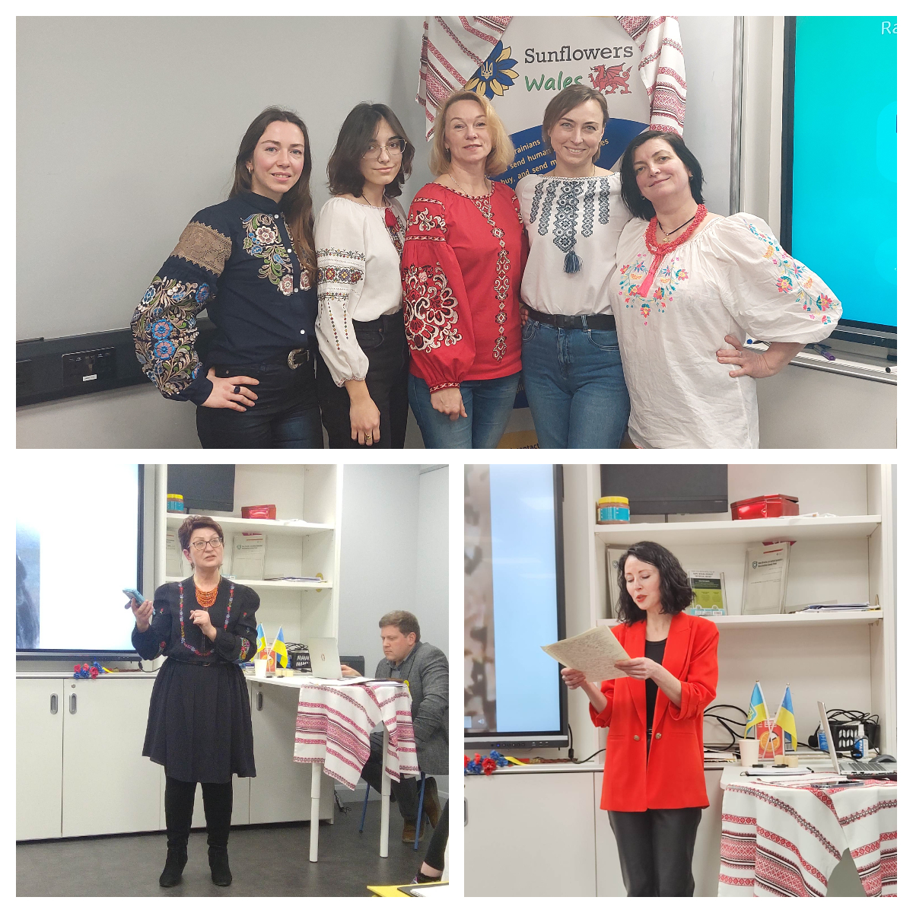

On March 10, <a href="https://www.facebook.com/groups/601579067497655" target="_blank">Sunflowers Wales (Соняшники)</a> organized Taras Shevchenko readings. For 2.5 hours, Swansea Multicultural HUB became a centre of Ukrainian literature and music! 

We read Taras' poems, sang and heard songs and music aroused from his art. Many thanks to all who joined us on that day! We listened stories about Taras' life and participated in a quiz to check our knowledge about him. 

Many thanks to all who joined us for the event, all participants - kids and adults, all who baked lovely cakes, and of course our fantastic art director and compere, <a href="https://www.facebook.com/tmarshtupa" target="_blank">Tatyana Marshtupa</a>, who made this evening bright and warm!

Standing Strong Together!

