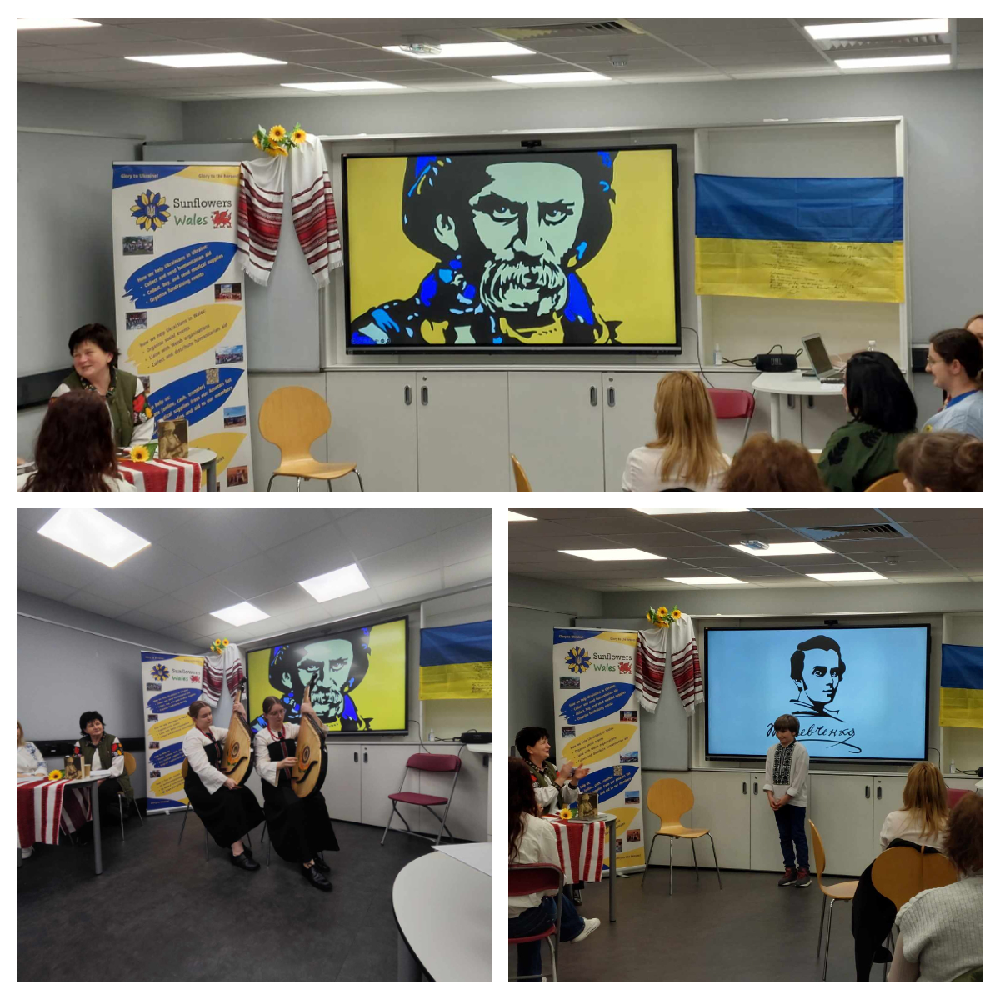

Like last year, we organised Taras Shevchenko readings on the poet's birthday. Ukrainians and admirers of Shevchenko's work gathered from various corners of South Wales. The evening was filled with the words of the Poet, his poems, and songs. Once again, we recalled his challenging life journey. We reaffirmed that Shevchenko is not just the past, he is the present. 

Sincere thanks to all guests and participants of the celebration, our youngest readers, talented bandurists, and everyone who took part. As always, our Ukrainian ladies with their treats made the evening particularly cozy. It was a truly warm gathering among friends!

<!--  -->
