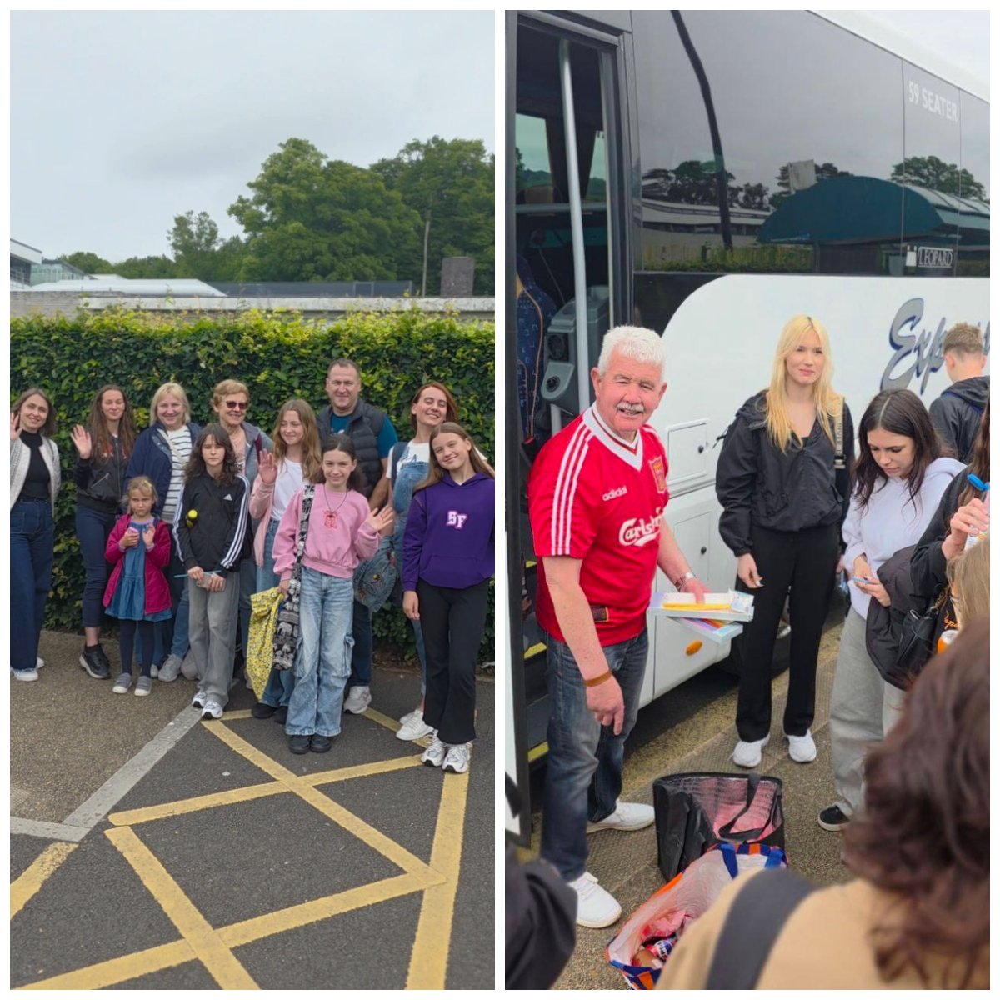
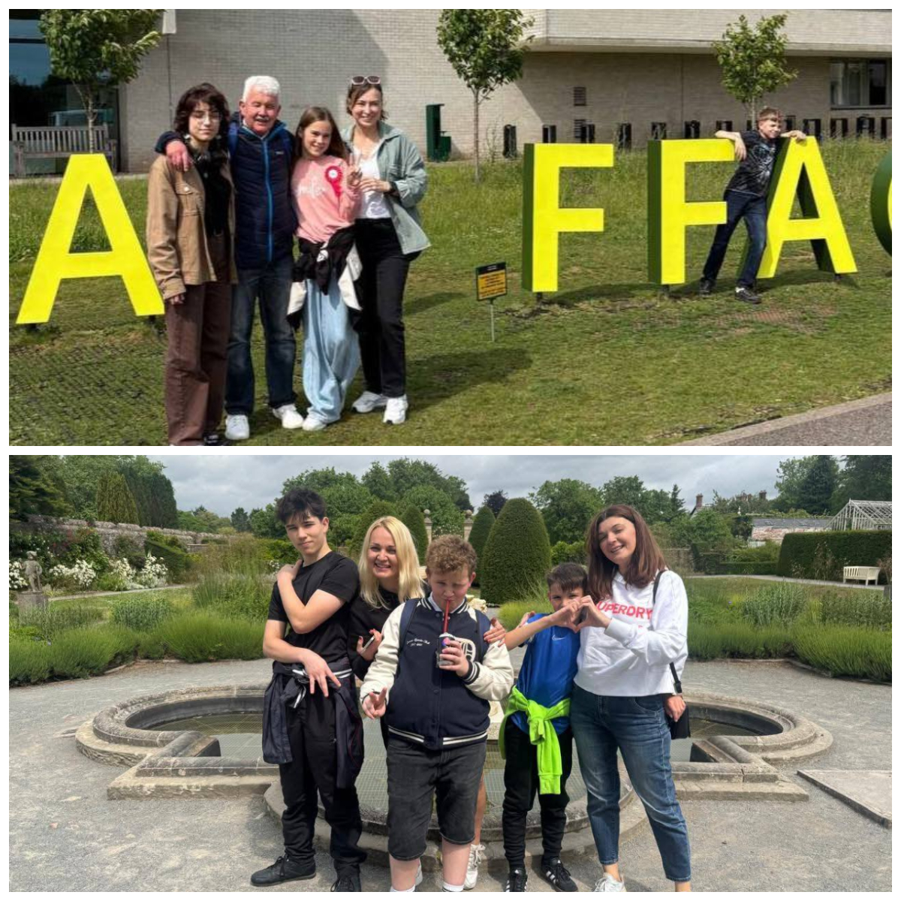
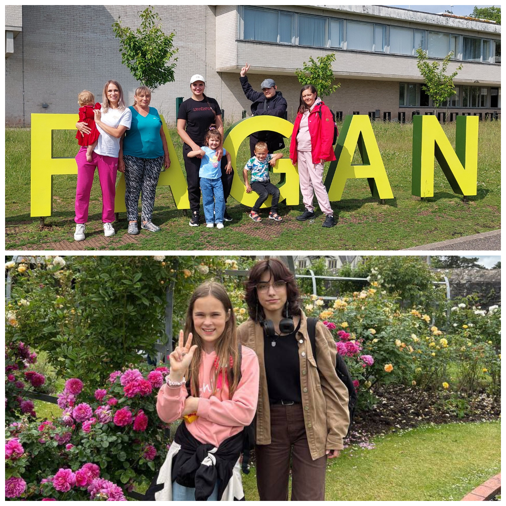
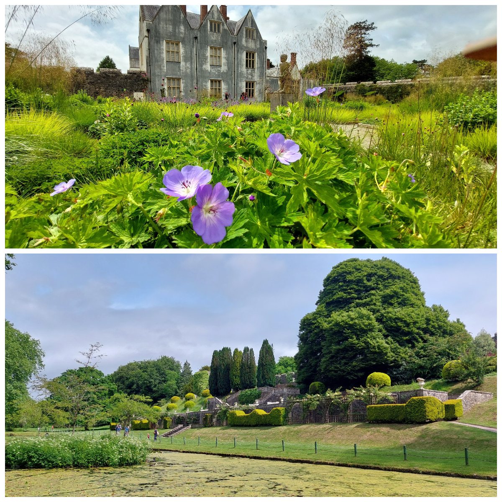
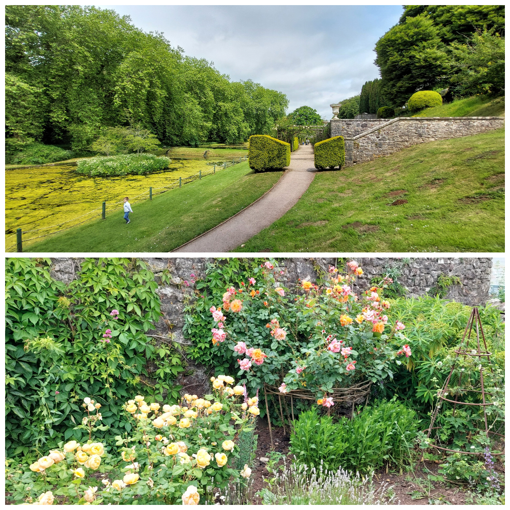

On the last day of spring, Sunflowers Wales organised a wonderful trip to St Fagans National Museum of History for Ukrainian children and their parents.

<!--more-->

It was a lovely and relaxing day. We walked around the museum, explored old Welsh houses, and learned how people lived in the past. 
The children were excited to run around, play, and ask questions about everything they saw. For many families, it was a chance to enjoy time together, meet others, and feel a sense of connection. There was a warm and friendly atmosphere throughout the day. This trip gave us not only new knowledge but also happy memories. It was a special day that brought smiles, comfort, and a feeling of togetherness.

We are extremely grateful to Neath Port Talbot Council  for their financial support, and to <a href="https://www.facebook.com/groups/601579067497655/user/100021561261219/" target="_blank">Neil Keogh</a> for organising the bus transfer.

<blockquote class="tiktok-embed" cite="https://www.tiktok.com/@sunflowerswales/video/7536189923842411798" data-video-id="7536189923842411798" style="max-width: 605px;min-width: 325px;" > <section> <a target="_blank" title="@sunflowerswales" href="https://www.tiktok.com/@sunflowerswales?refer=embed">@sunflowerswales</a>  <a target="_blank" title="♬ original sound  - Sunflowers Wales" href="https://www.tiktok.com/music/original-sound-Sunflowers-Wales-7536189957007346454?refer=embed">♬ original sound  - Sunflowers Wales</a> </section> </blockquote> 

