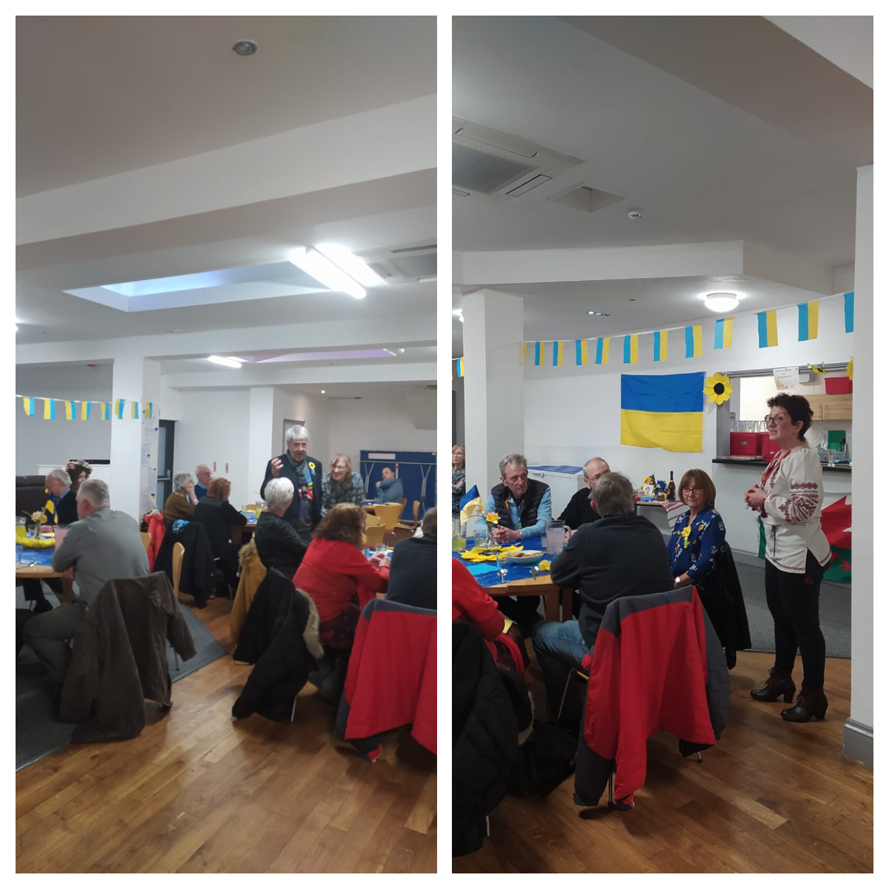
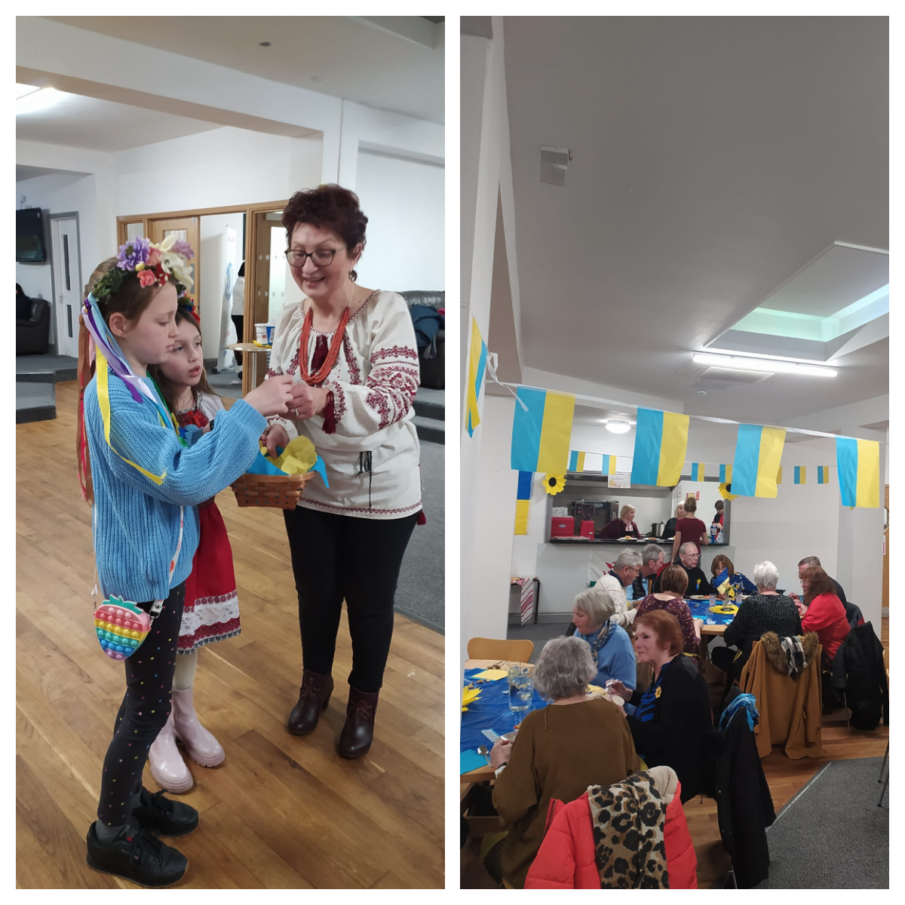
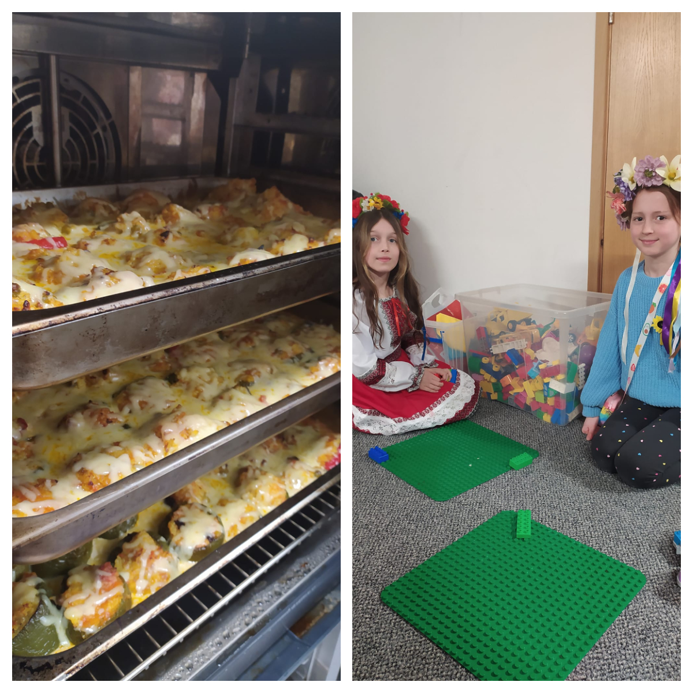
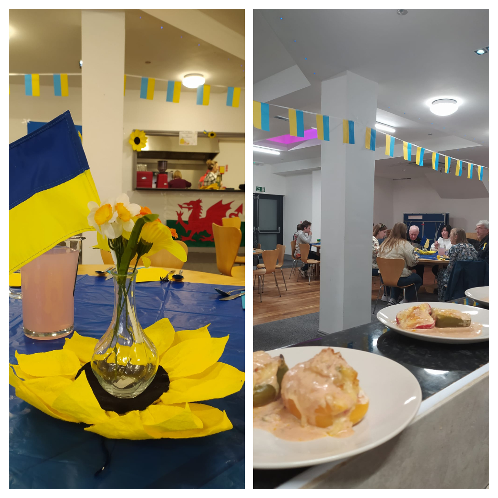

Taste of Ukraine event was held at Ty Gwyn church in Llanelli.

<a href="https://www.facebook.com/groups/601579067497655" target="_blank">Sunflowers Wales (Соняшники)</a> were pleased to see friends and supporters from Llanelli and Llandeilo Rotary Club, Paolo Piana and Ann Evans at LMCN, people who have done a lot for Ukrainians. We are strong together, as we say in Ukraine. 

It was very nice event with warm and friendly atmosphere. Our guests tried delicious Ukrainian food, enjoyed Ukrainian dancing, bandura music and singing by very talented sisters Lisa and Katya from Dnipro. Bandura is one of the hardest to play instruments in the world! 

Thank you for the time we spent together!

