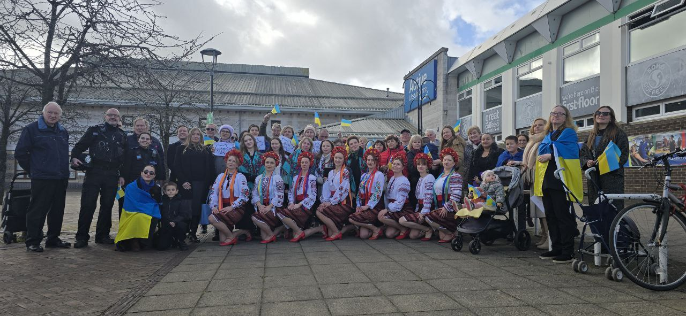

The eve of a bitter date for every Ukrainian—the third anniversary of the brutal war of aggression.

A time when we come together to support one another and once again tell the world the truth. And it is so important for all of us to unite, to make our words louder and our actions stronger!

That is why our dance collective, together with our daughters, eagerly joined the event in Bristol dedicated to the anniversary of the full-scale war. We cried as we watched video footage from the beginning of the war, reliving our shared grief and pain. Through dance, we touched the hearts of everyone present, conveying this sorrow.

But despite the sadness and bitterness, every participant of the event also felt strength, confidence, and faith. The strength to continue doing small deeds for the sake of our shared great goal. The confidence that together we can achieve so much—because we already have. And the faith that we will endure. Together, we will endure.

    <iframe width="853" height="480" src="https://www.youtube.com/embed/Ua9NEVsOVeo" title="Lullaby melody of Ukraine. Bristol, 22 February 2025" frameborder="0" allow="accelerometer; autoplay; clipboard-write; encrypted-media; gyroscope; picture-in-picture; web-share" referrerpolicy="strict-origin-when-cross-origin" allowfullscreen></iframe>

