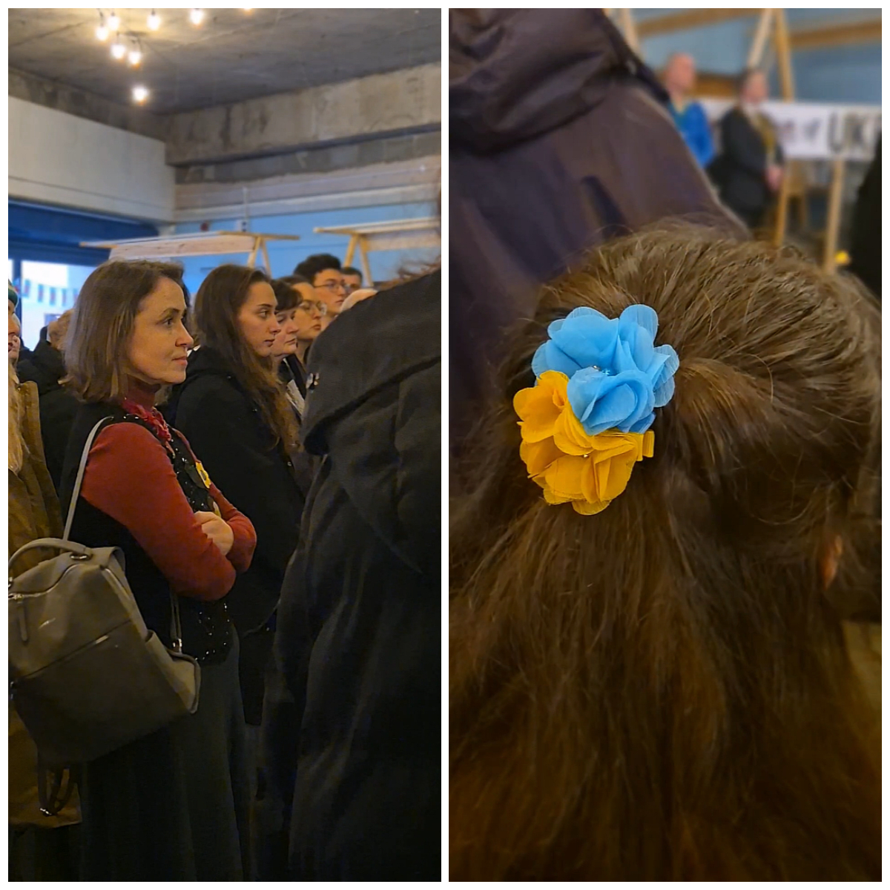

Today, Ukrainians and our Welsh friends gathered to commemorate the victims of the war and stand in solidarity with Ukraine! These days, unity among Ukrainians has become especially important and valuable. Only together can we support our country and help the Ukrainian defenders who protect our nation and freedom while shielding Europe from russia’s barbaric aggression.
We are grateful to everyone who came today despite the weather!

Sunflowers Wales – Standing Strong Together!

    <iframe width="318" height="566" src="https://www.youtube.com/embed/upel_2qnI8A" title="3 years of the full-scale invasion. 11 years of war" frameborder="0" allow="accelerometer; autoplay; clipboard-write; encrypted-media; gyroscope; picture-in-picture; web-share" referrerpolicy="strict-origin-when-cross-origin" allowfullscreen></iframe>

