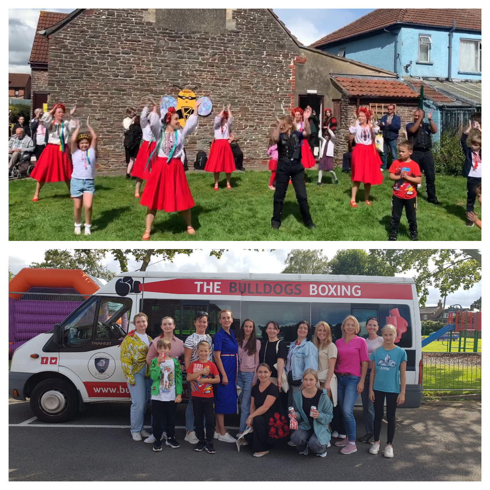
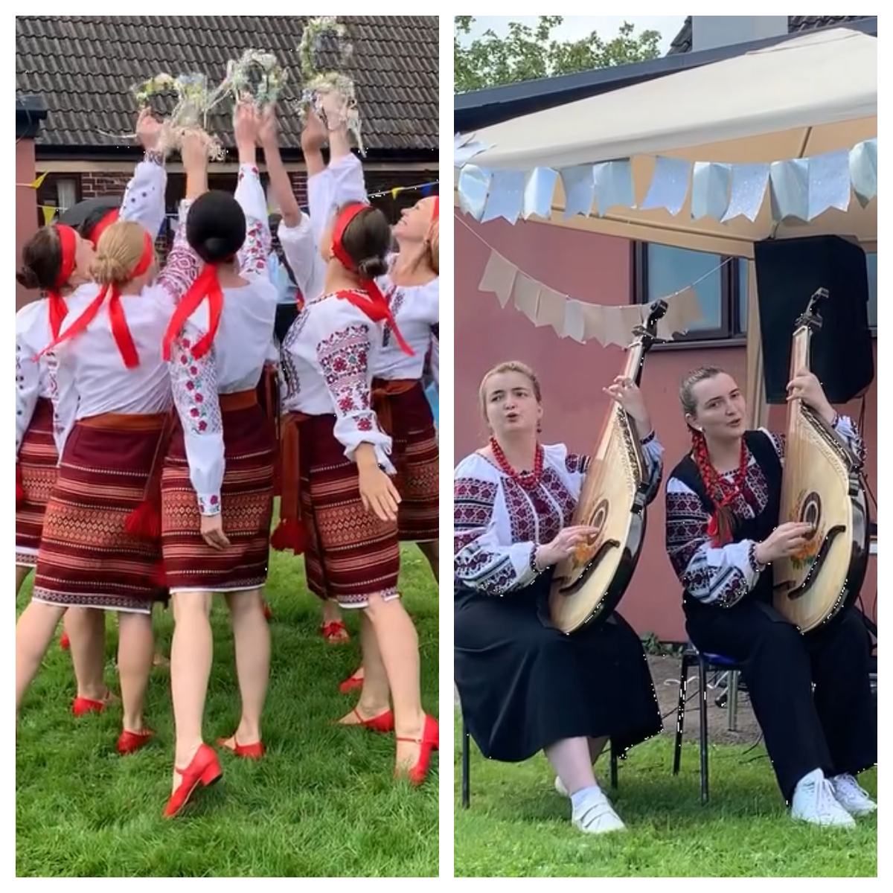
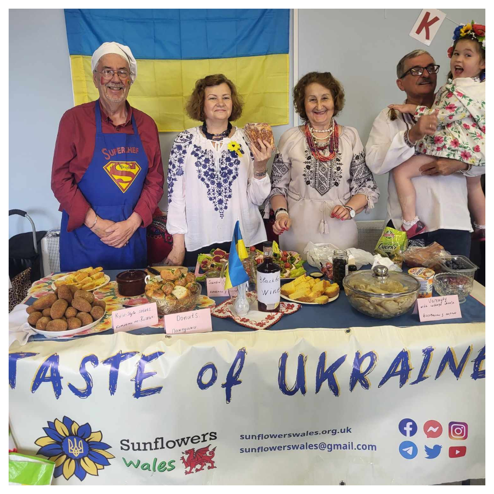

On Saturday, 26 August, members of Sunflowers Wales participated in three events across UK.

In Cardiff, we joined the <a href="https://bit.ly/Cardiff-26-08-23" target="_blank">Ukraine Independence Day Parade</a> organised by <a href="https://www.facebook.com/groups/601579067497655/user/100082874289231/" target="_blank">Stand With Ukraine Cardiff</a>. Despite the occasional rain, it was great to be a part of a big Ukrainian group marching across Cardiff city centre, and it was nice, of course, to meet friends from different places.

In Yate, our dancing group <a href="https://localgiving.org/charity/sunflowers-wales/project/dancing/" target="_blank">"Sunflowers"</a> together with bandura band of sisters Kalianovy were invited by <a href="https://www.facebook.com/groups/1043256196226980/" target="_blank">BristolAid4Ukraine</a> to take part in the celebration of <a href="https://bit.ly/BristolAid4Ukraine-Independence-Day" target="_blank">Ukrainian Independence Day</a> supported by <a href="https://www.facebook.com/sgloscouncil" target="_blank">South Gloucestershire Council</a>. This nice and warm event was well attended by Ukrainians from Bristol and South Gloucestershire. Many thanks to <a href="https://www.facebook.com/groups/601579067497655/user/100021561261219" target="_blank">Neil Keogh</a> for the transfer and friendship.

In Llanelli, our members participated in a multicultural event, organised by <a href="https://bit.ly/Tyisha" target="_blank">Tyisha Positive Action Group</a>, and presented there Ukrainian cuisine.

It was really a great day!

Sunflowers Wales – Standing Strong Together!

