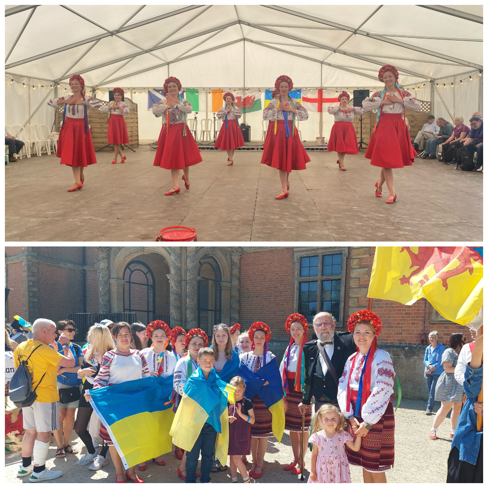
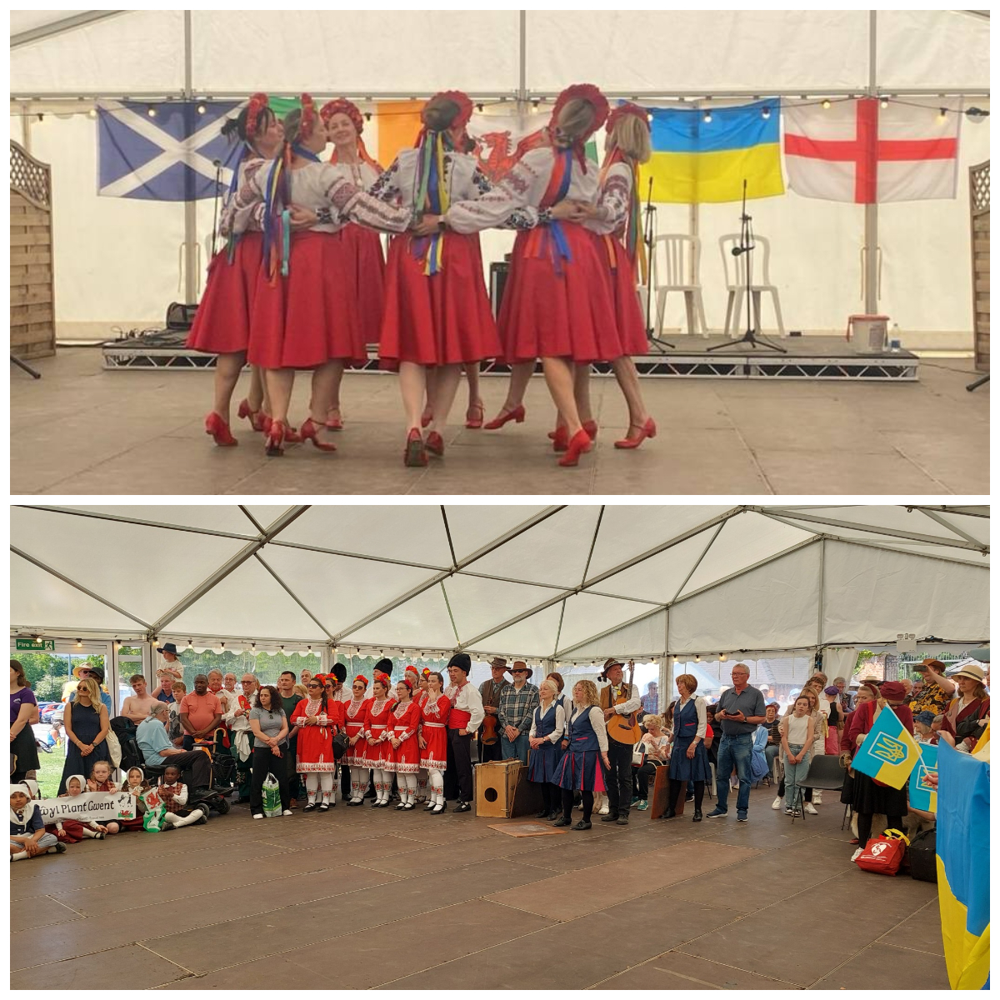
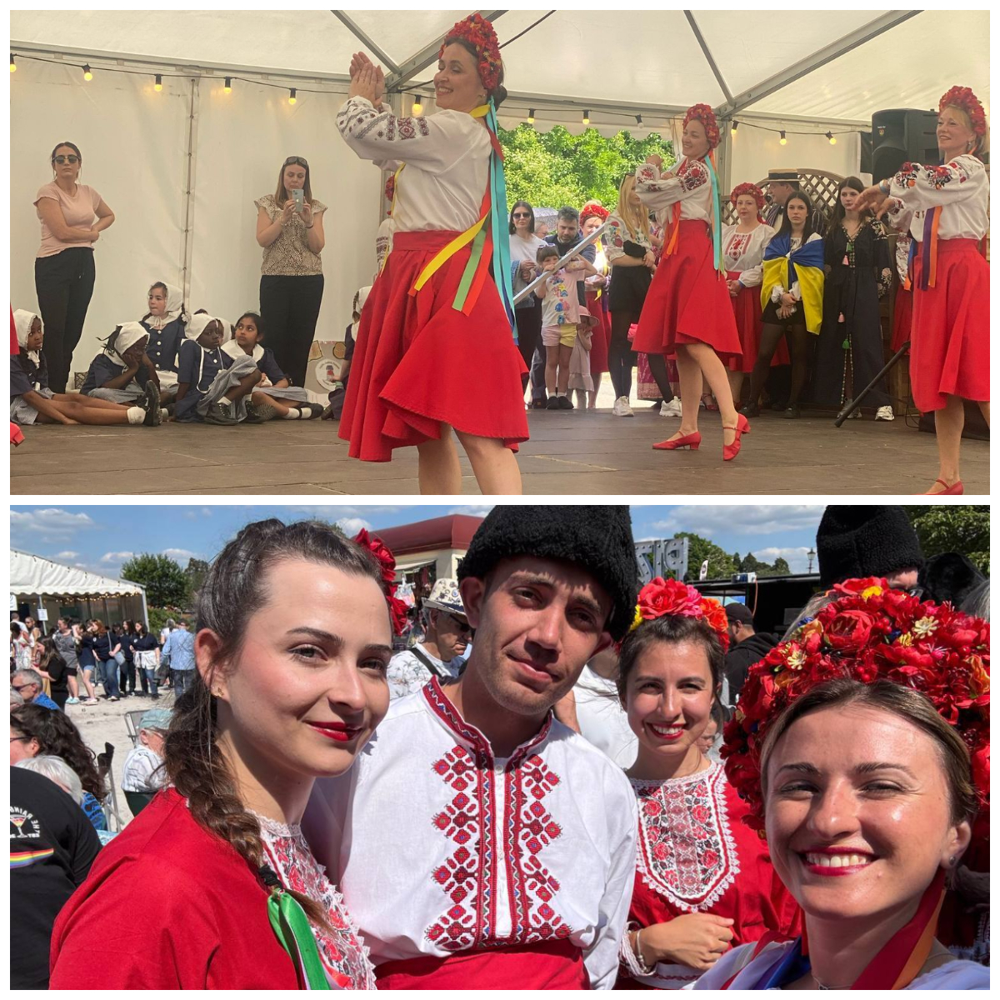
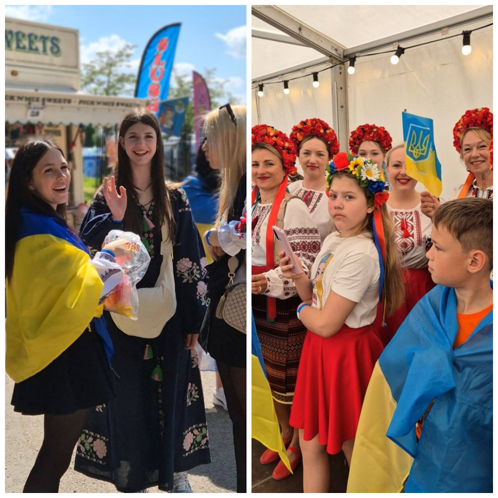
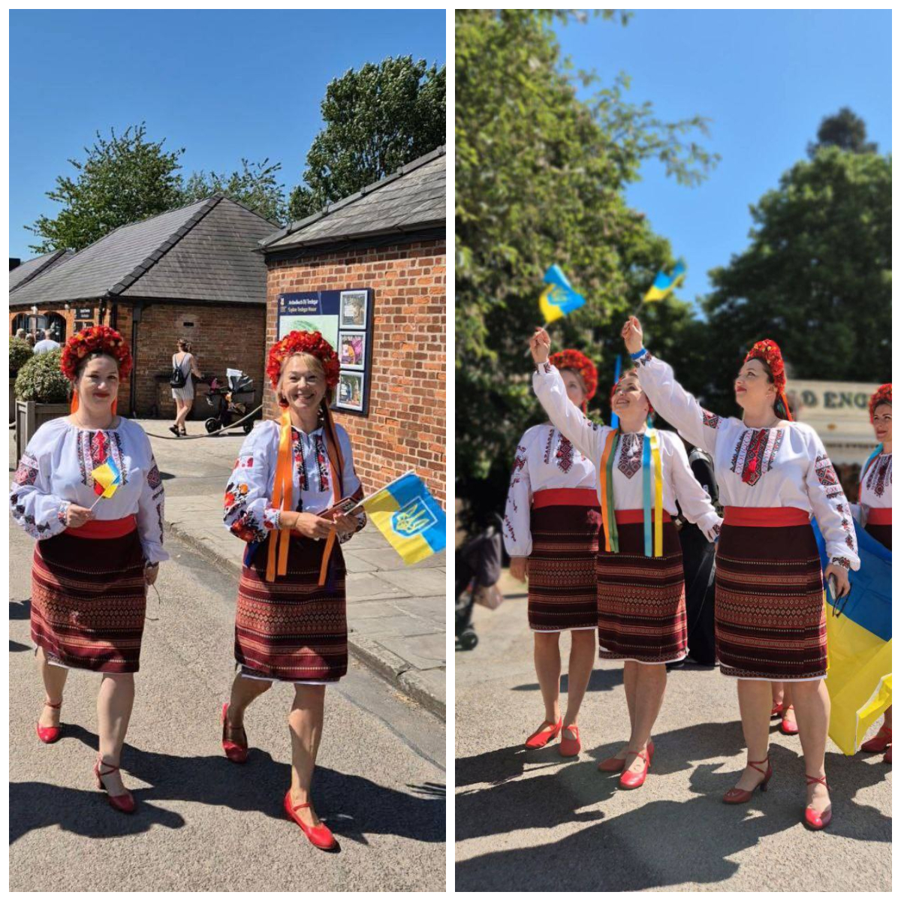
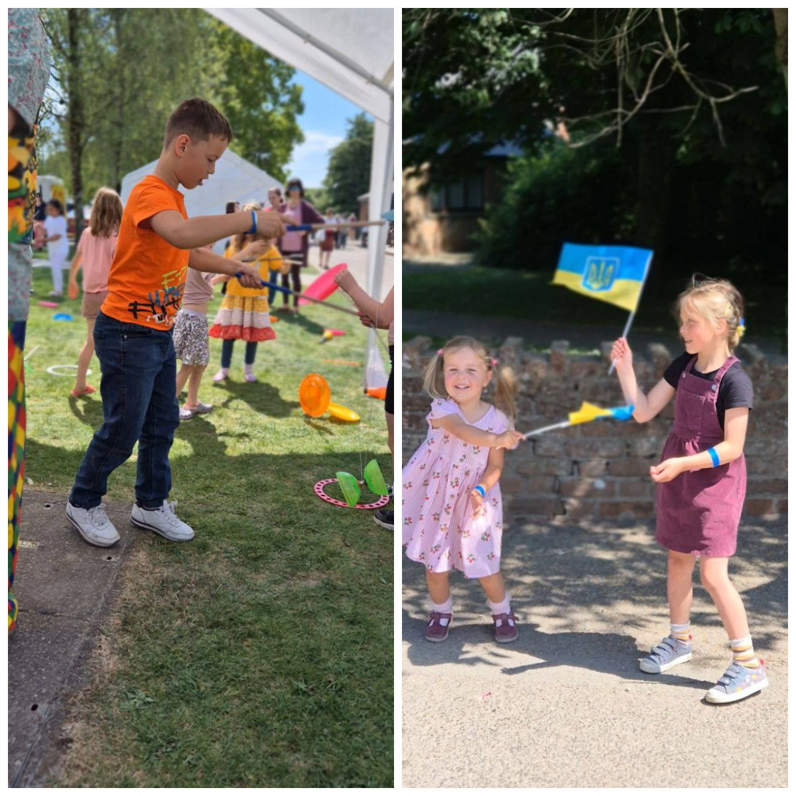

Every trip our dance group takes to perform becomes special. This happens thanks to the efforts of our girls, the organisers, and the warm welcome from the audience. But Saturday’s trip to the Tredegar House Folk Festival in Newport, which has been held for 34 consecutive years, took a very special place in our hearts!

We had almost come to terms with the idea that we wouldn’t take part in the opening parade, as we were running slightly late. But they waited for us and insisted we join. How surprised we were when we realised the parade was waiting specifically for us, as we had been given the great honour of leading it and then immediately opening the festival right after the parade!

The support was truly in the air, and it was very touching. The girls performed in two pavilions, and in both, there were incredible words of support for Ukraine and thunderous applause from the audience. Trips like this once again show us the importance of what we are doing – the mission we are carrying out.

This is what’s called cultural diplomacy.

Each time, new people see real Ukrainian women, their children, hear their—albeit general—but truthful stories, admire their stage costumes and choreographed performances. Each time, they are amazed by the beauty and strength, kindness and resilience of Ukrainians and Ukraine. Each time, their awareness grows of the importance of support and help. And this is how public opinion is formed—public opinion that politicians eventually follow.

On Saturday, for the first time, our little star Eva Yarushynska performed with us – incredible, delicate, with a lovely voice. The children couldn’t stay in their seats and came up to dance with her!

Sunflowers Wales are very grateful to all the event organisers for the invitations, support, and incredible warmth! It was an honour to be with you!

Special thanks to Neil Keogh, who, despite an injured leg, made this trip a reality!
And on Saturday, we set a personal record for our group – three performances per day (including the one in Swansea – the Europe Day - there were also words of support for Ukraine and a warm welcome). It wasn’t easy, but we’re proud we managed it!

<iframe width="411" height="731" src="https://www.youtube.com/embed/rCoCN2lDM30" title="Sunflowers Wales at Tredegar House Folk Festival, Newport, 10 May 2025" frameborder="0" allow="accelerometer; autoplay; clipboard-write; encrypted-media; gyroscope; picture-in-picture; web-share" referrerpolicy="strict-origin-when-cross-origin" allowfullscreen></iframe>

