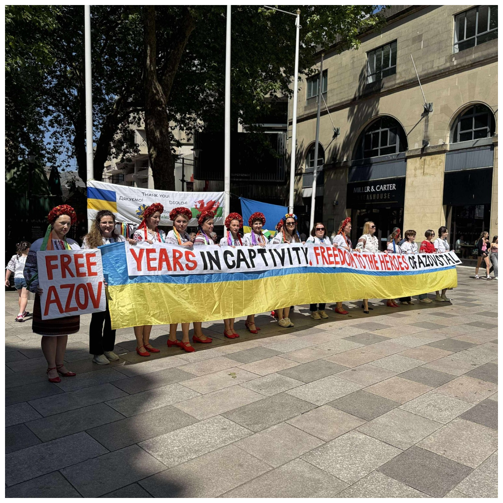
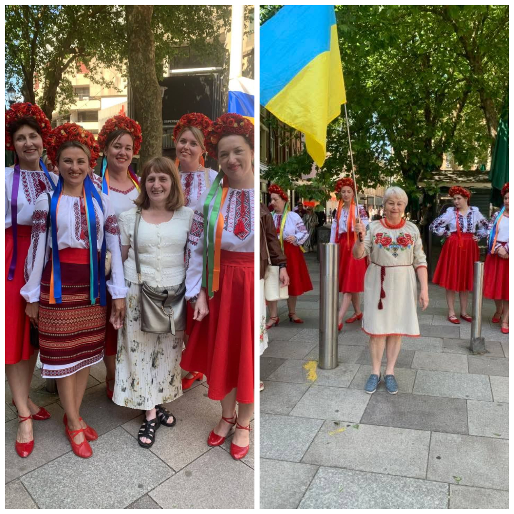

For the third year in a row, Sunflowers Wales has taken part in the celebration of Vyshyvanka Day in Cardiff.
This time, it took place at two neighbouring venues: the cultural event at the Central Library and the weekly Saturday rally in support of Ukrainian defenders.
It was a busy day for all our tireless volunteers.
Activists from our community travelled a long way to support the organisers and once again draw the attention of the Welsh people to Ukraine.
And our secret weapon also went to Cardiff — because the dances and smiles of the energetic Sunflowers dancers never leave anyone indifferent. Once again, they won over Cardiff audiences with their fiery and already popular dance “Palala” and swept them into the whirlwind of the Ukrainian polka “Ty zh mene pidmanula!” (“You Tricked Me!”).

We are grateful to everyone who was with us today!
You were true cultural diplomats, whose dedication helps the British discover our country and its cultural code.

Our joint work always brings real help to our defenders: another shipment of medical supplies has just left for Ukraine, and today’s donations will allow us to start a new fundraising campaign!

Stay with us — together we are stronger!

