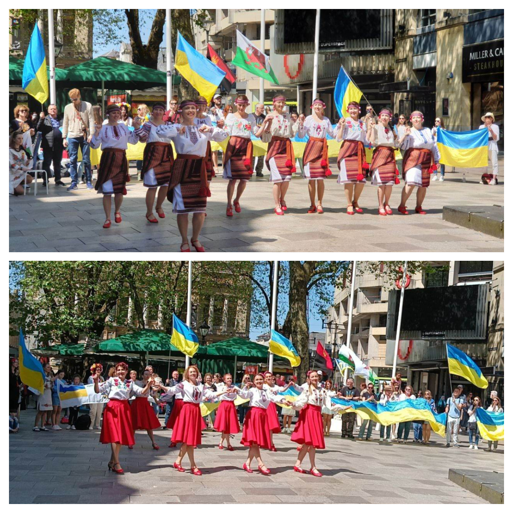
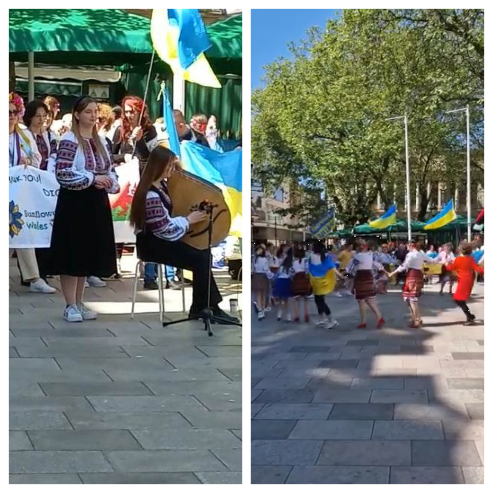

On Saturday 20 May, <a href="https://www.facebook.com/groups/601579067497655" target="_blank">Sunflowers Wales (Соняшники)</a> together with a href="https://www.facebook.com/standwithukraine.cardiff" target="_blank"> Stand With Ukraine Cardiff</a> celebrated Vyshyvanka Day 2023 in Cardiff near the stature of John Batchelor who was called *Friend of Freedom*.

Many thanks to everyone who joined us!

Many thanks to the incredible dancers from our dancing group <a href="https://localgiving.org/charity/sunflowers-wales/project/dancing/" target="_blank">Sunflowers</a>, whose “Kolomyika” encircled many people, to sisters Kalyanovy with their touching and powerful bandura, to our friendly and active Sunflowers-support group, to our tireless children who collected donates - and to all others who made this day so remarkable!

Sunflowers Wales - Standing Strong Together!

