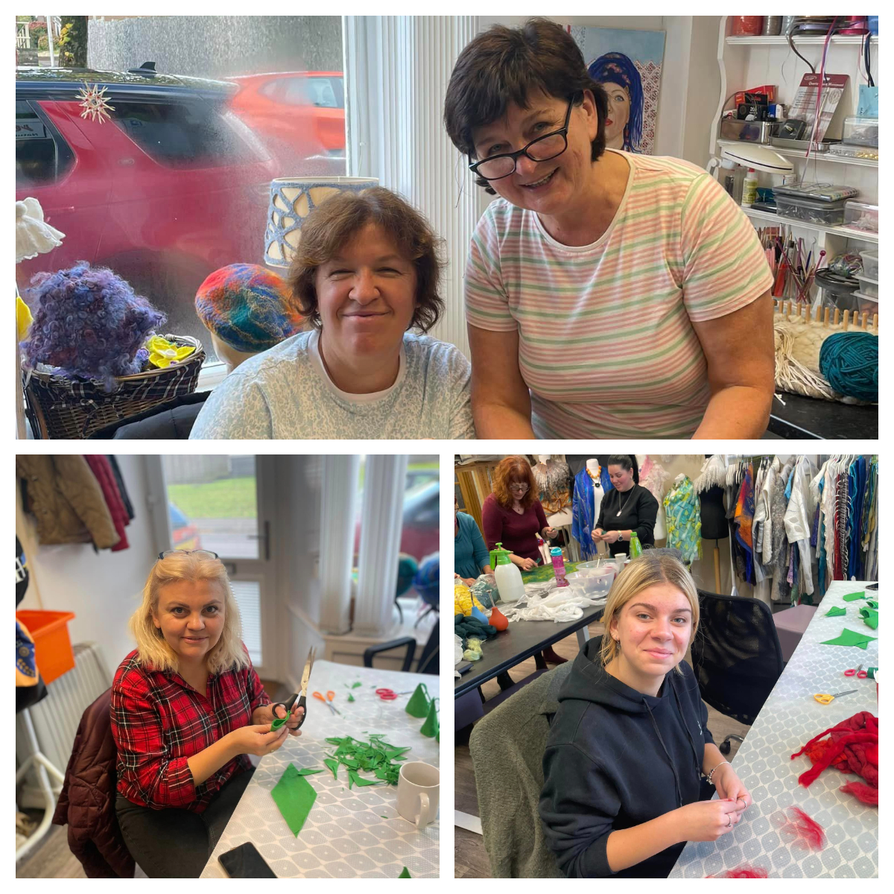

<a href="https://www.facebook.com/groups/601579067497655" target="_blank">Sunflowers Wales (Соняшники)</a> continued preparation to take part in <a href="https://fos.wales/" target="_blank">Llandeilo Festival of Senses</a>.

Again, we spent a day in <a href="https://www.woolsilk.co.uk/" target="_blank">Wool&Silk Art Studio</a>.

Hard work, loads of fun and new  batch of decorations will be prepared for the date.
We had two new members joining us  today <a href="https://www.facebook.com/groups/601579067497655/user/100009252831447/" target="_blank"> Anna Bilinska</a>, thank you!

Special thank you for two little helpers, Lidia and Avalyn! 🙂

And of course to our mentor and teacher with a patience of saint <a href="https://www.facebook.com/svetlana.lilley" target="_blank">Svetlana Lilley</a>! 🌟😇

See you all in Llandeilo Festival of Senses!

